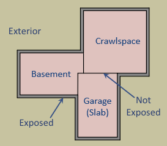
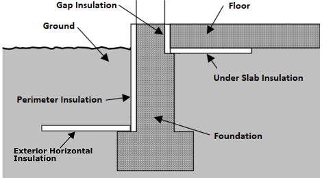

.. _workflow_inputs:

Workflow Inputs
===============

Introduction
------------

OpenStudio-ERI requires a building description in an `HPXML file <https://hpxml.nrel.gov/>`_ format.
HPXML is an open data standard for collecting and transferring home energy data.
Using HPXML files reduces the complexity and effort for software developers to leverage the EnergyPlus simulation engine.

HPXML Inputs
------------

HPXML is an flexible and extensible format, where nearly all elements in the schema are optional and custom elements can be included.
Because of this, a stricter set of requirements for the HPXML file have been developed for purposes of running an Energy Rating Index calculation.

HPXML files submitted to OpenStudio-ERI undergo a two step validation process:

1. Validation against the HPXML Schema

  The HPXML XSD Schema can be found at ``hpxml-measures/HPXMLtoOpenStudio/resources/hpxml_schema/HPXML.xsd``.
  XSD Schemas are used to validate what elements/attributes/enumerations are available, data types for elements/attributes, the number/order of children elements, etc.

2. Validation using `Schematron <http://schematron.com/>`_

  The Schematron document for the ERI use case can be found at ``rulesets/resources/301validator.sch``.
  Schematron is a rule-based validation language, expressed in XML using XPath expressions, for validating the presence or absence of inputs in XML files.
  As opposed to an XSD Schema, a Schematron document validates constraints and requirements based on conditionals and other logical statements.
  For example, if an element is specified with a particular value, the applicable enumerations of another element may change.

.. important::

  Usage of both validation approaches (XSD and Schematron) is recommended for developers actively working on creating HPXML files for Energy Rating Index calculations:

  - Validation against XSD for general correctness and usage of HPXML
  - Validation against Schematron for understanding XML document requirements specific to running ERI calculations

HPXML Software Info
-------------------

High-level software inputs are entered in ``/HPXML/SoftwareInfo``.

.. _hpxml_calculations:

HPXML Calculations
******************

The OpenStudio-ERI calculation(s) to be performed are entered in ``/HPXML/SoftwareInfo/extension``.

  =================================  ========  =======  ===========  ========  =======  ==================================
  Element                            Type      Units    Constraints  Required  Default  Description
  =================================  ========  =======  ===========  ========  =======  ==================================
  ``ERICalculation/Version``         string             See [#]_     No        <none>   Version(s) to perform ERI calculation; multiple allowed
  ``CO2IndexCalculation/Version``    string             See [#]_     No        <none>   Version(s) to perform CO2e Index calculation; multiple allowed
  ``IECCERICalculation/Version``     string             See [#]_     No        <none>   Version(s) to perform IECC ERI calculation; multiple allowed
  ``EnergyStarCalculation/Version``  string             See [#]_     No        <none>   Version(s) to perform ENERGY STAR ERI calculation; multiple allowed
  ``DENHCalculation/Version``        string             See [#]_     No        <none>   Version(s) to perform DOE Efficient New Homes ERI calculation; multiple allowed
  =================================  ========  =======  ===========  ========  =======  ==================================

  .. [#] ERICalculation/Version choices are "latest", "2022CE", "2022C", "2022", "2019ABCD", "2019ABC", "2019AB", "2019A", "2019", "2014AEG", "2014AE", "2014A", or "2014".
         For example, a value of "2019AB" tells the workflow to use ANSI/RESNET/ICC 301-2019 with both Addendum A and Addendum B included.
         A value of "latest" can be used to always point to the latest version available, including any RESNET HERS addenda not yet incorporated in ANSI/RESNET/ICC 301 at the time of release.
  .. [#] CO2IndexCalculation/Version choices are "latest", "2022CE", "2022C", "2022", or "2019ABCD".
         A value of "latest" can be used to always point to the latest version available, including any RESNET HERS addenda not yet incorporated in ANSI/RESNET/ICC 301 at the time of release.
         If :ref:`hers_diagnostic_output` is requested, a single CO2IndexCalculation/Version and a single ERICalculation/Version must be provided and use the same version.
  .. [#] IECCERICalculation/Version choices are "2024", "2021", "2018", or "2015".
  .. [#] EnergyStarCalculation/Version choices are "SF_National_3.3", "SF_National_3.2", "SF_National_3.1", "SF_National_3.0", "SF_Pacific_3.0", "SF_Florida_3.1", "SF_OregonWashington_3.2", "MF_National_1.3", "MF_National_1.2", "MF_National_1.1", "MF_National_1.0", or "MF_OregonWashington_1.2".
  .. [#] DENHCalculation/Version choices are "SF_2.0", "MF_2.0" or "1.0".
         DOE Efficient New Homes (DENH) was formerly known as Zero Energy Ready Homes (ZERH).

.. warning::

  For the IECC ERI compliance calculation, OpenStudio-ERI does not perform additional compliance checks beyond calculating the ERI.
  For example, it does not check the building thermal envelope (2021 IECC, Section R406.3).
  It is the software tool's responsibility to perform these additional steps.
  It does impose renewable energy limits (2021 IECC, Section R406.4), as applicable.

.. warning::

  For the ENERGY STAR and DOE Efficient New Homes ERI calculation, OpenStudio-ERI does not perform additional compliance checks beyond comparing the ERI to the ERI Target.
  For example, it does not check that the home meets all ENERGY STAR and DOE Efficient New Homes Mandatory Requirements.
  It is the software tool's responsibility to perform these additional steps.

HPXML Building Site
-------------------

Site information is entered in ``/HPXML/Building/Site``.

  =====================  ========  =======  ===========  ========  =======  ============================
  Element                Type      Units    Constraints  Required  Default  Description
  =====================  ========  =======  ===========  ========  =======  ============================
  ``Address/StateCode``  string             See [#]_     Yes                State/territory where the home is located
  ``Address/ZipCode``    string             See [#]_     Yes                ZIP Code where the home is located [#]_
  =====================  ========  =======  ===========  ========  =======  ============================

  .. [#] For ENERGY STAR calculations, allowed StateCode choices depend on the ENERGY STAR version:

         \- **National**: <anything>

         \- **Pacific**: HI, GU, MP

         \- **Florida**: FL

         \- **OregonWashington**: OR, WA

  .. [#] ZipCode can be defined as the standard 5 number postal code, or it can have the additional 4 number code separated by a hyphen.
  .. [#] ZipCode is used to look up the eGrid subregion (see ``rulesets/data/egrid/ZIP_mappings.csv``) and Cambium region (see ``rulesets/data/cambium/ZIP_mappings.csv``) for emissions calculations and the CO2e Index.
         It may also be used to choose a default TMY3 weather station when not provided in :ref:`weather_station`.

HPXML Building Summary
----------------------

High-level building summary information is entered in ``/HPXML/Building/BuildingDetails/BuildingSummary``.

HPXML Building Fuels
********************

Each fuel type available to the building is entered in ``/HPXML/Building/BuildingDetails/BuildingSummary/Site/FuelTypesAvailable``.

  ========  ========  =======  ===========  ========  =======  ============================
  Element   Type      Units    Constraints  Required  Default  Description
  ========  ========  =======  ===========  ========  =======  ============================
  ``Fuel``  string             See [#]_     Yes                Fuel name
  ========  ========  =======  ===========  ========  =======  ============================

  .. [#] Fuel choices can be found at the `HPXML Toolbox website <https://hpxml.nrel.gov/datadictionary/3.0.0/Building/BuildingDetails/BuildingSummary/Site/FuelTypesAvailable/Fuel>`_.

.. note::

  The provided fuels are used to determine whether the home has access to natural gas or fossil fuel delivery (specified by any value other than "electricity").
  This information may be used for determining the heating system, as specified by the ERI 301 Standard.

HPXML Building Construction
***************************

Building construction is entered in ``/HPXML/Building/BuildingDetails/BuildingSummary/BuildingConstruction``.

  =============================================================  ========  =========  =================================  ========  ========  =======================================================================
  Element                                                        Type      Units      Constraints                        Required  Default   Notes
  =============================================================  ========  =========  =================================  ========  ========  =======================================================================
  ``ResidentialFacilityType``                                    string               See [#]_                           Yes                 Type of dwelling unit
  ``NumberofConditionedFloors``                                  double               > 0                                Yes                 Number of conditioned floors (including a basement)
  ``NumberofConditionedFloorsAboveGrade``                        double               > 0, <= NumberofConditionedFloors  Yes                 Number of conditioned floors above grade (including a walkout basement)
  ``NumberofBedrooms``                                           integer              > 0                                Yes                 Number of bedrooms
  ``ConditionedFloorArea``                                       double    ft2        > 0                                Yes                 Floor area within conditioned space boundary
  =============================================================  ========  =========  =================================  ========  ========  =======================================================================

  .. [#] ResidentialFacilityType choices are "single-family detached", "single-family attached", or "apartment unit".
         For ENERGY STAR and DENH, "single-family detached" and "single-family attached" may only be used for SF versions and "apartment unit" may only be used for MF versions.

.. _weather_station:

HPXML Weather Station
---------------------

Weather information is entered in ``/HPXML/Building/BuildingDetails/ClimateandRiskZones/WeatherStation``.

  =========================  ======  =======  ===========  ========  ========  ==============================================
  Element                    Type    Units    Constraints  Required  Default   Notes
  =========================  ======  =======  ===========  ========  ========  ==============================================
  ``SystemIdentifier``       id                            Yes                 Unique identifier
  ``Name``                   string                        Yes                 Name of weather station
  ``extension/EPWFilePath``  string                        No        See [#]_  Path to the EnergyPlus weather file (EPW) [#]_
  =========================  ======  =======  ===========  ========  ========  ==============================================

  .. [#] If EPWFilePath not provided, defaults based on the U.S. TMY3 weather station closest to the zip code centroid.
         The mapping can be found at ``hpxml-measures/HPXMLtoOpenStudio/resources/data/zipcode_weather_stations.csv``.
  .. [#] A full set of U.S. TMY3 weather files can be `downloaded here <https://data.nrel.gov/system/files/128/tmy3s-cache-csv.zip>`_.

HPXML Climate Zones
-------------------

One or more IECC climate zones are each entered as a ``/HPXML/Building/BuildingDetails/ClimateandRiskZones/ClimateZoneIECC``.

  =================================  ========  =====  ===========  ========  ========  ===============
  Element                            Type      Units  Constraints  Required  Default   Description
  =================================  ========  =====  ===========  ========  ========  ===============
  ``Year``                           integer          See [#]_     Yes [#]_            IECC year
  ``ClimateZone``                    string           See [#]_     Yes                 IECC zone
  =================================  ========  =====  ===========  ========  ========  ===============

  .. [#] Year choices are 2003, 2006, 2009, 2012, 2015, 2018, 2021, or 2024.
  .. [#] The IECC climate zone for 2006 is always required.
         IECC climate zone years other than 2006 are optional; for programs that use specific IECC climate zone years (e.g., 2021 for DENH SF 2.0), that year is used if provided, otherwise the next earliest provided year will be used with the assumption that the climate zone has not changed across the years.
         See below for the list of climate zone years used by different programs:

         \- **ENERGY STAR SF_National_3.3, SF_National_3.2, MF_National_1.3, MF_National_1.2**: 2021

         \- **ENERGY STAR SF_National_3.1, MF_National_1.1, SF_OregonWashington_3.2, MF_OregonWashington_1.2**: 2012

         \- **DENH SF_2.0, MF_2.0**: 2021

         \- **DENH 1.0**: 2015

         \- **IECC ERI 20XX**: 20XX

  .. [#] ClimateZone choices are "1A", "1B", "1C", "2A", "2B", "2C", "3A", "3B", "3C", "4A", "4B", "4C", "5A", "5B", "5C", "6A", "6B", "6C", "7", or "8".

HPXML Enclosure
---------------

The dwelling unit's enclosure is entered in ``/HPXML/Building/BuildingDetails/Enclosure``.

All surfaces that bound different space types of the dwelling unit (i.e., not just thermal boundary surfaces) must be specified in the HPXML file.
For example, an attached garage would generally be defined by walls adjacent to conditioned space, walls adjacent to outdoors, a slab, and a roof or ceiling.
For software tools that do not collect sufficient inputs for every required surface, the software developers will need to make assumptions about these surfaces or collect additional input.

Interior partition surfaces (e.g., walls between rooms inside conditioned space, or the floor between two conditioned stories) can be excluded.

For single-family attached (SFA) or multifamily (MF) buildings, surfaces between unconditioned space and the neighboring unit's same unconditioned space should set ``InteriorAdjacentTo`` and ``ExteriorAdjacentTo`` to the same value.
For example, a foundation wall between the unit's vented crawlspace and the neighboring unit's vented crawlspace would use ``InteriorAdjacentTo="crawlspace - vented"`` and ``ExteriorAdjacentTo="crawlspace - vented"``.

.. warning::

  It is the software tool's responsibility to provide the appropriate building surfaces.
  While some error-checking is in place, it is not possible to know whether some surfaces are incorrectly missing.

Also note that wall and roof surfaces do not require an azimuth to be specified.
Rather, only the windows/skylights themselves require an azimuth.
Thus, software tools can choose to use a single wall (or roof) surface to represent multiple wall (or roof) surfaces for the entire building if all their other properties (construction type, interior/exterior adjacency, etc.) are identical.

HPXML Air Infiltration
**********************

Building air leakage is entered in ``/HPXML/Building/BuildingDetails/Enclosure/AirInfiltration/AirInfiltrationMeasurement``.

  ====================================  ======  =====  ===========  =========  ========  ===============================================
  Element                               Type    Units  Constraints  Required   Default   Notes
  ====================================  ======  =====  ===========  =========  ========  ===============================================
  ``SystemIdentifier``                  id                          Yes                  Unique identifier
  ``InfiltrationVolume``                double  ft3    > 0          Yes                  Volume associated with infiltration measurement [#]_
  ``InfiltrationHeight``                double  ft     > 0          No         See [#]_  Height associated with infiltration measurement [#]_
  ====================================  ======  =====  ===========  =========  ========  ===============================================

  .. [#] InfiltrationVolume can be thought of as the volume of space most impacted by a blower door test.
         Note that InfiltrationVolume can be larger than ConditionedBuildingVolume as it can include, e.g., attics or basements with access doors/hatches that are open during the blower door test.
  .. [#] If InfiltrationHeight not provided, it is estimated from other inputs (e.g., ConditionedFloorArea, NumberofConditionedFloorsAboveGrade, attics/foundations with WithinInfiltrationVolume=true, etc.).
  .. [#] InfiltrationHeight is defined as the vertical distance between the lowest and highest above-grade points within the pressure boundary, per ASHRAE 62.2.

In addition, one of the following air leakage types must also be defined:

- :ref:`infil_ach_cfm`
- :ref:`infil_natural_ach_cfm`
- :ref:`infil_ela`

.. _infil_ach_cfm:

ACH or CFM
~~~~~~~~~~

If entering air leakage as ACH or CFM at a user-specific pressure, additional information is entered in ``/HPXML/Building/BuildingDetails/Enclosure/AirInfiltration/AirInfiltrationMeasurement``.
For example, ACH50 (ACH at 50 Pascals) is a commonly obtained value from a blower door measurement.

  ====================================  ======  =====  ===========  =========  =======  ===============================================
  Element                               Type    Units  Constraints  Required   Default  Notes
  ====================================  ======  =====  ===========  =========  =======  ===============================================
  ``HousePressure``                     double  Pa     > 0          Yes                 House pressure with respect to outside [#]_
  ``BuildingAirLeakage/UnitofMeasure``  string         See [#]_     Yes                 Units for air leakage
  ``BuildingAirLeakage/AirLeakage``     double         > 0          Yes                 Value for air leakage [#]_
  ====================================  ======  =====  ===========  =========  =======  ===============================================

  .. [#] HousePressure typical value is 50 Pa.
  .. [#] UnitofMeasure choices are "ACH" or "CFM".
  .. [#] For attached dwelling units, BuildingAirLeakage/AirLeakage should be a compartmentalization test value and *not* adjusted by the Aext reduction factor specified in ANSI/RESNET/ICC 301.
         OpenStudio-ERI will automatically calculate and apply the Aext adjustment (and the Aext value can be found in, e.g., the ERIRatedHome.xml output file).
         Note that all attached surfaces, even adiabatic surfaces, must be defined in the HPXML file.

.. _infil_natural_ach_cfm:

Natural ACH or CFM
~~~~~~~~~~~~~~~~~~

If entering air leakage as natural ACH or CFM, additional information is entered in ``/HPXML/Building/BuildingDetails/Enclosure/AirInfiltration/AirInfiltrationMeasurement``.
Natural ACH or CFM represents the annual average infiltration that a building will see.

  ====================================  ======  =====  ===========  =========  =======  =================================
  Element                               Type    Units  Constraints  Required   Default  Notes
  ====================================  ======  =====  ===========  =========  =======  =================================
  ``BuildingAirLeakage/UnitofMeasure``  string         See [#]_     Yes                 Units for air leakage
  ``BuildingAirLeakage/AirLeakage``     double         > 0          Yes                 Value for air leakage [#]_
  ====================================  ======  =====  ===========  =========  =======  =================================

  .. [#] UnitofMeasure choices are "ACHnatural" or "CFMnatural".
  .. [#] For attached dwelling units, BuildingAirLeakage/AirLeakage should *not* be adjusted by the Aext reduction factor specified in ANSI/RESNET/ICC 301.
         OpenStudio-ERI will automatically calculate and apply the Aext adjustment (and the Aext value can be found in, e.g., the ERIRatedHome.xml output file).

.. _infil_ela:

Effective Leakage Area
~~~~~~~~~~~~~~~~~~~~~~

If entering air leakage as Effective Leakage Area (ELA), additional information is entered in ``/HPXML/Building/BuildingDetails/Enclosure/AirInfiltration/AirInfiltrationMeasurement``.
Effective Leakage Area is defined as the area of a special nozzle-shaped hole (similar to the inlet of a blower door fan) that would leak the same amount of air as the building does at a pressure difference of 4 Pascals.
Note that ELA is different than Equivalent Leakage Area (EqLA), which involves a sharp-edged hole at a pressure difference of 10 Pascals.

  ====================================  ======  =======  ===========  =========  =========================  ===============================================
  Element                               Type    Units    Constraints  Required   Default                    Notes
  ====================================  ======  =======  ===========  =========  =========================  ===============================================
  ``EffectiveLeakageArea``              double  sq. in.  >= 0         Yes                                   Effective leakage area value [#]_
  ====================================  ======  =======  ===========  =========  =========================  ===============================================

  .. [#] For attached dwelling units, BuildingAirLeakage/AirLeakage should *not* be adjusted by the Aext reduction factor specified in ANSI/RESNET/ICC 301.
         OpenStudio-ERI will automatically calculate and apply the Aext adjustment (and the Aext value can be found in, e.g., the ERIRatedHome.xml output file).

HPXML Attics
************

If the dwelling unit has an unvented attic, additional information is entered in ``/HPXML/Building/BuildingDetails/Enclosure/Attics/Attic[AtticType/Attic[Vented="false"]]``.

  ============================  =======  =====  ===========  ========  =======  ===============================================
  Element                       Type     Units  Constraints  Required  Default  Notes
  ============================  =======  =====  ===========  ========  =======  ===============================================
  ``WithinInfiltrationVolume``  boolean         See [#]_     Yes                Whether door/hatch to conditioned space open during blower door test [#]_
  ============================  =======  =====  ===========  ========  =======  ===============================================

  .. [#] If there are multiple unvented attics, they must all have the same value.
  .. [#] See `ANSI/RESNET/ICC 380-2022 <https://codes.iccsafe.org/content/RESNET3802022P1>`_ for more information.

If the dwelling unit has a vented attic, additional information is entered in ``/HPXML/Building/BuildingDetails/Enclosure/Attics/Attic[AtticType/Attic[Vented="true"]]``.

  =================================  ======  =====  ===========  ========  =======  ==========================
  Element                            Type    Units  Constraints  Required  Default  Notes
  =================================  ======  =====  ===========  ========  =======  ==========================
  ``VentilationRate/UnitofMeasure``  string         See [#]_     No        SLA      Units for ventilation rate
  ``VentilationRate/Value``          double         > 0 [#]_     No        1/300    Value for ventilation rate
  =================================  ======  =====  ===========  ========  =======  ==========================

  .. [#] UnitofMeasure choices are "SLA" (specific leakage area) or "ACHnatural" (natural air changes per hour).
  .. [#] If there are multiple vented attics, they must all have the same value.

HPXML Foundations
*****************

If the dwelling unit has a conditioned basement, additional information is entered in ``/HPXML/Building/BuildingDetails/Enclosure/Foundations/Foundation/FoundationType/Basement[Conditioned='true']``.

  ============================  =======  =====  ===========  ========  =======  ===============================================
  Element                       Type     Units  Constraints  Required  Default  Notes
  ============================  =======  =====  ===========  ========  =======  ===============================================
  ``WithinInfiltrationVolume``  boolean         See [#]_     No        true     Whether door/hatch to conditioned space open during blower door test [#]_
  ============================  =======  =====  ===========  ========  =======  ===============================================

  .. [#] If there are multiple conditioned basements, they must all have the same value.
  .. [#] See `ANSI/RESNET/ICC 380-2022 <https://codes.iccsafe.org/content/RESNET3802022P1>`_ for more information.

If the dwelling unit has an unconditioned basement, additional information is entered in ``/HPXML/Building/BuildingDetails/Enclosure/Foundations/Foundation[FoundationType/Basement[Conditioned='false']]``.

  ============================  =======  =====  ===========  ========  =======  ===============================================
  Element                       Type     Units  Constraints  Required  Default  Notes
  ============================  =======  =====  ===========  ========  =======  ===============================================
  ``WithinInfiltrationVolume``  boolean         See [#]_     Yes                Whether door/hatch to conditioned space open during blower door test [#]_
  ============================  =======  =====  ===========  ========  =======  ===============================================

  .. [#] If there are multiple unconditioned basements, they must all have the same value.
  .. [#] See `ANSI/RESNET/ICC 380-2022 <https://codes.iccsafe.org/content/RESNET3802022P1>`_ for more information.

If the dwelling unit has an unvented crawlspace, additional information is entered in ``/HPXML/Building/BuildingDetails/Enclosure/Foundations/Foundation[FoundationType/Crawlspace[Vented='false']]``.

  ============================  =======  =====  ===========  ========  =======  ===============================================
  Element                       Type     Units  Constraints  Required  Default  Notes
  ============================  =======  =====  ===========  ========  =======  ===============================================
  ``WithinInfiltrationVolume``  boolean         See [#]_     Yes                Whether door/hatch to conditioned space open during blower door test [#]_
  ============================  =======  =====  ===========  ========  =======  ===============================================

  .. [#] If there are multiple unvented crawlspaces, they must all have the same value.
  .. [#] See `ANSI/RESNET/ICC 380-2022 <https://codes.iccsafe.org/content/RESNET3802022P1>`_ for more information.

If the dwelling unit has a vented crawlspace, additional information is entered in ``/HPXML/Building/BuildingDetails/Enclosure/Foundations/Foundation[FoundationType/Crawlspace[Vented="true"]]``.

  =================================  ======  =====  ===========  ========  =======  ==========================
  Element                            Type    Units  Constraints  Required  Default  Notes
  =================================  ======  =====  ===========  ========  =======  ==========================
  ``VentilationRate/UnitofMeasure``  string         See [#]_     No        SLA      Units for ventilation rate
  ``VentilationRate/Value``          double         > 0 [#]_     No        1/150    Value for ventilation rate
  =================================  ======  =====  ===========  ========  =======  ==========================

  .. [#] UnitofMeasure only choice is "SLA" (specific leakage area).
  .. [#] If there are multiple vented crawlspaces, they must all have the same value.

HPXML Roofs
***********

Each pitched or flat roof surface that is exposed to ambient conditions is entered as a ``/HPXML/Building/BuildingDetails/Enclosure/Roofs/Roof``.

For a multifamily building where the dwelling unit has another dwelling unit above it, the surface between the two dwelling units should be considered a ``Floor`` and not a ``Roof``.

  ======================================  =========  ============  ============  =========  ========  ==================================
  Element                                 Type       Units         Constraints   Required   Default   Notes
  ======================================  =========  ============  ============  =========  ========  ==================================
  ``SystemIdentifier``                    id                                     Yes                  Unique identifier
  ``InteriorAdjacentTo``                  string                   See [#]_      Yes                  Interior adjacent space type
  ``Area``                                double     ft2           > 0           Yes                  Gross area (including skylights)
  ``Azimuth``                             integer    deg           >= 0, <= 359  No         See [#]_  Azimuth (clockwise from North)
  ``SolarAbsorptance``                    double                   >= 0, <= 1    Yes                  Solar absorptance of outermost material
  ``Emittance``                           double                   >= 0, <= 1    Yes                  Emittance of outermost material
  ``Pitch``                               double     ?/12          >= 0          Yes                  Pitch [#]_
  ``RadiantBarrier``                      boolean                                No         false     Presence of radiant barrier
  ``RadiantBarrierGrade``                 integer                  >= 1, <= 3    See [#]_             Radiant barrier installation grade
  ``Insulation/SystemIdentifier``         id                                     Yes                  Unique identifier
  ``Insulation/AssemblyEffectiveRValue``  double     F-ft2-hr/Btu  > 0           Yes                  Assembly R-value [#]_
  ======================================  =========  ============  ============  =========  ========  ==================================

  .. [#] InteriorAdjacentTo choices are "attic - vented", "attic - unvented", "conditioned space", or "garage".
         See :ref:`hpxmllocations` for descriptions.
  .. [#] If Azimuth not provided, and it's a *pitched* roof, modeled as four surfaces of equal area facing every direction.
         Azimuth is irrelevant for *flat* roofs.
  .. [#] Pitch is entered as vertical rise in inches for every 12 inches of horizontal run.
         For example, 6.0 means a 6/12 roof, which has a 26.57-degree roof slope.
  .. [#] RadiantBarrierGrade only required if RadiantBarrier=true.
  .. [#] AssemblyEffectiveRValue includes all material layers and interior/exterior air films.

.. warning::

  It is currently the software developer's responsibility to ensure the AssemblyEffectiveRValue includes the effects of insulation gaps (installation grading) and/or compressed insulation in cavities per `ANSI/RESNET/ICC 301-2022 <https://codes.iccsafe.org/content/RESNET3012022P1>`_.

HPXML Rim Joists
****************

Each rim joist surface (i.e., the perimeter of floor joists typically found between stories of a building or on top of a foundation wall) is entered as a ``/HPXML/Building/BuildingDetails/Enclosure/RimJoists/RimJoist``.

  ======================================  =======  ============  ============  ========  ===========  ==============================
  Element                                 Type     Units         Constraints   Required  Default      Notes
  ======================================  =======  ============  ============  ========  ===========  ==============================
  ``SystemIdentifier``                    id                                   Yes                    Unique identifier
  ``ExteriorAdjacentTo``                  string                 See [#]_      Yes                    Exterior adjacent space type
  ``InteriorAdjacentTo``                  string                 See [#]_      Yes                    Interior adjacent space type
  ``Area``                                double   ft2           > 0           Yes                    Gross area
  ``Azimuth``                             integer  deg           >= 0, <= 359  No        See [#]_     Azimuth (clockwise from North)
  ``SolarAbsorptance``                    double                 >= 0, <= 1    See [#]_               Solar absorptance of outermost material
  ``Emittance``                           double                 >= 0, <= 1    See [#]_               Emittance of outermost material
  ``Insulation/SystemIdentifier``         id                                   Yes                    Unique identifier
  ``Insulation/AssemblyEffectiveRValue``  double   F-ft2-hr/Btu  > 0           Yes                    Assembly R-value [#]_
  ======================================  =======  ============  ============  ========  ===========  ==============================

  .. [#] ExteriorAdjacentTo choices are "outside", "attic - vented", "attic - unvented", "basement - conditioned", "basement - unconditioned", "crawlspace - vented", "crawlspace - unvented", "garage", "other housing unit", "other heated space", "other multifamily buffer space", or "other non-freezing space".
         See :ref:`hpxmllocations` for descriptions.
  .. [#] InteriorAdjacentTo choices are "conditioned space", "attic - vented", "attic - unvented", "basement - conditioned", "basement - unconditioned", "crawlspace - vented", "crawlspace - unvented", or "garage".
         See :ref:`hpxmllocations` for descriptions.
  .. [#] If Azimuth not provided, and it's an *exterior* rim joist, modeled as four surfaces of equal area facing every direction.
         Azimuth is irrelevant for *interior* rim joists.
  .. [#] SolarAbsorptance only required for exterior rim joists (i.e., ExteriorAdjacentTo=outside).
  .. [#] Emittance only required for exterior rim joists (i.e., ExteriorAdjacentTo=outside).
  .. [#] AssemblyEffectiveRValue includes all material layers and interior/exterior air films.

.. warning::

  It is currently the software developer's responsibility to ensure the AssemblyEffectiveRValue includes the effects of insulation gaps (installation grading) and/or compressed insulation in cavities per `ANSI/RESNET/ICC 301-2022 <https://codes.iccsafe.org/content/RESNET3012022P1>`_.

HPXML Walls
***********

Each wall surface is entered as a ``/HPXML/Building/BuildingDetails/Enclosure/Walls/Wall``.

  ======================================  =======  ============  ============  ========  ===========  ====================================
  Element                                 Type     Units         Constraints   Required  Default      Notes
  ======================================  =======  ============  ============  ========  ===========  ====================================
  ``SystemIdentifier``                    id                                   Yes                    Unique identifier
  ``ExteriorAdjacentTo``                  string                 See [#]_      Yes                    Exterior adjacent space type
  ``InteriorAdjacentTo``                  string                 See [#]_      Yes                    Interior adjacent space type
  ``WallType``                            element                See [#]_      Yes                    Wall type (for thermal mass)
  ``Area``                                double   ft2           > 0           Yes                    Gross area (including doors/windows)
  ``Azimuth``                             integer  deg           >= 0, <= 359  No        See [#]_     Azimuth (clockwise from North)
  ``SolarAbsorptance``                    double                 >= 0, <= 1    See [#]_               Solar absorptance of outermost material
  ``Emittance``                           double                 >= 0, <= 1    See [#]_               Emittance of outermost material
  ``Insulation/SystemIdentifier``         id                                   Yes                    Unique identifier
  ``Insulation/AssemblyEffectiveRValue``  double   F-ft2-hr/Btu  > 0           Yes                    Assembly R-value [#]_
  ======================================  =======  ============  ============  ========  ===========  ====================================

  .. [#] ExteriorAdjacentTo choices are "outside", "attic - vented", "attic - unvented", "basement - conditioned", "basement - unconditioned", "crawlspace - vented", "crawlspace - unvented", "garage", "other housing unit", "other heated space", "other multifamily buffer space", or "other non-freezing space".
         See :ref:`hpxmllocations` for descriptions.
  .. [#] InteriorAdjacentTo choices are "conditioned space", "attic - vented", "attic - unvented", "basement - conditioned", "basement - unconditioned", "crawlspace - vented", "crawlspace - unvented", or "garage".
         See :ref:`hpxmllocations` for descriptions.
  .. [#] WallType child element choices are ``WoodStud``, ``DoubleWoodStud``, ``ConcreteMasonryUnit``, ``StructuralInsulatedPanel``, ``InsulatedConcreteForms``, ``SteelFrame``, ``SolidConcrete``, ``StructuralBrick``, ``StrawBale``, ``Stone``, ``LogWall``, or ``Adobe``.
  .. [#] If Azimuth not provided, and it's an *exterior* wall, modeled as four surfaces of equal area facing every direction.
         Azimuth is irrelevant for *interior* walls (e.g., between conditioned space and garage).
  .. [#] SolarAbsorptance only required for exterior walls (i.e., ExteriorAdjacentTo=outside).
  .. [#] Emittance only required for exterior walls (i.e., ExteriorAdjacentTo=outside).
  .. [#] AssemblyEffectiveRValue includes all material layers and interior/exterior air films.

.. warning::

  It is currently the software developer's responsibility to ensure the AssemblyEffectiveRValue includes the effects of insulation gaps (installation grading) and/or compressed insulation in cavities per `ANSI/RESNET/ICC 301-2022 <https://codes.iccsafe.org/content/RESNET3012022P1>`_.

HPXML Foundation Walls
**********************

Each foundation wall surface is entered as a ``/HPXML/Building/BuildingDetails/Enclosure/FoundationWalls/FoundationWall``.
Any wall surface in contact with the ground is considered a foundation wall.

  ==============================================================  ========  ============  ===============  =========  ==============  ====================================
  Element                                                         Type      Units         Constraints      Required   Default         Notes
  ==============================================================  ========  ============  ===============  =========  ==============  ====================================
  ``SystemIdentifier``                                            id                                       Yes                        Unique identifier
  ``ExteriorAdjacentTo``                                          string                  See [#]_         Yes                        Exterior adjacent space type [#]_
  ``InteriorAdjacentTo``                                          string                  See [#]_         Yes                        Interior adjacent space type
  ``Type``                                                        string                  See [#]_         No         solid concrete  Type of material
  ``Height``                                                      double    ft            > 0              Yes                        Total height
  ``Area``                                                        double    ft2           > 0              Yes                        Gross area (including doors/windows)
  ``Azimuth``                                                     integer   deg           >= 0, <= 359     No         See [#]_        Azimuth (clockwise from North)
  ``Thickness``                                                   double    in            > 0              No         8.0             Thickness excluding interior framing
  ``DepthBelowGrade``                                             double    ft            >= 0, <= Height  Yes                        Depth below grade [#]_
  ``Insulation/SystemIdentifier``                                 id                                       Yes                        Unique identifier
  ``Insulation/Layer[InstallationType="continuous - interior"]``  element                                  See [#]_                   Interior insulation layer
  ``Insulation/Layer[InstallationType="continuous - exterior"]``  element                                  See [#]_                   Exterior insulation layer
  ``Insulation/AssemblyEffectiveRValue``                          double    F-ft2-hr/Btu  > 0              See [#]_                   Assembly R-value [#]_
  ==============================================================  ========  ============  ===============  =========  ==============  ====================================

  .. [#] ExteriorAdjacentTo choices are "ground", "basement - conditioned", "basement - unconditioned", "crawlspace - vented", "crawlspace - unvented", "garage", "other housing unit", "other heated space", "other multifamily buffer space", or "other non-freezing space".
         See :ref:`hpxmllocations` for descriptions.
  .. [#] InteriorAdjacentTo choices are "basement - conditioned", "basement - unconditioned", "crawlspace - vented", "crawlspace - unvented", or "garage".
         See :ref:`hpxmllocations` for descriptions.
  .. [#] Interior foundation walls (e.g., between basement and crawlspace) should **not** use "ground" even if the foundation wall has some contact with the ground due to the difference in below-grade depths of the two adjacent spaces.
  .. [#] Type choices are "solid concrete", "concrete block", "concrete block foam core", "concrete block vermiculite core", "concrete block perlite core", "concrete block solid core", "double brick", or "wood".
  .. [#] If Azimuth not provided, and it's an *exterior* foundation wall, modeled as four surfaces of equal area facing every direction.
         Azimuth is irrelevant for *interior* foundation walls (e.g., between basement and garage).
  .. [#] For exterior foundation walls, depth below grade is relative to the ground plane.
         For interior foundation walls, depth below grade is the vertical span of foundation wall in contact with the ground.
         For example, an interior foundation wall between an 8 ft conditioned basement and a 3 ft crawlspace has a height of 8 ft and a depth below grade of 5 ft.
         Alternatively, an interior foundation wall between an 8 ft conditioned basement and an 8 ft unconditioned basement has a height of 8 ft and a depth below grade of 0 ft.
  .. [#] Layer[InstallationType="continuous - interior"] only required if AssemblyEffectiveRValue is not provided.
  .. [#] Layer[InstallationType="continuous - exterior"] only required if AssemblyEffectiveRValue is not provided.
  .. [#] AssemblyEffectiveRValue only required if Layer elements are not provided.
  .. [#] AssemblyEffectiveRValue includes all material layers and the interior air film; it should **not** include the exterior air film (for any above-grade exposure) or any soil thermal resistance.

.. warning::

  It is currently the software developer's responsibility to ensure the AssemblyEffectiveRValue includes the effects of insulation gaps (installation grading) and/or compressed insulation in cavities per `ANSI/RESNET/ICC 301-2022 <https://codes.iccsafe.org/content/RESNET3012022P1>`_.

If insulation layers are provided, additional information is entered in each ``FoundationWall/Insulation/Layer``.

  ==========================================  ========  ============  ===========  ========  =======  =====================================================================
  Element                                     Type      Units         Constraints  Required  Default  Notes
  ==========================================  ========  ============  ===========  ========  =======  =====================================================================
  ``NominalRValue``                           double    F-ft2-hr/Btu  >= 0         Yes                R-value of the foundation wall insulation; use zero if no insulation
  ``DistanceToTopOfInsulation``               double    ft            >= 0         Yes                Vertical distance from top of foundation wall to top of insulation
  ``DistanceToBottomOfInsulation``            double    ft            See [#]_     Yes                Vertical distance from top of foundation wall to bottom of insulation
  ==========================================  ========  ============  ===========  ========  =======  =====================================================================

  .. [#] When NominalRValue is non-zero, DistanceToBottomOfInsulation must be greater than DistanceToTopOfInsulation and less than or equal to FoundationWall/Height.

HPXML Floors
************

Each floor/ceiling surface that is not in contact with the ground (Slab) nor adjacent to ambient conditions above (Roof) is entered as a ``/HPXML/Building/BuildingDetails/Enclosure/Floors/Floor``.

  ======================================  ========  ============  ===========  ========  =======  ============================
  Element                                 Type      Units         Constraints  Required  Default  Notes
  ======================================  ========  ============  ===========  ========  =======  ============================
  ``SystemIdentifier``                    id                                   Yes                Unique identifier
  ``ExteriorAdjacentTo``                  string                  See [#]_     Yes                Exterior adjacent space type
  ``InteriorAdjacentTo``                  string                  See [#]_     Yes                Interior adjacent space type
  ``FloorOrCeiling``                      string                  See [#]_     See [#]_           Floor or ceiling from the perspective of the conditioned space
  ``FloorType``                           element                 See [#]_     Yes                Floor type (for thermal mass)
  ``Area``                                double    ft2           > 0          Yes                Gross area (including skylights for ceilings)
  ``Insulation/SystemIdentifier``         id                                   Yes                Unique identifier
  ``Insulation/AssemblyEffectiveRValue``  double    F-ft2-hr/Btu  > 0          Yes                Assembly R-value [#]_
  ======================================  ========  ============  ===========  ========  =======  ============================

  .. [#] ExteriorAdjacentTo choices are "outside", "attic - vented", "attic - unvented", "basement - conditioned", "basement - unconditioned", "crawlspace - vented", "crawlspace - unvented", "garage", "other housing unit", "other heated space", "other multifamily buffer space", or "other non-freezing space".
         See :ref:`hpxmllocations` for descriptions.
  .. [#] InteriorAdjacentTo choices are "conditioned space", "attic - vented", "attic - unvented", "basement - conditioned", "basement - unconditioned", "crawlspace - vented", "crawlspace - unvented", or "garage".
         See :ref:`hpxmllocations` for descriptions.
  .. [#] FloorOrCeiling choices are "floor" or "ceiling".
  .. [#] FloorOrCeiling only required for floors adjacent to "other housing unit", "other heated space", "other multifamily buffer space", or "other non-freezing space".
  .. [#] FloorType child element choices are ``WoodFrame``, ``StructuralInsulatedPanel``, ``SteelFrame``, or ``SolidConcrete``.
  .. [#] AssemblyEffectiveRValue includes all material layers and interior/exterior air films.

.. warning::

  It is currently the software developer's responsibility to ensure the AssemblyEffectiveRValue includes the effects of insulation gaps (installation grading), compressed insulation in cavities, and/or reduced attic floor insulation thickness at the eaves per `ANSI/RESNET/ICC 301-2022 <https://codes.iccsafe.org/content/RESNET3012022P1>`_.

HPXML Slabs
***********

Each space type that borders the ground (i.e., basement, crawlspace, garage, and slab-on-grade foundation) should have a slab entered as a ``/HPXML/Building/BuildingDetails/Enclosure/Slabs/Slab``.

  =======================================================  ========  ============  ===========  =========  ========  ====================================================
  Element                                                  Type      Units         Constraints  Required   Default   Notes
  =======================================================  ========  ============  ===========  =========  ========  ====================================================
  ``SystemIdentifier``                                     id                                   Yes                  Unique identifier
  ``InteriorAdjacentTo``                                   string                  See [#]_     Yes                  Interior adjacent space type
  ``Area``                                                 double    ft2           > 0          Yes                  Gross area
  ``Thickness``                                            double    in            >= 0         No         See [#]_  Thickness [#]_
  ``ExposedPerimeter``                                     double    ft            >= 0         Yes                  Perimeter exposed to ambient conditions [#]_
  ``DepthBelowGrade``                                      double    ft            >= 0         No         See [#]_  Depth from the top of the slab surface to grade
  ``PerimeterInsulation/SystemIdentifier``                 id                                   Yes                  Unique identifier
  ``PerimeterInsulation/Layer/NominalRValue``              double    F-ft2-hr/Btu  >= 0         Yes                  R-value of vertical insulation (see figure below)
  ``PerimeterInsulation/Layer/InsulationDepth``            double    ft            >= 0         Yes                  Depth from top of slab to bottom of vertical insulation
  ``UnderSlabInsulation/SystemIdentifier``                 id                                   Yes                  Unique identifier
  ``UnderSlabInsulation/Layer/NominalRValue``              double    F-ft2-hr/Btu  >= 0         Yes                  R-value of horizontal insulation (see figure below)
  ``UnderSlabInsulation/Layer/InsulationWidth``            double    ft            >= 0         See [#]_             Width from slab edge inward of horizontal insulation
  ``UnderSlabInsulation/Layer/InsulationSpansEntireSlab``  boolean                              See [#]_             Whether horizontal insulation spans entire slab
  ``extension/GapInsulationRValue``                        double    F-ft2-hr/Btu  >= 0         No         See [#]_  R-value of gap insulation (see figure below)
  ``extension/CarpetFraction``                             double    frac          >= 0, <= 1   Yes                  Fraction of slab covered by carpet
  ``extension/CarpetRValue``                               double    F-ft2-hr/Btu  >= 0         Yes                  Carpet R-value
  =======================================================  ========  ============  ===========  =========  ========  ====================================================

  .. [#] InteriorAdjacentTo choices are "conditioned space", "basement - conditioned", "basement - unconditioned", "crawlspace - vented", "crawlspace - unvented", or "garage".
         See :ref:`hpxmllocations` for descriptions.
  .. [#] If Thickness not provided, defaults to 0 when adjacent to crawlspace and 4 inches for all other cases.
  .. [#] For a crawlspace with a dirt floor, enter a thickness of zero.
  .. [#] ExposedPerimeter includes any slab length that falls along the perimeter of the building's footprint (i.e., is exposed to ground or outdoor air conditions).
         See the figure below for an example of calculating slab exposed perimeter.
  .. [#] If DepthBelowGrade not provided, defaults to zero for foundation types without walls.
         For foundation types with walls, DepthBelowGrade is ignored as the slab's position relative to grade is determined by the ``FoundationWall/DepthBelowGrade`` value(s).
  .. [#] InsulationWidth only required if InsulationSpansEntireSlab=true is not provided.
  .. [#] InsulationSpansEntireSlab=true only required if InsulationWidth is not provided.
  .. [#] If GapInsulationRValue not provided, defaults to 5.0 if there is under slab (horizontal) insulation, otherwise 0.0.

An example of calculating slab exposed perimeter is shown below:

As illustrated above, basement slab edge adjacent to a garage slab or crawlspace is not considered exposed perimeter.
It is quite uncommon for a slab to have an exposed perimeter of zero.
Heat transfer is only calculated for the length of exposed perimeter; the rest of the perimeter is assumed to have minimal heat transfer.

Slab insulation locations can be visualized in the figure below:

.. _windowinputs:

HPXML Windows
*************

Each window or glass door area is entered as a ``/HPXML/Building/BuildingDetails/Enclosure/Windows/Window``.

  ============================================  ========  ============  ============  ========  ===========  ==============================================
  Element                                       Type      Units         Constraints   Required  Default      Notes
  ============================================  ========  ============  ============  ========  ===========  ==============================================
  ``SystemIdentifier``                          id                                    Yes                    Unique identifier
  ``Area``                                      double    ft2           > 0           Yes                    Total area [#]_
  ``Azimuth``                                   integer   deg           >= 0, <= 359  Yes                    Azimuth (clockwise from North)
  ``UFactor``                                   double    Btu/F-ft2-hr  > 0           Yes                    Full-assembly NFRC U-factor
  ``SHGC``                                      double                  > 0, < 1      Yes                    Full-assembly NFRC solar heat gain coefficient
  ``Overhangs``                                 element                               No        <none>       Presence of overhangs (including roof eaves)
  ``FractionOperable``                          double    frac          >= 0, <= 1    Yes                    Operable fraction [#]_
  ``PerformanceClass``                          string                  See [#]_      No        residential  Performance class
  ``AttachedToWall``                            idref                   See [#]_      Yes                    ID of attached wall
  ============================================  ========  ============  ============  ========  ===========  ==============================================

  .. [#] For bay or garden windows, this should represent the *total* area, not just the primary flat exposure.
         The ratio of total area to primary flat exposure is typically around 1.15 for bay windows and 2.0 for garden windows.
  .. [#] FractionOperable reflects whether the windows are operable (can be opened), not how they are used by the occupants.
         If a ``Window`` represents a single window, the value should be 0 or 1.
         If a ``Window`` represents multiple windows, the value is calculated as the total window area for any operable windows divided by the total window area.
  .. [#] PerformanceClass choices are "residential" (e.g., Class R) or "architectural" (e.g., Class AW).
  .. [#] AttachedToWall must reference a ``Wall`` or ``FoundationWall``.

If overhangs are specified, additional information is entered in ``Overhangs``.

  ============================  ========  ======  ===========  ========  =======  ========================================================
  Element                       Type      Units   Constraints  Required  Default  Notes
  ============================  ========  ======  ===========  ========  =======  ========================================================
  ``Depth``                     double    ft      >= 0         Yes                Depth of overhang
  ``DistanceToTopOfWindow``     double    ft      >= 0         Yes                Vertical distance from overhang to top of window
  ``DistanceToBottomOfWindow``  double    ft      See [#]_     Yes                Vertical distance from overhang to bottom of window [#]_
  ============================  ========  ======  ===========  ========  =======  ========================================================

  .. [#] The difference between DistanceToBottomOfWindow and DistanceToTopOfWindow defines the height of the window.
  .. [#] When Depth is non-zero, DistanceToBottomOfWindow must be greater than DistanceToTopOfWindow.

HPXML Skylights
***************

Each skylight is entered as a ``/HPXML/Building/BuildingDetails/Enclosure/Skylights/Skylight``.

  ============================================  ========  ============  ============  ========  =========  ==============================================
  Element                                       Type      Units         Constraints   Required  Default    Notes
  ============================================  ========  ============  ============  ========  =========  ==============================================
  ``SystemIdentifier``                          id                                    Yes                  Unique identifier
  ``Area``                                      double    ft2           > 0           Yes                  Total area [#]_
  ``Azimuth``                                   integer   deg           >= 0, <= 359  Yes                  Azimuth (clockwise from North)
  ``UFactor``                                   double    Btu/F-ft2-hr  > 0           Yes                  Full-assembly NFRC U-factor
  ``SHGC``                                      double                  > 0, < 1      Yes                  Full-assembly NFRC solar heat gain coefficient
  ``AttachedToRoof``                            idref                   See [#]_      Yes                  ID of attached roof
  ``AttachedToFloor``                           idref                   See [#]_      See [#]_             ID of attached attic floor for a skylight with a shaft or sun tunnel
  ``extension/Curb``                            element                               No        <none>     Presence of curb (skylight wall above the roof deck) [#]_
  ``extension/Shaft``                           element                               No        <none>     Presence of shaft (skylight wall below the roof deck) [#]_
  ============================================  ========  ============  ============  ========  =========  ==============================================

  .. [#] For dome skylights, this should represent the *total* area, not just the primary flat exposure.
         The ratio of total area to primary flat exposure is typically around 1.25 for dome skylights.
  .. [#] AttachedToRoof must reference a ``Roof``.
  .. [#] AttachedToFloor must reference a ``Floor``.
  .. [#] AttachedToFloor required if the attached roof is not adjacent to conditioned space (i.e., there is a skylight shaft).
  .. [#] If extension/Curb is provided, additional inputs are described in :ref:`skylight_curb`.
  .. [#] If extension/Shaft is provided, additional inputs are described in :ref:`skylight_shaft`.
         The skylight shaft will be modeled similar to an attic knee wall.

.. _skylight_curb:

Skylight Curb
~~~~~~~~~~~~~

If the skylight has a curb, additional information is entered in ``Skylight``.

  ===========================================  ========  ============  ===========  ========  ========  ========================================================
  Element                                      Type      Units         Constraints  Required  Default   Notes
  ===========================================  ========  ============  ===========  ========  ========  ========================================================
  ``extension/Curb/Area``                      double    ft2           > 0          Yes                 Total area including all sides
  ``extension/Curb/AssemblyEffectiveRValue``   double    F-ft2-hr/Btu  > 0          Yes                 Assembly R-value [#]_
  ===========================================  ========  ============  ===========  ========  ========  ========================================================

  .. [#] AssemblyEffectiveRValue includes all material layers and interior/exterior air films.

.. _skylight_shaft:

Skylight Shaft
~~~~~~~~~~~~~~

If the skylight has a shaft, additional information is entered in ``Skylight``.

  ===========================================  ========  ============  ===========  ========  ========  ========================================================
  Element                                      Type      Units         Constraints  Required  Default   Notes
  ===========================================  ========  ============  ===========  ========  ========  ========================================================
  ``extension/Shaft/Area``                     double    ft2           > 0          Yes                 Total area including all sides
  ``extension/Shaft/AssemblyEffectiveRValue``  double    F-ft2-hr/Btu  > 0          Yes                 Assembly R-value [#]_
  ===========================================  ========  ============  ===========  ========  ========  ========================================================

  .. [#] AssemblyEffectiveRValue includes all material layers and interior/exterior air films.

HPXML Doors
***********

Each door with opaque area is entered as a ``/HPXML/Building/BuildingDetails/Enclosure/Doors/Door``.

  ============================================  ========  ============  ============  ========  =========  ==============================
  Element                                       Type      Units         Constraints   Required  Default    Notes
  ============================================  ========  ============  ============  ========  =========  ==============================
  ``SystemIdentifier``                          id                                    Yes                  Unique identifier
  ``AttachedToWall``                            idref                   See [#]_      Yes                  ID of attached wall
  ``Area``                                      double    ft2           > 0           Yes                  Total opaque area [#]_
  ``Azimuth``                                   integer   deg           >= 0, <= 359  Yes                  Azimuth (clockwise from North)
  ``RValue``                                    double    F-ft2-hr/Btu  > 0           Yes                  R-value [#]_
  ============================================  ========  ============  ============  ========  =========  ==============================

  .. [#] AttachedToWall must reference a ``Wall`` or ``FoundationWall``.
  .. [#] Any *glass* area in the door should be modeled using :ref:`windowinputs`.
         For example, if a 30 ft2 door has 10 ft2 of glass, the door area should be entered as 20 ft2 (with a separate ``Window`` for the remaining 10 ft2).
  .. [#] RValue includes interior/exterior air films and presence of any storm door.

HPXML Systems
-------------

The dwelling unit's systems are entered in ``/HPXML/Building/BuildingDetails/Systems``.

.. _hvac_heating:

HPXML Heating Systems
*********************

The following heating system types can be modeled:

- :ref:`hvac_heating_elec_resistance`
- :ref:`hvac_heating_furnace`
- :ref:`hvac_heating_wall_furnace`
- :ref:`hvac_heating_floor_furnace`
- :ref:`hvac_heating_boiler`
- :ref:`hvac_heating_shared_boiler`
- :ref:`hvac_heating_stove`
- :ref:`hvac_heating_space_heater`
- :ref:`hvac_heating_fireplace`

.. _hvac_heating_elec_resistance:

Electric Resistance
~~~~~~~~~~~~~~~~~~~

Each electric resistance heating system is entered as a ``/HPXML/Building/BuildingDetails/Systems/HVAC/HVACPlant/HeatingSystem``.

  ==================================================  =======  ======  ===============  ========  =======  ==========
  Element                                             Type     Units   Constraints      Required  Default  Notes
  ==================================================  =======  ======  ===============  ========  =======  ==========
  ``SystemIdentifier``                                id                                Yes                Unique identifier
  ``HeatingSystemType/ElectricResistance``            element                           Yes                Type of heating system
  ``HeatingSystemFuel``                               string           electricity      Yes                Fuel type
  ``HeatingCapacity``                                 double   Btu/hr  >= 0 [#]_        Yes                Heating output capacity
  ``AnnualHeatingEfficiency[Units="Percent"]/Value``  double   frac    > 0, <= 1        Yes                Heating efficiency
  ``FractionHeatLoadServed``                          double   frac    >= 0, <= 1 [#]_  Yes                Fraction of heating load served
  ==================================================  =======  ======  ===============  ========  =======  ==========

  .. [#] HeatingCapacity=-1 can be used to autosize the equipment for research purposes or to run tests (it should *not* be used for a real home).
  .. [#] The sum of all ``FractionHeatLoadServed`` (across all HVAC systems) must be less than or equal to 1.

.. _hvac_heating_furnace:

Furnace
~~~~~~~

Each central furnace is entered as a ``/HPXML/Building/BuildingDetails/Systems/HVAC/HVACPlant/HeatingSystem``.

  ===============================================  =======  ======  ===============  ========  ===========  ================================================
  Element                                          Type     Units   Constraints      Required  Default      Notes
  ===============================================  =======  ======  ===============  ========  ===========  ================================================
  ``SystemIdentifier``                             id                                Yes                    Unique identifier
  ``DistributionSystem``                           idref            See [#]_         Yes                    ID of attached distribution system
  ``HeatingSystemType/Furnace``                    element                           Yes                    Type of heating system
  ``HeatingSystemFuel``                            string           See [#]_         Yes                    Fuel type
  ``HeatingCapacity``                              double   Btu/hr  >= 0 [#]_        Yes                    Heating output capacity
  ``AnnualHeatingEfficiency[Units="AFUE"]/Value``  double   frac    > 0, <= 1        Yes                    Rated heating efficiency
  ``FractionHeatLoadServed``                       double   frac    >= 0, <= 1 [#]_  Yes                    Fraction of heating load served
  ``extension/FanMotorType``                       string           See [#]_         No        See [#]_     Blower fan model type
  ``extension/FanPowerWattsPerCFM``                double   W/cfm   >= 0 [#]_        Yes                    Blower fan efficiency at maximum fan speed [#]_
  ``extension/HeatingDesignAirflowCFM``            double   cfm     >= 0             No        240 cfm/ton  Blower fan heating design airflow rate [#]_
  ``extension/AirflowDefectRatio``                 double   frac    >= -0.9, <= 9    Yes                    Deviation between design/installed airflow rates [#]_
  ===============================================  =======  ======  ===============  ========  ===========  ================================================

  .. [#] HVACDistribution type must be :ref:`hvac_distribution_air` (type: "regular velocity" or "gravity") or :ref:`hvac_distribution_dse`.
  .. [#] HeatingSystemFuel choices are  "natural gas", "fuel oil", "propane", "electricity", "wood", or "wood pellets".
  .. [#] HeatingCapacity=-1 can be used to autosize the equipment for research purposes or to run tests (it should *not* be used for a real home).
  .. [#] The sum of all ``FractionHeatLoadServed`` (across all HVAC systems) must be less than or equal to 1.
  .. [#] FanMotorType choices are "PSC" (Permanent Split Capacitor) and "BPM" (Brushless Permanent Magnet).
         If there is a cooling system attached to the DistributionSystem, the heating and cooling systems cannot have different values for FanMotorType.
  .. [#] If FanMotorType is not provided and if there is a cooling system attached to the DistributionSystem, defaults to "PSC" if the attached cooling system CompressorType is "single stage", else "BPM"; If there's no cooling system attached, defaults to "PSC" if AFUE <= 0.9, else "BPM".
  .. [#] If there is a cooling system attached to the DistributionSystem, the heating and cooling systems cannot have different values for FanPowerWattsPerCFM.
  .. [#] If the fan power is not measured, a value of 0.58 W/cfm should be used according to `ANSI/RESNET/ICC 301-2019 Addendum B <https://www.resnet.us/wp-content/uploads/301-2019_Adndm_B-2020_final_rev11.5.22.pdf>`_.
  .. [#] When the home's blower fan airflow is measured according to `ANSI/RESNET/ACCA 310-2020 Standard for Grading the Installation of HVAC Systems <https://codes.iccsafe.org/content/ICC3102020P1>`_, the design airflow rate should be provided for either the heating mode (HeatingDesignAirflowCFM) or cooling mode (CoolingDesignAirflowCFM of cooling system attached to the DistributionSystem).
  .. [#] AirflowDefectRatio is defined as (InstalledAirflow - DesignAirflow) / DesignAirflow; a value of zero means no airflow defect.
         A non-zero airflow defect can only be applied for systems attached to a distribution system.
         See `ANSI/RESNET/ACCA 310-2020 Standard for Grading the Installation of HVAC Systems <https://codes.iccsafe.org/content/ICC3102020P1>`_ for more information.
         If the airflow rate is not measured and the measurement is not exempted, a value of -0.25 should be used according to `ANSI/RESNET/ICC 301-2019 Addendum B <https://www.resnet.us/wp-content/uploads/301-2019_Adndm_B-2020_final_rev11.5.22.pdf>`_.

.. warning::

  HVAC installation grading inputs (i.e., ``FanPowerWattsPerCFM`` and ``AirflowDefectRatio``) should be provided per the conditions specified in `ANSI/RESNET/ACCA 310-2020 <https://codes.iccsafe.org/content/ICC3102020P1>`_.
  OS-ERI does not check that, for example, the total duct leakage requirement has been met or that a Grade I/II input is appropriate per the ANSI 310 process flow; that is currently the responsibility of the software developer.

.. _hvac_heating_wall_furnace:

Wall Furnace
~~~~~~~~~~~~

Each wall furnace is entered as a ``/HPXML/Building/BuildingDetails/Systems/HVAC/HVACPlant/HeatingSystem``.

  ===============================================  =======  ======  ===============  ========  =======  ===================
  Element                                          Type     Units   Constraints      Required  Default  Notes
  ===============================================  =======  ======  ===============  ========  =======  ===================
  ``SystemIdentifier``                             id                                Yes                Unique identifier
  ``HeatingSystemType/WallFurnace``                element                           Yes                Type of heating system
  ``HeatingSystemFuel``                            string           See [#]_         Yes                Fuel type
  ``HeatingCapacity``                              double   Btu/hr  >= 0 [#]_        Yes                Heating output capacity
  ``AnnualHeatingEfficiency[Units="AFUE"]/Value``  double   frac    > 0, <= 1        Yes                Rated heating efficiency
  ``FractionHeatLoadServed``                       double   frac    >= 0, <= 1 [#]_  Yes                Fraction of heating load served
  ``extension/FanPowerWatts``                      double   W       >= 0             No        0        Fan power
  ===============================================  =======  ======  ===============  ========  =======  ===================

  .. [#] HeatingSystemFuel choices are  "natural gas", "fuel oil", "propane", "electricity", "wood", or "wood pellets".
  .. [#] HeatingCapacity=-1 can be used to autosize the equipment for research purposes or to run tests (it should *not* be used for a real home).
  .. [#] The sum of all ``FractionHeatLoadServed`` (across all HVAC systems) must be less than or equal to 1.

.. _hvac_heating_floor_furnace:

Floor Furnace
~~~~~~~~~~~~~

Each floor furnace is entered as a ``/HPXML/Building/BuildingDetails/Systems/HVAC/HVACPlant/HeatingSystem``.

  ===============================================  =======  ======  ===============  ========  =======  ===================
  Element                                          Type     Units   Constraints      Required  Default  Notes
  ===============================================  =======  ======  ===============  ========  =======  ===================
  ``SystemIdentifier``                             id                                Yes                Unique identifier
  ``HeatingSystemType/FloorFurnace``               element                           Yes                Type of heating system
  ``HeatingSystemFuel``                            string           See [#]_         Yes                Fuel type
  ``HeatingCapacity``                              double   Btu/hr  >= 0 [#]_        Yes                Heating output capacity
  ``AnnualHeatingEfficiency[Units="AFUE"]/Value``  double   frac    > 0, <= 1        Yes                Rated heating efficiency
  ``FractionHeatLoadServed``                       double   frac    >= 0, <= 1 [#]_  Yes                Fraction of heating load served
  ``extension/FanPowerWatts``                      double   W       >= 0             No        0        Fan power
  ===============================================  =======  ======  ===============  ========  =======  ===================

  .. [#] HeatingSystemFuel choices are  "natural gas", "fuel oil", "propane", "electricity", "wood", or "wood pellets".
  .. [#] HeatingCapacity=-1 can be used to autosize the equipment for research purposes or to run tests (it should *not* be used for a real home).
  .. [#] The sum of all ``FractionHeatLoadServed`` (across all HVAC systems) must be less than or equal to 1.

.. _hvac_heating_boiler:

Boiler (In-Unit)
~~~~~~~~~~~~~~~~

Each in-unit boiler is entered as a ``/HPXML/Building/BuildingDetails/Systems/HVAC/HVACPlant/HeatingSystem``.

  ===============================================  ========  ======  ===============  ========  ========  =========================================
  Element                                          Type      Units   Constraints      Required  Default   Notes
  ===============================================  ========  ======  ===============  ========  ========  =========================================
  ``SystemIdentifier``                             id                                 Yes                 Unique identifier
  ``DistributionSystem``                           idref             See [#]_         Yes                 ID of attached distribution system
  ``HeatingSystemType/Boiler``                     element                            Yes                 Type of heating system
  ``HeatingSystemFuel``                            string            See [#]_         Yes                 Fuel type
  ``HeatingCapacity``                              double    Btu/hr  >= 0 [#]_        Yes                 Heating output capacity
  ``AnnualHeatingEfficiency[Units="AFUE"]/Value``  double    frac    > 0, <= 1        Yes                 Rated heating efficiency
  ``FractionHeatLoadServed``                       double    frac    >= 0, <= 1 [#]_  Yes                 Fraction of heating load served
  ===============================================  ========  ======  ===============  ========  ========  =========================================

  .. [#] HVACDistribution type must be :ref:`hvac_distribution_hydronic` (type: "radiator", "baseboard", "radiant floor", or "radiant ceiling") or :ref:`hvac_distribution_dse`.
         Note: The choice of hydronic distribution type does not currently affect simulation results.
  .. [#] HeatingSystemFuel choices are  "natural gas", "fuel oil", "propane", "electricity", "wood", or "wood pellets".
  .. [#] HeatingCapacity=-1 can be used to autosize the equipment for research purposes or to run tests (it should *not* be used for a real home).
  .. [#] The sum of all ``FractionHeatLoadServed`` (across all HVAC systems) must be less than or equal to 1.

.. _hvac_heating_shared_boiler:

Boiler (Shared)
~~~~~~~~~~~~~~~

Each shared boiler (serving multiple dwelling units) is entered as a ``/HPXML/Building/BuildingDetails/Systems/HVAC/HVACPlant/HeatingSystem``.

  ===============================================  ========  ======  ===============  ========  ========  =========================================
  Element                                          Type      Units   Constraints      Required  Default   Notes
  ===============================================  ========  ======  ===============  ========  ========  =========================================
  ``SystemIdentifier``                             id                                 Yes                 Unique identifier
  ``IsSharedSystem``                               boolean                            Yes                 Whether it serves multiple dwelling units
  ``NumberofUnitsServed``                          integer           > 1              Yes                 Number of dwelling units served
  ``DistributionSystem``                           idref             See [#]_         Yes                 ID of attached distribution system
  ``HeatingSystemType/Boiler``                     element                            Yes                 Type of heating system
  ``HeatingSystemFuel``                            string            See [#]_         Yes                 Fuel type
  ``HeatingCapacity``                              double    Btu/hr  >= 0             Yes                 Heating output capacity
  ``AnnualHeatingEfficiency[Units="AFUE"]/Value``  double    frac    > 0, <= 1        Yes                 Rated heating efficiency
  ``FractionHeatLoadServed``                       double    frac    >= 0, <= 1 [#]_  Yes                 Fraction of heating load served
  ``extension/SharedLoopWatts``                    double    W       >= 0             Yes                 Shared loop power
  ``extension/SharedLoopMotorEfficiency``          double    frac    > 0, < 1         No        0.85      Shared loop motor efficiency
  ``extension/FanCoilWatts``                       double    W       >= 0             See [#]_            Fan coil power
  ===============================================  ========  ======  ===============  ========  ========  =========================================

  .. [#] HVACDistribution type must be :ref:`hvac_distribution_hydronic` (type: "radiator", "baseboard", "radiant floor", "radiant ceiling", or "water loop") or :ref:`hvac_distribution_air` (type: "fan coil").
         If the shared boiler has "water loop" distribution, a :ref:`hvac_hp_water_loop` must also be specified.
         Note: The choice of hydronic distribution type does not currently affect simulation results.
  .. [#] HeatingSystemFuel choices are  "natural gas", "fuel oil", "propane", "electricity", "wood", or "wood pellets".
  .. [#] The sum of all ``FractionHeatLoadServed`` (across all HVAC systems) must be less than or equal to 1.
  .. [#] FanCoilWatts only required if boiler connected to fan coil.

.. _hvac_heating_stove:

Stove
~~~~~

Each stove is entered as a ``/HPXML/Building/BuildingDetails/Systems/HVAC/HVACPlant/HeatingSystem``.

  ==================================================  =======  ======  ===============  ========  =========  ===================
  Element                                             Type     Units   Constraints      Required  Default    Notes
  ==================================================  =======  ======  ===============  ========  =========  ===================
  ``SystemIdentifier``                                id                                Yes                  Unique identifier
  ``HeatingSystemType/Stove``                         element                           Yes                  Type of heating system
  ``HeatingSystemFuel``                               string           See [#]_         Yes                  Fuel type
  ``HeatingCapacity``                                 double   Btu/hr  >= 0 [#]_        Yes                  Heating output capacity
  ``AnnualHeatingEfficiency[Units="Percent"]/Value``  double   frac    > 0, <= 1        Yes                  Heating efficiency
  ``FractionHeatLoadServed``                          double   frac    >= 0, <= 1 [#]_  Yes                  Fraction of heating load served
  ``extension/FanPowerWatts``                         double   W       >= 0             No        40         Fan power
  ==================================================  =======  ======  ===============  ========  =========  ===================

  .. [#] HeatingSystemFuel choices are  "natural gas", "fuel oil", "propane", "electricity", "wood", or "wood pellets".
  .. [#] HeatingCapacity=-1 can be used to autosize the equipment for research purposes or to run tests (it should *not* be used for a real home).
  .. [#] The sum of all ``FractionHeatLoadServed`` (across all HVAC systems) must be less than or equal to 1.

.. _hvac_heating_space_heater:

Space Heater
~~~~~~~~~~~~

Each space heater is entered as a ``/HPXML/Building/BuildingDetails/Systems/HVAC/HVACPlant/HeatingSystem``.

  ==================================================  =======  ======  ===============  ========  =========  ===================
  Element                                             Type     Units   Constraints      Required  Default    Notes
  ==================================================  =======  ======  ===============  ========  =========  ===================
  ``SystemIdentifier``                                id                                Yes                  Unique identifier
  ``HeatingSystemType/SpaceHeater``                   element                           Yes                  Type of heating system
  ``HeatingSystemFuel``                               string           See [#]_         Yes                  Fuel type
  ``HeatingCapacity``                                 double   Btu/hr  >= 0 [#]_        Yes                  Heating output capacity
  ``AnnualHeatingEfficiency[Units="Percent"]/Value``  double   frac    > 0, <= 1        Yes                  Heating efficiency
  ``FractionHeatLoadServed``                          double   frac    >= 0, <= 1 [#]_  Yes                  Fraction of heating load served
  ``extension/FanPowerWatts``                         double   W       >= 0             No        0          Fan power
  ==================================================  =======  ======  ===============  ========  =========  ===================

  .. [#] HeatingSystemFuel choices are  "natural gas", "fuel oil", "propane", "electricity", "wood", or "wood pellets".
  .. [#] HeatingCapacity=-1 can be used to autosize the equipment for research purposes or to run tests (it should *not* be used for a real home).
  .. [#] The sum of all ``FractionHeatLoadServed`` (across all HVAC systems) must be less than or equal to 1.

.. _hvac_heating_fireplace:

Fireplace
~~~~~~~~~

Each fireplace is entered as a ``/HPXML/Building/BuildingDetails/Systems/HVAC/HVACPlant/HeatingSystem``.

  ==================================================  =======  ======  ===============  ========  =========  ===================
  Element                                             Type     Units   Constraints      Required  Default    Notes
  ==================================================  =======  ======  ===============  ========  =========  ===================
  ``SystemIdentifier``                                id                                Yes                  Unique identifier
  ``HeatingSystemType/Fireplace``                     element                           Yes                  Type of heating system
  ``HeatingSystemFuel``                               string           See [#]_         Yes                  Fuel type
  ``HeatingCapacity``                                 double   Btu/hr  >= 0 [#]_        Yes                  Heating output capacity
  ``AnnualHeatingEfficiency[Units="Percent"]/Value``  double   frac    > 0, <= 1        Yes                  Heating efficiency
  ``FractionHeatLoadServed``                          double   frac    >= 0, <= 1 [#]_  Yes                  Fraction of heating load served
  ``extension/FanPowerWatts``                         double   W       >= 0             No        0          Fan power
  ==================================================  =======  ======  ===============  ========  =========  ===================

  .. [#] HeatingSystemFuel choices are  "natural gas", "fuel oil", "propane", "electricity", "wood", or "wood pellets".
  .. [#] HeatingCapacity=-1 can be used to autosize the equipment for research purposes or to run tests (it should *not* be used for a real home).
  .. [#] The sum of all ``FractionHeatLoadServed`` (across all HVAC systems) must be less than or equal to 1.

.. _hvac_cooling:

HPXML Cooling Systems
*********************

The following cooling system types can be modeled:

- :ref:`hvac_cooling_central_ac`
- :ref:`hvac_cooling_room_ac`
- :ref:`hvac_cooling_ptac`
- :ref:`hvac_cooling_evap_cooler`
- :ref:`hvac_cooling_minisplit_ac`
- :ref:`hvac_cooling_shared_chiller`
- :ref:`hvac_cooling_shared_tower`

.. _hvac_cooling_central_ac:

Central Air Conditioner
~~~~~~~~~~~~~~~~~~~~~~~

Each central air conditioner is entered as a ``/HPXML/Building/BuildingDetails/Systems/HVAC/HVACPlant/CoolingSystem``.

  ================================================================  ======  ======  =======================  ========  ============  ================================================
  Element                                                           Type    Units   Constraints              Required  Default       Notes
  ================================================================  ======  ======  =======================  ========  ============  ================================================
  ``SystemIdentifier``                                              id                                       Yes                     Unique identifier
  ``DistributionSystem``                                            idref           See [#]_                 Yes                     ID of attached distribution system
  ``CoolingSystemType``                                             string          central air conditioner  Yes                     Type of cooling system
  ``CoolingSystemFuel``                                             string          electricity              Yes                     Fuel type
  ``CoolingCapacity``                                               double  Btu/hr  >= 0 [#]_                Yes                     Cooling output capacity
  ``CompressorType``                                                string          See [#]_                 Yes                     Type of compressor
  ``FractionCoolLoadServed``                                        double  frac    >= 0, <= 1 [#]_          Yes                     Fraction of cooling load served
  ``AnnualCoolingEfficiency[Units="SEER2" or Units="SEER"]/Value``  double  Btu/Wh  > 0                      Yes                     Rated cooling efficiency [#]_
  ``AnnualCoolingEfficiency[Units="EER2" or Units="EER"]/Value``    double  Btu/Wh  > 0 [#]_                 Yes                     Rated cooling efficiency [#]_
  ``extension/FanMotorType``                                        string          See [#]_                 No        See [#]_      Blower fan model type
  ``extension/FanPowerWattsPerCFM``                                 double  W/cfm   >= 0 [#]_                Yes                     Blower fan efficiency at maximum fan speed [#]_
  ``extension/CoolingDesignAirflowCFM``                             double  cfm     >= 0                     No        360 cfm/ton   Blower fan cooling design airflow rate [#]_
  ``extension/AirflowDefectRatio``                                  double  frac    >= -0.9, <= 9            Yes                     Deviation between design/installed airflow rates [#]_
  ``extension/ChargeDefectRatio``                                   double  frac    -0.25, 0, 0.25           Yes                     Deviation between design/installed refrigerant charges [#]_
  ``extension/EquipmentType``                                       string          See [#]_                 No        split system  Equipment type only used for SEER/SEER2 and EER/EER2 conversions
  ================================================================  ======  ======  =======================  ========  ============  ================================================

  .. [#] HVACDistribution type must be :ref:`hvac_distribution_air` (type: "regular velocity") or :ref:`hvac_distribution_dse`.
  .. [#] CoolingCapacity=-1 can be used to autosize the equipment for research purposes or to run tests (it should *not* be used for a real home).
  .. [#] CompressorType choices are "single stage", "two stage", or "variable speed".
  .. [#] The sum of all ``FractionCoolLoadServed`` (across all HVAC systems) must be less than or equal to 1.
  .. [#] If SEER provided, converted to SEER2 using ANSI/RESNET/ICC 301-2022 Addendum C. For example, SEER2 = SEER * 0.95 if EquipmentType is "split system".
  .. [#] In addition, EER2 must be <= SEER2; EER must be < SEER.
  .. [#] If EER provided, converted to EER2 using ANSI/RESNET/ICC 301-2022 Addendum C. For example, EER2 = EER * 0.95 if EquipmentType is "split system".
  .. [#] FanMotorType choices are "PSC" (Permanent Split Capacitor) and "BPM" (Brushless Permanent Magnet).
         If there is a heating system attached to the DistributionSystem, the heating and cooling systems cannot have different values for FanMotorType.
  .. [#] If FanMotorType is not provided, defaults to using attached furnace FanMotorType if available, else "PSC" if CompressorType is "single stage", else "BPM".
  .. [#] If there is a heating system attached to the DistributionSystem, the heating and cooling systems cannot have different values for FanPowerWattsPerCFM.
  .. [#] If the fan power is not measured, a value of 0.58 W/cfm should be used according to `ANSI/RESNET/ICC 301-2019 Addendum B <https://www.resnet.us/wp-content/uploads/301-2019_Adndm_B-2020_final_rev11.5.22.pdf>`_.
  .. [#] When the home's blower fan airflow is measured according to `ANSI/RESNET/ACCA 310-2020 Standard for Grading the Installation of HVAC Systems <https://codes.iccsafe.org/content/ICC3102020P1>`_, the design airflow rate should be provided for either the cooling mode (CoolingDesignAirflowCFM) or heating mode (HeatingDesignAirflowCFM of heating system attached to the DistributionSystem).
  .. [#] AirflowDefectRatio is defined as (InstalledAirflow - DesignAirflow) / DesignAirflow; a value of zero means no airflow defect.
         A non-zero airflow defect can only be applied for systems attached to a distribution system.
         See `ANSI/RESNET/ACCA 310-2020 Standard for Grading the Installation of HVAC Systems <https://codes.iccsafe.org/content/ICC3102020P1>`_ for more information.
         If the airflow rate is not measured and the measurement is not exempted, a value of -0.25 should be used according to `ANSI/RESNET/ICC 301-2019 Addendum B <https://www.resnet.us/wp-content/uploads/301-2019_Adndm_B-2020_final_rev11.5.22.pdf>`_.
  .. [#] ChargeDefectRatio is defined as (InstalledCharge - DesignCharge) / DesignCharge; a value of zero means no refrigerant charge defect.
         A non-zero charge defect should typically only be applied for systems that are charged on site, not for systems that have pre-charged line sets.
         See `ANSI/RESNET/ACCA 310-2020 Standard for Grading the Installation of HVAC Systems <https://codes.iccsafe.org/content/ICC3102020P1>`_ for more information.
         If the charge is not measured and the measurement is not exempted, a value of -0.25 should be used according to `ANSI/RESNET/ICC 301-2019 Addendum B <https://www.resnet.us/wp-content/uploads/301-2019_Adndm_B-2020_final_rev11.5.22.pdf>`_.
  .. [#] EquipmentType choices are "split system", "packaged system", "small duct high velocity system", or "space constrained system".

.. warning::

  HVAC installation grading inputs (i.e., ``FanPowerWattsPerCFM``, ``AirflowDefectRatio``, and ``ChargeDefectRatio``) should be provided per the conditions specified in `ANSI/RESNET/ACCA 310-2020 <https://codes.iccsafe.org/content/ICC3102020P1>`_.
  OS-ERI does not check that, for example, the total duct leakage requirement has been met or that a Grade I/II input is appropriate per the ANSI 310 process flow; that is currently the responsibility of the software developer.

.. _hvac_cooling_room_ac:

Room Air Conditioner
~~~~~~~~~~~~~~~~~~~~

Each room air conditioner is entered as a ``/HPXML/Building/BuildingDetails/Systems/HVAC/HVACPlant/CoolingSystem``.

  ==============================================================  ========  ======  ====================  ========  =========  ==============================
  Element                                                         Type      Units   Constraints           Required  Default    Notes
  ==============================================================  ========  ======  ====================  ========  =========  ==============================
  ``SystemIdentifier``                                            id                                      Yes                  Unique identifier
  ``CoolingSystemType``                                           string            room air conditioner  Yes                  Type of cooling system
  ``CoolingSystemFuel``                                           string            electricity           Yes                  Fuel type
  ``CoolingCapacity``                                             double    Btu/hr  >= 0 [#]_             Yes                  Cooling output capacity
  ``FractionCoolLoadServed``                                      double    frac    >= 0, <= 1 [#]_       Yes                  Fraction of cooling load served
  ``AnnualCoolingEfficiency[Units="CEER" or Units="EER"]/Value``  double    Btu/Wh  > 0                   Yes                  Rated cooling efficiency
  ``IntegratedHeatingSystemFuel``                                 string            See [#]_              No        <none>     Fuel type of integrated heater
  ==============================================================  ========  ======  ====================  ========  =========  ==============================

  .. [#] CoolingCapacity=-1 can be used to autosize the equipment for research purposes or to run tests (it should *not* be used for a real home).
  .. [#] The sum of all ``FractionCoolLoadServed`` (across all HVAC systems) must be less than or equal to 1.
  .. [#] IntegratedHeatingSystemFuel choices are "electricity", "natural gas", "fuel oil", "propane", "wood", or "wood pellets".

If the room air conditioner has integrated heating, additional information is entered in ``CoolingSystem``.
Note that a room air conditioner with reverse cycle heating should be entered as a heat pump; see :ref:`hvac_hp_room_ac_reverse_cycle`.

  ==================================================================  ======  ======  ===============  ========  =========  ============================================
  Element                                                             Type    Units   Constraints      Required  Default    Notes
  ==================================================================  ======  ======  ===============  ========  =========  ============================================
  ``IntegratedHeatingSystemCapacity``                                 double  Btu/hr  >= 0 [#]_        Yes                  Heating output capacity of integrated heater
  ``IntegratedHeatingSystemAnnualEfficiency[Units="Percent"]/Value``  double  frac    > 0, <= 1        Yes                  Efficiency of integrated heater
  ``IntegratedHeatingSystemFractionHeatLoadServed``                   double  frac    >= 0, <= 1 [#]_  Yes                  Fraction of heating load served
  ==================================================================  ======  ======  ===============  ========  =========  ============================================

  .. [#] IntegratedHeatingSystemCapacity=-1 can be used to autosize the equipment for research purposes or to run tests (it should *not* be used for a real home).
  .. [#] The sum of all ``FractionHeatLoadServed`` (across all HVAC systems) must be less than or equal to 1.

.. _hvac_cooling_ptac:

Packaged Terminal Air Conditioner
~~~~~~~~~~~~~~~~~~~~~~~~~~~~~~~~~

Each packaged terminal air conditioner (PTAC) is entered as a ``/HPXML/Building/BuildingDetails/Systems/HVAC/HVACPlant/CoolingSystem``.

  ==============================================================  ========  ======  =================================  ========  =========  ==============================
  Element                                                         Type      Units   Constraints                        Required  Default    Notes
  ==============================================================  ========  ======  =================================  ========  =========  ==============================
  ``SystemIdentifier``                                            id                                                   Yes                  Unique identifier
  ``CoolingSystemType``                                           string            packaged terminal air conditioner  Yes                  Type of cooling system
  ``CoolingSystemFuel``                                           string            electricity                        Yes                  Fuel type
  ``CoolingCapacity``                                             double    Btu/hr  >= 0 [#]_                          Yes                  Cooling output capacity
  ``FractionCoolLoadServed``                                      double    frac    >= 0, <= 1 [#]_                    Yes                  Fraction of cooling load served
  ``AnnualCoolingEfficiency[Units="CEER" or Units="EER"]/Value``  double    Btu/Wh  > 0                                Yes                  Rated cooling efficiency
  ``IntegratedHeatingSystemFuel``                                 string            See [#]_                           No        <none>     Fuel type of integrated heater
  ==============================================================  ========  ======  =================================  ========  =========  ==============================

  .. [#] CoolingCapacity=-1 can be used to autosize the equipment for research purposes or to run tests (it should *not* be used for a real home).
  .. [#] The sum of all ``FractionCoolLoadServed`` (across all HVAC systems) must be less than or equal to 1.
  .. [#] IntegratedHeatingSystemFuel choices are "electricity", "natural gas", "fuel oil", "propane", "wood", or "wood pellets".

If the PTAC has integrated heating, additional information is entered in ``CoolingSystem``.
Note that a packaged terminal heat pump should be entered as a heat pump; see :ref:`hvac_hp_pthp`.

  ==================================================================  ======  ======  ===============  ========  =========  ============================================
  Element                                                             Type    Units   Constraints      Required  Default    Notes
  ==================================================================  ======  ======  ===============  ========  =========  ============================================
  ``IntegratedHeatingSystemCapacity``                                 double  Btu/hr  >= 0 [#]_        Yes                  Heating output capacity of integrated heater
  ``IntegratedHeatingSystemAnnualEfficiency[Units="Percent"]/Value``  double  frac    > 0, <= 1        Yes                  Efficiency of integrated heater
  ``IntegratedHeatingSystemFractionHeatLoadServed``                   double  frac    >= 0, <= 1 [#]_  Yes                  Fraction of heating load served
  ==================================================================  ======  ======  ===============  ========  =========  ============================================

  .. [#] IntegratedHeatingSystemCapacity=-1 can be used to autosize the equipment for research purposes or to run tests (it should *not* be used for a real home).
  .. [#] The sum of all ``FractionHeatLoadServed`` (across all HVAC systems) must be less than or equal to 1.

.. _hvac_cooling_evap_cooler:

Evaporative Cooler
~~~~~~~~~~~~~~~~~~

Each evaporative cooler is entered as a ``/HPXML/Building/BuildingDetails/Systems/HVAC/HVACPlant/CoolingSystem``.

  =================================  ========  ======  ==================  ========  =========  ==================================
  Element                            Type      Units   Constraints         Required  Default    Notes
  =================================  ========  ======  ==================  ========  =========  ==================================
  ``SystemIdentifier``               id                                    Yes                  Unique identifier
  ``DistributionSystem``             idref             See [#]_            No                   ID of attached distribution system
  ``CoolingSystemType``              string            evaporative cooler  Yes                  Type of cooling system
  ``CoolingSystemFuel``              string            electricity         Yes                  Fuel type
  ``CoolingCapacity``                double    Btu/hr  >= 0 [#]_           Yes                  Cooling output capacity
  ``FractionCoolLoadServed``         double    frac    >= 0, <= 1 [#]_     Yes                  Fraction of cooling load served
  =================================  ========  ======  ==================  ========  =========  ==================================

  .. [#] If DistributionSystem provided, HVACDistribution type must be :ref:`hvac_distribution_air` (type: "regular velocity") or :ref:`hvac_distribution_dse`.
  .. [#] CoolingCapacity=-1 can be used to autosize the equipment for research purposes or to run tests (it should *not* be used for a real home).
  .. [#] The sum of all ``FractionCoolLoadServed`` (across all HVAC systems) must be less than or equal to 1.

.. _hvac_cooling_minisplit_ac:

Mini-Split Air Conditioner
~~~~~~~~~~~~~~~~~~~~~~~~~~

Each mini-split air conditioner is entered as a ``/HPXML/Building/BuildingDetails/Systems/HVAC/HVACPlant/CoolingSystem``.

  ================================================================  ======  ======  ===============  ========  ==============  ================================================
  Element                                                           Type    Units   Constraints      Required  Default         Notes
  ================================================================  ======  ======  ===============  ========  ==============  ================================================
  ``SystemIdentifier``                                              id                               Yes                       Unique identifier
  ``DistributionSystem``                                            idref           See [#]_         No                        ID of attached distribution system
  ``CoolingSystemType``                                             string          mini-split       Yes                       Type of cooling system
  ``CoolingSystemFuel``                                             string          electricity      Yes                       Fuel type
  ``CoolingCapacity``                                               double  Btu/hr  >= 0 [#]_        Yes                       Cooling output capacity
  ``CompressorType``                                                string          variable speed   Yes                       Type of compressor
  ``FractionCoolLoadServed``                                        double  frac    >= 0, <= 1 [#]_  Yes                       Fraction of cooling load served
  ``AnnualCoolingEfficiency[Units="SEER2" or Units="SEER"]/Value``  double  Btu/Wh  > 0              Yes                       Rated cooling efficiency [#]_
  ``AnnualCoolingEfficiency[Units="EER2" or Units="EER"]/Value``    double  Btu/Wh  > 0 [#]_         Yes                       Rated cooling efficiency [#]_
  ``extension/FanMotorType``                                        string          See [#]_         No        BPM             Blower fan model type
  ``extension/FanPowerWattsPerCFM``                                 double  W/cfm   >= 0 [#]_        Yes                       Blower fan efficiency at maximum fan speed [#]_
  ``extension/CoolingDesignAirflowCFM``                             double  cfm     >= 0             No        360 cfm/ton     Blower fan cooling design airflow rate [#]_
  ``extension/AirflowDefectRatio``                                  double  frac    >= -0.9, <= 9    Yes                       Deviation between design/installed airflow rates [#]_
  ``extension/ChargeDefectRatio``                                   double  frac    -0.25, 0, 0.25   Yes                       Deviation between design/installed refrigerant charges [#]_
  ================================================================  ======  ======  ===============  ========  ==============  ================================================

  .. [#] If provided, HVACDistribution type must be :ref:`hvac_distribution_air` (type: "regular velocity") or :ref:`hvac_distribution_dse`.
  .. [#] CoolingCapacity=-1 can be used to autosize the equipment for research purposes or to run tests (it should *not* be used for a real home).
  .. [#] The sum of all ``FractionCoolLoadServed`` (across all HVAC systems) must be less than or equal to 1.
  .. [#] If SEER provided, converted to SEER2 using ANSI/RESNET/ICC 301-2022 Addendum C, where SEER2 = SEER * 0.95 if ducted and SEER2 = SEER if ductless.
  .. [#] In addition, EER2 must be <= SEER2; EER must be < SEER.
  .. [#] If EER provided, converted to EER2 using ANSI/RESNET/ICC 301-2022 Addendum C, where EER2 = EER * 0.95 if ducted and EER2 = EER if ductless.
  .. [#] FanMotorType choices are "PSC" (Permanent Split Capacitor) and "BPM" (Brushless Permanent Magnet).
         If there is a heating system attached to the DistributionSystem, the heating and cooling systems cannot have different values for FanMotorType.
  .. [#] If there is a heating system attached to the DistributionSystem, the heating and cooling systems cannot have different values for FanPowerWattsPerCFM.
  .. [#] If the fan power is not measured, a value of 0.58 W/cfm should be used according to `ANSI/RESNET/ICC 301-2019 Addendum B <https://www.resnet.us/wp-content/uploads/301-2019_Adndm_B-2020_final_rev11.5.22.pdf>`_.
  .. [#] When the home's blower fan airflow is measured according to `ANSI/RESNET/ACCA 310-2020 Standard for Grading the Installation of HVAC Systems <https://codes.iccsafe.org/content/ICC3102020P1>`_, the design airflow rate should be provided for either the cooling mode (CoolingDesignAirflowCFM) or heating mode (HeatingDesignAirflowCFM of heating system attached to the DistributionSystem).
  .. [#] AirflowDefectRatio is defined as (InstalledAirflow - DesignAirflow) / DesignAirflow; a value of zero means no airflow defect.
         A non-zero airflow defect can only be applied for systems attached to a distribution system.
         See `ANSI/RESNET/ACCA 310-2020 Standard for Grading the Installation of HVAC Systems <https://codes.iccsafe.org/content/ICC3102020P1>`_ for more information.
         If the airflow rate is not measured and the measurement is not exempted, a value of -0.25 should be used according to `ANSI/RESNET/ICC 301-2019 Addendum B <https://www.resnet.us/wp-content/uploads/301-2019_Adndm_B-2020_final_rev11.5.22.pdf>`_.
  .. [#] ChargeDefectRatio is defined as (InstalledCharge - DesignCharge) / DesignCharge; a value of zero means no refrigerant charge defect.
         A non-zero charge defect should typically only be applied for systems that are charged on site, not for systems that have pre-charged line sets.
         See `ANSI/RESNET/ACCA 310-2020 Standard for Grading the Installation of HVAC Systems <https://codes.iccsafe.org/content/ICC3102020P1>`_ for more information.
         If the charge is not measured and the measurement is not exempted, a value of -0.25 should be used according to `ANSI/RESNET/ICC 301-2019 Addendum B <https://www.resnet.us/wp-content/uploads/301-2019_Adndm_B-2020_final_rev11.5.22.pdf>`_.

.. warning::

  HVAC installation grading inputs (i.e., ``FanPowerWattsPerCFM``, ``AirflowDefectRatio``, and ``ChargeDefectRatio``) should be provided per the conditions specified in `ANSI/RESNET/ACCA 310-2020 <https://codes.iccsafe.org/content/ICC3102020P1>`_.
  OS-ERI does not check that, for example, the total duct leakage requirement has been met or that a Grade I/II input is appropriate per the ANSI 310 process flow; that is currently the responsibility of the software developer.

.. _hvac_cooling_shared_chiller:

Chiller (Shared)
~~~~~~~~~~~~~~~~

Each shared chiller (serving multiple dwelling units) is entered as a ``/HPXML/Building/BuildingDetails/Systems/HVAC/HVACPlant/CoolingSystem``.

  =================================================  ========  ======  ===============  ========  =========  =========================================
  Element                                            Type      Units   Constraints      Required  Default    Notes
  =================================================  ========  ======  ===============  ========  =========  =========================================
  ``SystemIdentifier``                               id                                 Yes                  Unique identifier
  ``DistributionSystem``                             idref             See [#]_         Yes                  ID of attached distribution system
  ``IsSharedSystem``                                 boolean           true             Yes                  Whether it serves multiple dwelling units
  ``NumberofUnitsServed``                            integer           > 1              Yes                  Number of dwelling units served
  ``CoolingSystemType``                              string            chiller          Yes                  Type of cooling system
  ``CoolingSystemFuel``                              string            electricity      Yes                  Fuel type
  ``CoolingCapacity``                                double    Btu/hr  >= 0             Yes                  Total cooling output capacity
  ``FractionCoolLoadServed``                         double    frac    >= 0, <= 1 [#]_  Yes                  Fraction of cooling load served
  ``AnnualCoolingEfficiency[Units="kW/ton"]/Value``  double    kW/ton  > 0              Yes                  Rated cooling efficiency
  ``extension/SharedLoopWatts``                      double    W       >= 0             Yes                  Pumping and fan power serving the system
  ``extension/SharedLoopMotorEfficiency``            double    frac    > 0, < 1         No        0.85       Shared loop motor efficiency
  ``extension/FanCoilWatts``                         double    W       >= 0             See [#]_             Fan coil power
  =================================================  ========  ======  ===============  ========  =========  =========================================

  .. [#] HVACDistribution type must be :ref:`hvac_distribution_hydronic` (type: "radiator", "baseboard", "radiant floor", "radiant ceiling", or "water loop") or :ref:`hvac_distribution_air` (type: "fan coil").
         If the chiller has "water loop" distribution, a :ref:`hvac_hp_water_loop` must also be specified.
  .. [#] The sum of all ``FractionCoolLoadServed`` (across all HVAC systems) must be less than or equal to 1.
  .. [#] FanCoilWatts only required if chiller connected to fan coil.

.. _hvac_cooling_shared_tower:

Cooling Tower (Shared)
~~~~~~~~~~~~~~~~~~~~~~

Each shared cooling tower (serving multiple dwelling units) is entered as a ``/HPXML/Building/BuildingDetails/Systems/HVAC/HVACPlant/CoolingSystem``.

  =======================================  ========  ======  ===============  ========  =========  =========================================
  Element                                  Type      Units   Constraints      Required  Default    Notes
  =======================================  ========  ======  ===============  ========  =========  =========================================
  ``SystemIdentifier``                     id                                 Yes                  Unique identifier
  ``DistributionSystem``                   idref             See [#]_         Yes                  ID of attached distribution system
  ``IsSharedSystem``                       boolean           true             Yes                  Whether it serves multiple dwelling units
  ``NumberofUnitsServed``                  integer           > 1              Yes                  Number of dwelling units served
  ``CoolingSystemType``                    string            cooling tower    Yes                  Type of cooling system
  ``CoolingSystemFuel``                    string            electricity      Yes                  Fuel type
  ``FractionCoolLoadServed``               double    frac    >= 0, <= 1 [#]_  Yes                  Fraction of cooling load served
  ``extension/SharedLoopWatts``            double    W       >= 0             Yes                  Pumping and fan power serving the system
  ``extension/SharedLoopMotorEfficiency``  double    frac    > 0, < 1         No        0.85       Shared loop motor efficiency
  =======================================  ========  ======  ===============  ========  =========  =========================================

  .. [#] HVACDistribution type must be :ref:`hvac_distribution_hydronic` (type: "water loop").
         A :ref:`hvac_hp_water_loop` must also be specified.
  .. [#] The sum of all ``FractionCoolLoadServed`` (across all HVAC systems) must be less than or equal to 1.

.. _hvac_heatpump:

HPXML Heat Pumps
****************

The following heat pump types can be modeled:

- :ref:`hvac_hp_air_to_air`
- :ref:`hvac_hp_mini_split`
- :ref:`hvac_hp_pthp`
- :ref:`hvac_hp_room_ac_reverse_cycle`
- :ref:`hvac_hp_ground_to_air`
- :ref:`hvac_hp_water_loop`

.. _hvac_hp_air_to_air:

Air-to-Air Heat Pump
~~~~~~~~~~~~~~~~~~~~

Each air-to-air heat pump is entered as a ``/HPXML/Building/BuildingDetails/Systems/HVAC/HVACPlant/HeatPump``.

  ================================================================  ======  ========  ========================  ========  ============  ================================================
  Element                                                           Type    Units     Constraints               Required  Default       Notes
  ================================================================  ======  ========  ========================  ========  ============  ================================================
  ``SystemIdentifier``                                              id                                          Yes                     Unique identifier
  ``DistributionSystem``                                            idref             See [#]_                  Yes                     ID of attached distribution system
  ``HeatPumpType``                                                  string            air-to-air                Yes                     Type of heat pump
  ``HeatPumpFuel``                                                  string            electricity               Yes                     Fuel type
  ``HeatingCapacity``                                               double  Btu/hr    >= 0 [#]_                 Yes                     Heating output capacity at 47F
  ``HeatingCapacity17F``                                            double  Btu/hr    >= 0, <= HeatingCapacity  Yes                     Heating output capacity at 17F
  ``CoolingCapacity``                                               double  Btu/hr    >= 0                      Yes                     Cooling output capacity
  ``CompressorType``                                                string            See [#]_                  Yes                     Type of compressor
  ``CompressorLockoutTemperature``                                  double  F                                   No        See [#]_      Minimum outdoor temperature for compressor operation
  ``BackupType``                                                    string            integrated                No        <none>        Type of backup heating [#]_
  ``FractionHeatLoadServed``                                        double  frac      >= 0, <= 1 [#]_           Yes                     Fraction of heating load served
  ``FractionCoolLoadServed``                                        double  frac      >= 0, <= 1 [#]_           Yes                     Fraction of cooling load served
  ``AnnualCoolingEfficiency[Units="SEER2" or Units="SEER"]/Value``  double  Btu/Wh    > 0                       Yes                     Rated cooling efficiency [#]_
  ``AnnualCoolingEfficiency[Units="EER2" or Units="EER"]/Value``    double  Btu/Wh    > 0 [#]_                  Yes                     Rated cooling efficiency [#]_
  ``AnnualHeatingEfficiency[Units="HSPF2" or Units="HSPF"]/Value``  double  Btu/Wh    > 0                       Yes                     Rated heating efficiency [#]_
  ``extension/FanMotorType``                                        string            See [#]_                  No        See [#]_      Blower fan model type
  ``extension/FanPowerWattsPerCFM``                                 double  W/cfm     >= 0                      Yes                     Blower fan efficiency at maximum fan speed [#]_
  ``extension/HeatingDesignAirflowCFM``                             double  cfm       >= 0                      No        See [#]_      Blower fan heating design airflow rate [#]_
  ``extension/CoolingDesignAirflowCFM``                             double  cfm       >= 0                      No        See [#]_      Blower fan cooling design airflow rate [#]_
  ``extension/AirflowDefectRatio``                                  double  frac      >= -0.9, <= 9             Yes                     Deviation between design/installed airflow rates [#]_
  ``extension/ChargeDefectRatio``                                   double  frac      -0.25, 0, 0.25            Yes                     Deviation between design/installed refrigerant charges [#]_
  ``extension/EquipmentType``                                       string            See [#]_                  No        split system  Equipment type only used for SEER/SEER2, EER/EER2, and HSPF/HSPF2 conversions
  ================================================================  ======  ========  ========================  ========  ============  ================================================

  .. [#] HVACDistribution type must be :ref:`hvac_distribution_air` (type: "regular velocity") or :ref:`hvac_distribution_dse`.
  .. [#] HeatingCapacity=-1 and CoolingCapacity=-1 can be used to autosize the equipment for research purposes or to run tests (it should *not* be used for a real home).
  .. [#] CompressorType choices are "single stage", "two stage", or "variable speed".
  .. [#] CompressorLockoutTemperature input is only allowed if ``BackupSystemFuel`` is "electricity" or not provided (i.e., it is not allowed for dual-fuel heat pumps).
         If not provided, CompressorLockoutTemperature defaults to -20F if CompressorType is "variable speed" otherwise 0F.
  .. [#] Additional backup inputs are described in :ref:`hvac_hp_backup`.
  .. [#] The sum of all ``FractionHeatLoadServed`` (across all HVAC systems) must be less than or equal to 1.
  .. [#] The sum of all ``FractionCoolLoadServed`` (across all HVAC systems) must be less than or equal to 1.
  .. [#] If SEER provided, converted to SEER2 using ANSI/RESNET/ICC 301-2022 Addendum C. For example, SEER2 = SEER * 0.95 if EquipmentType is "split system".
  .. [#] In addition, EER2 must be <= SEER2; EER must be < SEER.
  .. [#] If EER provided, converted to EER2 using ANSI/RESNET/ICC 301-2022 Addendum C. For example, EER2 = EER * 0.95 if EquipmentType is "split system".
  .. [#] If HSPF provided, converted to HSPF2 using ANSI/RESNET/ICC 301-2022 Addendum C. For example, HSPF2 = HSPF * 0.85 if EquipmentType is "split system".
  .. [#] FanMotorType choices are "PSC" (Permanent Split Capacitor) and "BPM" (Brushless Permanent Magnet).
  .. [#] If FanMotorType is not provided, defaults to "PSC" if CompressorType is "single stage", else "BPM".
  .. [#] If the fan power is not measured, a value of 0.58 W/cfm should be used according to `ANSI/RESNET/ICC 301-2019 Addendum B <https://www.resnet.us/wp-content/uploads/301-2019_Adndm_B-2020_final_rev11.5.22.pdf>`_.
  .. [#] If HeatingDesignAirflowCFM not provided, defaults to cfm/ton based on CoolingDesignAirflowCFM if provided, else 360 cfm/ton.
  .. [#] When the home's blower fan airflow is measured according to `ANSI/RESNET/ACCA 310-2020 Standard for Grading the Installation of HVAC Systems <https://codes.iccsafe.org/content/ICC3102020P1>`_, the design airflow rate should be provided for either the heating mode (HeatingDesignAirflowCFM) or cooling mode (CoolingDesignAirflowCFM).
  .. [#] If CoolingDesignAirflowCFM not provided, defaults to cfm/ton based on HeatingDesignAirflowCFM if provided, else 360 cfm/ton.
  .. [#] When the home's blower fan airflow is measured according to `ANSI/RESNET/ACCA 310-2020 Standard for Grading the Installation of HVAC Systems <https://codes.iccsafe.org/content/ICC3102020P1>`_, the design airflow rate should be provided for either the cooling mode (CoolingDesignAirflowCFM) or heating mode (HeatingDesignAirflowCFM).
  .. [#] AirflowDefectRatio is defined as (InstalledAirflow - DesignAirflow) / DesignAirflow; a value of zero means no airflow defect.
         A non-zero airflow defect can only be applied for systems attached to a distribution system.
         See `ANSI/RESNET/ACCA 310-2020 Standard for Grading the Installation of HVAC Systems <https://codes.iccsafe.org/content/ICC3102020P1>`_ for more information.
         If the airflow rate is not measured and the measurement is not exempted, a value of -0.25 should be used according to `ANSI/RESNET/ICC 301-2019 Addendum B <https://www.resnet.us/wp-content/uploads/301-2019_Adndm_B-2020_final_rev11.5.22.pdf>`_.
  .. [#] ChargeDefectRatio is defined as (InstalledCharge - DesignCharge) / DesignCharge; a value of zero means no refrigerant charge defect.
         A non-zero charge defect should typically only be applied for systems that are charged on site, not for systems that have pre-charged line sets.
         See `ANSI/RESNET/ACCA 310-2020 Standard for Grading the Installation of HVAC Systems <https://codes.iccsafe.org/content/ICC3102020P1>`_ for more information.
         If the charge is not measured and the measurement is not exempted, a value of -0.25 should be used according to `ANSI/RESNET/ICC 301-2019 Addendum B <https://www.resnet.us/wp-content/uploads/301-2019_Adndm_B-2020_final_rev11.5.22.pdf>`_.
  .. [#] EquipmentType choices are "split system", "packaged system", "small duct high velocity system", or "space constrained system".

.. warning::

  HVAC installation grading inputs (i.e., ``FanPowerWattsPerCFM``, ``AirflowDefectRatio``, and ``ChargeDefectRatio``) should be provided per the conditions specified in `ANSI/RESNET/ACCA 310-2020 <https://codes.iccsafe.org/content/ICC3102020P1>`_.
  OS-ERI does not check that, for example, the total duct leakage requirement has been met or that a Grade I/II input is appropriate per the ANSI 310 process flow; that is currently the responsibility of the software developer.

.. _hvac_hp_mini_split:

Mini-Split Heat Pump
~~~~~~~~~~~~~~~~~~~~

Each mini-split heat pump is entered as a ``/HPXML/Building/BuildingDetails/Systems/HVAC/HVACPlant/HeatPump``.
Each ``HeatPump`` should represent a single outdoor unit, whether connected to one indoor head or multiple indoor heads.

  ================================================================  ======  ========  ========================  ========  ==============  ================================================
  Element                                                           Type    Units     Constraints               Required  Default         Notes
  ================================================================  ======  ========  ========================  ========  ==============  ================================================
  ``SystemIdentifier``                                              id                                          Yes                       Unique identifier
  ``DistributionSystem``                                            idref             See [#]_                  No                        ID of attached distribution system, if present
  ``HeatPumpType``                                                  string            mini-split                Yes                       Type of heat pump
  ``HeatPumpFuel``                                                  string            electricity               Yes                       Fuel type
  ``HeatingCapacity``                                               double  Btu/hr    >= 0 [#]_                 Yes                       Heating output capacity at 47F
  ``HeatingCapacity17F``                                            double  Btu/hr    >= 0, <= HeatingCapacity  Yes                       Heating output capacity at 17F
  ``CoolingCapacity``                                               double  Btu/hr    >= 0                      Yes                       Cooling output capacity
  ``CompressorType``                                                string            variable speed            Yes                       Type of compressor
  ``CompressorLockoutTemperature``                                  double  F                                   No        See [#]_        Minimum outdoor temperature for compressor operation
  ``BackupType``                                                    string            integrated                No        <none>          Type of backup heating [#]_
  ``FractionHeatLoadServed``                                        double  frac      >= 0, <= 1 [#]_           Yes                       Fraction of heating load served
  ``FractionCoolLoadServed``                                        double  frac      >= 0, <= 1 [#]_           Yes                       Fraction of cooling load served
  ``AnnualCoolingEfficiency[Units="SEER2" or Units="SEER"]/Value``  double  Btu/Wh    > 0                       Yes                       Rated cooling efficiency [#]_
  ``AnnualCoolingEfficiency[Units="EER2" or Units="EER"]/Value``    double  Btu/Wh    > 0 [#]_                  Yes                       Rated cooling efficiency [#]_
  ``AnnualHeatingEfficiency[Units="HSPF2" or Units="HSPF"]/Value``  double  Btu/Wh    > 0                       Yes                       Rated heating efficiency [#]_
  ``extension/FanMotorType``                                        string            See [#]_                  No        BPM             Blower fan model type
  ``extension/FanPowerWattsPerCFM``                                 double  W/cfm     >= 0                      Yes                       Blower fan efficiency at maximum fan speed [#]_
  ``extension/HeatingDesignAirflowCFM``                             double  cfm       >= 0                      No        See [#]_        Blower fan heating design airflow rate [#]_
  ``extension/CoolingDesignAirflowCFM``                             double  cfm       >= 0                      No        See [#]_        Blower fan cooling design airflow rate [#]_
  ``extension/AirflowDefectRatio``                                  double  frac      >= -0.9, <= 9             Yes                       Deviation between design/installed airflow rates [#]_
  ``extension/ChargeDefectRatio``                                   double  frac      -0.25, 0, 0.25            Yes                       Deviation between design/installed refrigerant charges [#]_
  ================================================================  ======  ========  ========================  ========  ==============  ================================================

  .. [#] If DistributionSystem provided, HVACDistribution type must be :ref:`hvac_distribution_air` (type: "regular velocity") or :ref:`hvac_distribution_dse`.
  .. [#] HeatingCapacity=-1 and CoolingCapacity=-1 can be used to autosize the equipment for research purposes or to run tests (it should *not* be used for a real home).
  .. [#] CompressorLockoutTemperature input is only allowed if ``BackupSystemFuel`` is "electricity" or not provided (i.e., it is not allowed for dual-fuel heat pumps).
         If not provided, CompressorLockoutTemperature defaults to -20F.
  .. [#] Additional backup inputs are described in :ref:`hvac_hp_backup`.
  .. [#] The sum of all ``FractionHeatLoadServed`` (across all HVAC systems) must be less than or equal to 1.
  .. [#] The sum of all ``FractionCoolLoadServed`` (across all HVAC systems) must be less than or equal to 1.
  .. [#] If SEER provided, converted to SEER2 using ANSI/RESNET/ICC 301-2022 Addendum C, where SEER2 = SEER * 0.95 if ducted and SEER2 = SEER if ductless.
  .. [#] In addition, EER2 must be <= SEER2; EER must be < SEER.
  .. [#] If EER provided, converted to EER2 using ANSI/RESNET/ICC 301-2022 Addendum C, where EER2 = EER * 0.95 if ducted and EER2 = EER if ductless.
  .. [#] If HSPF provided, converted to HSPF2 using ANSI/RESNET/ICC 301-2022 Addendum C, where HSPF2 = HSPF * 0.85 if ducted and HSPF2 = HSPF * 0.90 if ductless.
  .. [#] FanMotorType choices are "PSC" (Permanent Split Capacitor) and "BPM" (Brushless Permanent Magnet).
  .. [#] If the fan power is not measured, a value of 0.58 W/cfm should be used according to `ANSI/RESNET/ICC 301-2019 Addendum B <https://www.resnet.us/wp-content/uploads/301-2019_Adndm_B-2020_final_rev11.5.22.pdf>`_.
  .. [#] If HeatingDesignAirflowCFM not provided, defaults to cfm/ton based on CoolingDesignAirflowCFM if provided, else 360 cfm/ton.
  .. [#] When the home's blower fan airflow is measured according to `ANSI/RESNET/ACCA 310-2020 Standard for Grading the Installation of HVAC Systems <https://codes.iccsafe.org/content/ICC3102020P1>`_, the design airflow rate should be provided for either the heating mode (HeatingDesignAirflowCFM) or cooling mode (CoolingDesignAirflowCFM).
  .. [#] If CoolingDesignAirflowCFM not provided, defaults to cfm/ton based on HeatingDesignAirflowCFM if provided, else 360 cfm/ton.
  .. [#] When the home's blower fan airflow is measured according to `ANSI/RESNET/ACCA 310-2020 Standard for Grading the Installation of HVAC Systems <https://codes.iccsafe.org/content/ICC3102020P1>`_, the design airflow rate should be provided for either the cooling mode (CoolingDesignAirflowCFM) or heating mode (HeatingDesignAirflowCFM).
  .. [#] AirflowDefectRatio is defined as (InstalledAirflow - DesignAirflow) / DesignAirflow; a value of zero means no airflow defect.
         A non-zero airflow defect can only be applied for systems attached to a distribution system.
         See `ANSI/RESNET/ACCA 310-2020 Standard for Grading the Installation of HVAC Systems <https://codes.iccsafe.org/content/ICC3102020P1>`_ for more information.
         If the airflow rate is not measured and the measurement is not exempted, a value of -0.25 should be used according to `ANSI/RESNET/ICC 301-2019 Addendum B <https://www.resnet.us/wp-content/uploads/301-2019_Adndm_B-2020_final_rev11.5.22.pdf>`_.
  .. [#] ChargeDefectRatio is defined as (InstalledCharge - DesignCharge) / DesignCharge; a value of zero means no refrigerant charge defect.
         A non-zero charge defect should typically only be applied for systems that are charged on site, not for systems that have pre-charged line sets.
         See `ANSI/RESNET/ACCA 310-2020 Standard for Grading the Installation of HVAC Systems <https://codes.iccsafe.org/content/ICC3102020P1>`_ for more information.
         If the charge is not measured and the measurement is not exempted, a value of -0.25 should be used according to `ANSI/RESNET/ICC 301-2019 Addendum B <https://www.resnet.us/wp-content/uploads/301-2019_Adndm_B-2020_final_rev11.5.22.pdf>`_.

.. warning::

  HVAC installation grading inputs (i.e., ``FanPowerWattsPerCFM``, ``AirflowDefectRatio``, and ``ChargeDefectRatio``) should be provided per the conditions specified in `ANSI/RESNET/ACCA 310-2020 <https://codes.iccsafe.org/content/ICC3102020P1>`_.
  OS-ERI does not check that, for example, the total duct leakage requirement has been met or that a Grade I/II input is appropriate per the ANSI 310 process flow; that is currently the responsibility of the software developer.

.. _hvac_hp_pthp:

Packaged Terminal Heat Pump
~~~~~~~~~~~~~~~~~~~~~~~~~~~

Each packaged terminal heat pump is entered as a ``/HPXML/Building/BuildingDetails/Systems/HVAC/HVACPlant/HeatPump``.

  ===============================================================  ========  ========  ===========================  ========  =========  ==============================================
  Element                                                          Type      Units     Constraints                  Required  Default    Notes
  ===============================================================  ========  ========  ===========================  ========  =========  ==============================================
  ``SystemIdentifier``                                             id                                               Yes                  Unique identifier
  ``HeatPumpType``                                                 string              packaged terminal heat pump  Yes                  Type of heat pump
  ``HeatPumpFuel``                                                 string              electricity                  Yes                  Fuel type
  ``HeatingCapacity``                                              double    Btu/hr    >= 0 [#]_                    Yes                  Heating output capacity at 47F
  ``HeatingCapacity17F``                                           double    Btu/hr    >= 0, <= HeatingCapacity     No                   Heating output capacity at 17F
  ``CoolingCapacity``                                              double    Btu/hr    >= 0                         Yes                  Cooling output capacity
  ``CompressorLockoutTemperature``                                 double    F                                      No        See [#]_   Minimum outdoor temperature for compressor operation
  ``BackupType``                                                   string              integrated                   No        <none>     Type of backup heating [#]_
  ``FractionHeatLoadServed``                                       double    frac      >= 0, <= 1 [#]_              Yes                  Fraction of heating load served
  ``FractionCoolLoadServed``                                       double    frac      >= 0, <= 1 [#]_              Yes                  Fraction of cooling load served
  ``AnnualCoolingEfficiency[Units="CEER" or Units="EER"]/Value``   double    Btu/Wh    > 0                          Yes                  Rated cooling efficiency
  ``AnnualHeatingEfficiency[Units="COP"]/Value``                   double    W/W       > 0                          Yes                  Rated heating efficiency
  ===============================================================  ========  ========  ===========================  ========  =========  ==============================================

  .. [#] HeatingCapacity=-1 and CoolingCapacity=-1 can be used to autosize the equipment for research purposes or to run tests (it should *not* be used for a real home).
  .. [#] CompressorLockoutTemperature input is only allowed if ``BackupSystemFuel`` is "electricity" or not provided (i.e., it is not allowed for dual-fuel heat pumps).
         If not provided, CompressorLockoutTemperature defaults to 0F.
  .. [#] Additional backup inputs are described in :ref:`hvac_hp_backup`.
  .. [#] The sum of all ``FractionHeatLoadServed`` (across all HVAC systems) must be less than or equal to 1.
  .. [#] The sum of all ``FractionCoolLoadServed`` (across all HVAC systems) must be less than or equal to 1.

.. _hvac_hp_room_ac_reverse_cycle:

Room Air Conditioner w/ Reverse Cycle
~~~~~~~~~~~~~~~~~~~~~~~~~~~~~~~~~~~~~

Each room air conditioner with reverse cycle is entered as a ``/HPXML/Building/BuildingDetails/Systems/HVAC/HVACPlant/HeatPump``.

  ===============================================================  ========  ========  =======================================  ========  =========  ==============================================
  Element                                                          Type      Units     Constraints                              Required  Default    Notes
  ===============================================================  ========  ========  =======================================  ========  =========  ==============================================
  ``SystemIdentifier``                                             id                                                           Yes                  Unique identifier
  ``HeatPumpType``                                                 string              room air conditioner with reverse cycle  Yes                  Type of heat pump
  ``HeatPumpFuel``                                                 string              electricity                              Yes                  Fuel type
  ``HeatingCapacity``                                              double    Btu/hr    >= 0 [#]_                                Yes                  Heating output capacity at 47F
  ``HeatingCapacity17F``                                           double    Btu/hr    >= 0, <= HeatingCapacity                 No                   Heating output capacity at 17F
  ``CoolingCapacity``                                              double    Btu/hr    >= 0                                     Yes                  Cooling output capacity
  ``CompressorLockoutTemperature``                                 double    F                                                  No        See [#]_   Minimum outdoor temperature for compressor operation
  ``BackupType``                                                   string              integrated                               No        <none>     Type of backup heating [#]_
  ``FractionHeatLoadServed``                                       double    frac      >= 0, <= 1 [#]_                          Yes                  Fraction of heating load served
  ``FractionCoolLoadServed``                                       double    frac      >= 0, <= 1 [#]_                          Yes                  Fraction of cooling load served
  ``AnnualCoolingEfficiency[Units="CEER" or Units="EER"]/Value``   double    Btu/Wh    > 0                                      Yes                  Rated cooling efficiency
  ``AnnualHeatingEfficiency[Units="COP"]/Value``                   double    W/W       > 0                                      Yes                  Rated heating efficiency
  ===============================================================  ========  ========  =======================================  ========  =========  ==============================================

  .. [#] HeatingCapacity=-1 and CoolingCapacity=-1 can be used to autosize the equipment for research purposes or to run tests (it should *not* be used for a real home).
  .. [#] CompressorLockoutTemperature input is only allowed if ``BackupSystemFuel`` is "electricity" or not provided (i.e., it is not allowed for dual-fuel heat pumps).
         If not provided, CompressorLockoutTemperature defaults to 0F.
  .. [#] Additional backup inputs are described in :ref:`hvac_hp_backup`.
  .. [#] The sum of all ``FractionHeatLoadServed`` (across all HVAC systems) must be less than or equal to 1.
  .. [#] The sum of all ``FractionCoolLoadServed`` (across all HVAC systems) must be less than or equal to 1.

.. _hvac_hp_ground_to_air:

Ground-to-Air Heat Pump
~~~~~~~~~~~~~~~~~~~~~~~

Each ground-to-air heat pump is entered as a ``/HPXML/Building/BuildingDetails/Systems/HVAC/HVACPlant/HeatPump``.

  ==============================================  =======  ======  ===============  ========  =========  ================================================
  Element                                         Type     Units   Constraints      Required  Default    Notes
  ==============================================  =======  ======  ===============  ========  =========  ================================================
  ``SystemIdentifier``                            id                                Yes                  Unique identifier
  ``IsSharedSystem``                              boolean                           Yes                  Whether it has a shared hydronic circulation loop [#]_
  ``HeatPumpType``                                string           ground-to-air    Yes                  Type of heat pump
  ``HeatPumpFuel``                                string           electricity      Yes                  Fuel type
  ``DistributionSystem``                          idref            See [#]_         Yes                  ID of attached distribution system
  ``HeatingCapacity``                             double   Btu/hr  >= 0 [#]_        Yes                  Heating output capacity
  ``CoolingCapacity``                             double   Btu/hr  >= 0             Yes                  Cooling output capacity
  ``BackupType``                                  string           integrated       No        <none>     Type of backup heating [#]_
  ``FractionHeatLoadServed``                      double   frac    >= 0, <= 1 [#]_  Yes                  Fraction of heating load served
  ``FractionCoolLoadServed``                      double   frac    >= 0, <= 1 [#]_  Yes                  Fraction of cooling load served
  ``AnnualCoolingEfficiency[Units="EER"]/Value``  double   Btu/Wh  > 0              Yes                  Rated cooling efficiency
  ``AnnualHeatingEfficiency[Units="COP"]/Value``  double   W/W     > 0              Yes                  Rated heating efficiency
  ``NumberofUnitsServed``                         integer          > 0              See [#]_             Number of dwelling units served
  ``extension/PumpPowerWattsPerTon``              double   W/ton   >= 0             Yes                  Pump power [#]_
  ``extension/SharedLoopWatts``                   double   W       >= 0             See [#]_             Shared pump power [#]_
  ``extension/SharedLoopMotorEfficiency``         double   frac    > 0, < 1         No        0.85 [#]_  Shared loop motor efficiency
  ``extension/FanMotorType``                      string           See [#]_         No        See [#]_   Blower fan model type
  ``extension/FanPowerWattsPerCFM``               double   W/cfm   >= 0             Yes                  Blower fan efficiency at maximum fan speed [#]_
  ``extension/HeatingDesignAirflowCFM``           double   cfm     >= 0             No        See [#]_   Blower fan heating design airflow rate
  ``extension/CoolingDesignAirflowCFM``           double   cfm     >= 0             No        See [#]_   Blower fan cooling design airflow rate
  ``extension/AirflowDefectRatio``                double   frac    >= -0.9, <= 9    Yes                  Deviation between design/installed airflow rates [#]_
  ``extension/ChargeDefectRatio``                 double   frac    -0.25, 0, 0.25   Yes                  Deviation between design/installed refrigerant charges [#]_
  ==============================================  =======  ======  ===============  ========  =========  ================================================

  .. [#] IsSharedSystem should be true if the SFA/MF building has multiple ground source heat pumps connected to a shared hydronic circulation loop.
  .. [#] HVACDistribution type must be :ref:`hvac_distribution_air` (type: "regular velocity") or :ref:`hvac_distribution_dse`.
  .. [#] HeatingCapacity=-1 and CoolingCapacity=-1 can be used to autosize the equipment for research purposes or to run tests (it should *not* be used for a real home).
  .. [#] Additional backup inputs are described in :ref:`hvac_hp_backup`.
  .. [#] The sum of all ``FractionHeatLoadServed`` (across all HVAC systems) must be less than or equal to 1.
  .. [#] The sum of all ``FractionCoolLoadServed`` (across all HVAC systems) must be less than or equal to 1.
  .. [#] NumberofUnitsServed only required if IsSharedSystem is true, in which case it must be > 1.
  .. [#] Pump power is calculated using PumpPowerWattsPerTon and the cooling capacity in tons, unless the system only provides heating, in which case the heating capacity in tons is used instead.
         Any pump power that is shared by multiple dwelling units should be included in SharedLoopWatts, *not* PumpPowerWattsPerTon, so that shared loop pump power attributed to the dwelling unit is calculated.
  .. [#] SharedLoopWatts only required if IsSharedSystem is true.
  .. [#] Shared loop pump power attributed to the dwelling unit is calculated as SharedLoopWatts / NumberofUnitsServed.
  .. [#] SharedLoopMotorEfficiency only used if IsSharedSystem is true.
  .. [#] FanMotorType choices are "PSC" (Permanent Split Capacitor) and "BPM" (Brushless Permanent Magnet).
  .. [#] If FanMotorType is not provided, defaults to "PSC" if COP <= 8.75/3.2, else "BPM".
  .. [#] If the fan power is not measured, a value of 0.58 W/cfm should be used according to `ANSI/RESNET/ICC 301-2019 Addendum B <https://www.resnet.us/wp-content/uploads/301-2019_Adndm_B-2020_final_rev11.5.22.pdf>`_.
  .. [#] If HeatingDesignAirflowCFM not provided, defaults to cfm/ton based on CoolingDesignAirflowCFM if provided, else 360 cfm/ton.
  .. [#] If CoolingDesignAirflowCFM not provided, defaults to cfm/ton based on HeatingDesignAirflowCFM if provided, else 360 cfm/ton.
  .. [#] AirflowDefectRatio is defined as (InstalledAirflow - DesignAirflow) / DesignAirflow; a value of zero means no airflow defect.
         A non-zero airflow defect can only be applied for systems attached to a distribution system.
         See `ANSI/RESNET/ACCA 310-2020 Standard for Grading the Installation of HVAC Systems <https://codes.iccsafe.org/content/ICC3102020P1>`_ for more information.
         If the airflow rate is not measured and the measurement is not exempted, a value of -0.25 should be used according to `ANSI/RESNET/ICC 301-2019 Addendum B <https://www.resnet.us/wp-content/uploads/301-2019_Adndm_B-2020_final_rev11.5.22.pdf>`_.
  .. [#] ChargeDefectRatio is defined as (InstalledCharge - DesignCharge) / DesignCharge; a value of zero means no refrigerant charge defect.
         A non-zero charge defect should typically only be applied for systems that are charged on site, not for systems that have pre-charged line sets.
         See `ANSI/RESNET/ACCA 310-2020 Standard for Grading the Installation of HVAC Systems <https://codes.iccsafe.org/content/ICC3102020P1>`_ for more information.
         If the charge is not measured and the measurement is not exempted, a value of -0.25 should be used according to `ANSI/RESNET/ICC 301-2019 Addendum B <https://www.resnet.us/wp-content/uploads/301-2019_Adndm_B-2020_final_rev11.5.22.pdf>`_.

.. warning::

  HVAC installation grading inputs (i.e., ``FanPowerWattsPerCFM``, ``AirflowDefectRatio``, and ``ChargeDefectRatio``) should be provided per the conditions specified in `ANSI/RESNET/ACCA 310-2020 <https://codes.iccsafe.org/content/ICC3102020P1>`_.
  OS-ERI does not check that, for example, the total duct leakage requirement has been met or that a Grade I/II input is appropriate per the ANSI 310 process flow; that is currently the responsibility of the software developer.

.. _hvac_hp_water_loop:

Water-Loop-to-Air Heat Pump
~~~~~~~~~~~~~~~~~~~~~~~~~~~

Each water-loop-to-air heat pump is entered as a ``/HPXML/Building/BuildingDetails/Systems/HVAC/HVACPlant/HeatPump``.

  ===============================================  ========  ======  =================  ========  =========  ==============================================
  Element                                          Type      Units   Constraints        Required  Default    Notes
  ===============================================  ========  ======  =================  ========  =========  ==============================================
  ``SystemIdentifier``                             id                                   Yes                  Unique identifier
  ``DistributionSystem``                           idref             See [#]_           Yes                  ID of attached distribution system
  ``HeatPumpType``                                 string            water-loop-to-air  Yes                  Type of heat pump
  ``HeatPumpFuel``                                 string            electricity        Yes                  Fuel type
  ``HeatingCapacity``                              double    Btu/hr  > 0                See [#]_             Heating output capacity
  ``CoolingCapacity``                              double    Btu/hr  > 0                See [#]_             Cooling output capacity
  ``BackupType``                                   string            integrated         No        <none>     Type of backup heating [#]_
  ``AnnualCoolingEfficiency[Units="EER"]/Value``   double    Btu/Wh  > 0                See [#]_             Rated cooling efficiency
  ``AnnualHeatingEfficiency[Units="COP"]/Value``   double    W/W     > 0                See [#]_             Rated heating efficiency
  ===============================================  ========  ======  =================  ========  =========  ==============================================

  .. [#] HVACDistribution type must be :ref:`hvac_distribution_air` (type: "regular velocity") or :ref:`hvac_distribution_dse`.
  .. [#] HeatingCapacity required if there is a shared boiler with water loop distribution.
  .. [#] CoolingCapacity required if there is a shared chiller or cooling tower with water loop distribution.
  .. [#] Additional backup inputs are described in :ref:`hvac_hp_backup`.
  .. [#] AnnualCoolingEfficiency required if there is a shared chiller or cooling tower with water loop distribution.
  .. [#] AnnualHeatingEfficiency required if there is a shared boiler with water loop distribution.

.. note::

  If a water loop heat pump is specified, there must be at least one shared heating system (i.e., :ref:`hvac_heating_boiler`) and/or one shared cooling system (i.e., :ref:`hvac_cooling_shared_chiller` or :ref:`hvac_cooling_shared_tower`) specified with water loop distribution.

.. _hvac_hp_backup:

Backup
~~~~~~

If a backup type of "integrated" is provided, additional information is entered in ``HeatPump``.

  =============================================================================  ========  ======  ===========  ========  ========  ==========================================
  Element                                                                        Type      Units   Constraints  Required  Default   Notes
  =============================================================================  ========  ======  ===========  ========  ========  ==========================================
  ``BackupSystemFuel``                                                           string            See [#]_     Yes                 Integrated backup heating fuel type
  ``BackupAnnualHeatingEfficiency[Units="Percent" or Units="AFUE"]/Value``       double    frac    > 0, <= 1    Yes                 Integrated backup heating efficiency
  ``BackupHeatingCapacity``                                                      double    Btu/hr  >= 0 [#]_    Yes                 Integrated backup heating output capacity
  =============================================================================  ========  ======  ===========  ========  ========  ==========================================

  .. [#] BackupSystemFuel choices are "electricity", "natural gas", "fuel oil", "propane", "wood", or "wood pellets".
  .. [#] BackupHeatingCapacity=-1 can be used to autosize the equipment for research purposes or to run tests (it should *not* be used for a real home).

HPXML HVAC Control
******************

If any HVAC systems are specified, a single thermostat is entered as a ``/HPXML/Building/BuildingDetails/Systems/HVAC/HVACControl``.

  ====================  ========  =======  ===========  ========  =========  ========================================
  Element               Type      Units    Constraints  Required  Default    Notes
  ====================  ========  =======  ===========  ========  =========  ========================================
  ``SystemIdentifier``  id                              Yes                  Unique identifier
  ``ControlType``       string             See [#]_     Yes                  Type of thermostat
  ====================  ========  =======  ===========  ========  =========  ========================================

  .. [#] ControlType choices are "manual thermostat" or "programmable thermostat".

HPXML HVAC Distribution
***********************

- :ref:`hvac_distribution_air`
- :ref:`hvac_distribution_hydronic`
- :ref:`hvac_distribution_dse`

.. note::

  There can be at most one heating system and one cooling system attached to a distribution system.
  See :ref:`hvac_heating`, :ref:`hvac_cooling`, and :ref:`hvac_heatpump` for information on which distribution system type is allowed for which HVAC system.
  Also note that some HVAC systems (e.g., room air conditioners) are not allowed to be attached to a distribution system.

.. _hvac_distribution_air:

Air Distribution
~~~~~~~~~~~~~~~~

Each air distribution system is entered as a ``/HPXML/Building/BuildingDetails/Systems/HVAC/HVACDistribution``.

  ====================================================================================  =======  =======  ===========  ========  =========  ==========================
  Element                                                                               Type     Units    Constraints  Required  Default    Notes
  ====================================================================================  =======  =======  ===========  ========  =========  ==========================
  ``SystemIdentifier``                                                                  id                             Yes                  Unique identifier
  ``DistributionSystemType/AirDistribution``                                            element                        Yes                  Type of distribution system
  ``DistributionSystemType/AirDistribution/AirDistributionType``                        string            See [#]_     Yes                  Type of air distribution
  ``DistributionSystemType/AirDistribution/DuctLeakageMeasurement[DuctType="supply"]``  element                        See [#]_             Supply duct leakage value
  ``DistributionSystemType/AirDistribution/DuctLeakageMeasurement[DuctType="return"]``  element                        See [#]_             Return duct leakage value
  ``DistributionSystemType/AirDistribution/Ducts``                                      element                        No                   Supply/return ducts; multiple are allowed [#]_
  ``DistributionSystemType/AirDistribution/NumberofReturnRegisters``                    integer           >= 0         See [#]_             Number of return registers
  ``ConditionedFloorAreaServed``                                                        double   ft2      > 0          See [#]_             Conditioned floor area served
  ====================================================================================  =======  =======  ===========  ========  =========  ==========================

  .. [#] AirDistributionType choices are "regular velocity", "gravity", or "fan coil" and are further restricted based on attached HVAC system type (e.g., only "regular velocity" or "gravity" for a furnace, only "fan coil" for a shared boiler, etc.).
  .. [#] Supply duct leakage required if AirDistributionType is "regular velocity" or "gravity" and optional if AirDistributionType is "fan coil".
  .. [#] Return duct leakage required if AirDistributionType is "regular velocity" or "gravity" and optional if AirDistributionType is "fan coil".
  .. [#] Provide a Ducts element for each supply duct and each return duct.
  .. [#] NumberofReturnRegisters required only if ``AirDistribution/Ducts`` are present.
  .. [#] ConditionedFloorAreaServed required only if ``AirDistribution/Ducts`` are present.

Additional information is entered in each ``DuctLeakageMeasurement``.

  ================================  =======  =======  ===========  ========  =========  =========================================================
  Element                           Type     Units    Constraints  Required  Default    Notes
  ================================  =======  =======  ===========  ========  =========  =========================================================
  ``DuctLeakage/Units``             string            See [#]_     Yes                  Duct leakage units
  ``DuctLeakage/Value``             double            >= 0         Yes                  Duct leakage value [#]_
  ``DuctLeakage/TotalOrToOutside``  string            to outside   Yes                  Type of duct leakage (outside conditioned space vs total)
  ================================  =======  =======  ===========  ========  =========  =========================================================

  .. [#] Units choices are "CFM25" or "CFM50".
  .. [#] If the HVAC system has no return ducts (e.g., a ducted evaporative cooler), use zero for the Value.

.. note::

  ANSI/RESNET/ICC 301 allows for various duct leakage exemptions, including not testing a distribution system or measuring total duct leakage in lieu of leakage to the outside.
  OS-ERI does not automatically handle these exemptions.
  Any software tool that offers these options to their end users must incorporate the necessary logic and pass the appropriate inputs to OS-ERI (i.e., leakage to the outside or distribution system efficiency (DSE)).

Additional information is entered in each ``Ducts``.

  ================================================  ================  ============  ======================  ========  ==========  ======================================
  Element                                           Type              Units         Constraints             Required  Default     Notes
  ================================================  ================  ============  ======================  ========  ==========  ======================================
  ``SystemIdentifier``                              id                                                      Yes                   Unique identifier
  ``DuctType``                                      string                          See [#]_                Yes                   Supply or return ducts
  ``DuctInsulationRValue``                          double            F-ft2-hr/Btu  >= 0                    Yes                   R-value of duct insulation [#]_
  ``DuctBuriedInsulationLevel``                     string                          See [#]_                No        not buried  Duct buried insulation level [#]_
  ``DuctLocation``                                  string                          See [#]_                Yes                   Duct location
  ``FractionDuctArea`` and/or ``DuctSurfaceArea``   double            frac or ft2   0-1 or >= 0 [#]_        Yes [#]_  See [#]_    Duct fraction/surface area in location
  ================================================  ================  ============  ======================  ========  ==========  ======================================

  .. [#] DuctType choices are "supply" or "return".
  .. [#] DuctInsulationRValue represents the nominal insulation R-value and should not include interior/exterior air films (i.e., use 0 for an uninsulated duct).
         For ducts buried in insulation (i.e., DuctBuriedInsulationLevel is any value but "not buried"), DuctInsulationRValue should only represent any surrounding insulation duct wrap and not the entire attic insulation R-value.
  .. [#] DuctBuriedInsulationLevel choices are "not buried", "partially buried", "fully buried", or "deeply buried".
  .. [#] Whether the ducts are buried in, e.g., attic loose-fill insulation.
         Partially buried ducts have insulation that does not cover the top of the ducts.
         Fully buried ducts have insulation that just covers the top of the ducts.
         Deeply buried ducts have insulation that continues above the top of the ducts.
         See the `Building America Solution Center <https://basc.pnnl.gov/resource-guides/ducts-buried-attic-insulation>`_ for more information.
  .. [#] DuctLocation choices are "conditioned space", "basement - conditioned", "basement - unconditioned", "crawlspace - unvented", "crawlspace - vented", "attic - unvented", "attic - vented", "garage", "outside", "exterior wall", "under slab", "roof deck", "other housing unit", "other heated space", "other multifamily buffer space", or "other non-freezing space".
         See :ref:`hpxmllocations` for descriptions.
  .. [#] The sum of all FractionDuctArea must each equal to 1, both for the supply side and return side.
  .. [#] If both are provided, DuctSurfaceArea will be used in the model.
  .. [#] If DuctSurfaceArea not provided, duct surface areas will be calculated based on `ANSI/RESNET/ICC 301-2022 <https://codes.iccsafe.org/content/RESNET3012022P1>`_:

         \- **Supply duct area**: 0.27 * ConditionedFloorAreaServed

         \- **Return duct area**: (if NumberofReturnRegisters < 6, 0.05 * NumberofReturnRegisters, 0.25 otherwise) * ConditionedFloorAreaServed

         where each duct surface area will be FractionDuctArea multiplied by supply, or return, duct area.

.. _hvac_distribution_hydronic:

Hydronic Distribution
~~~~~~~~~~~~~~~~~~~~~

Each hydronic distribution system is entered as a ``/HPXML/Building/BuildingDetails/Systems/HVAC/HVACDistribution``.

  ========================================================================  =======  =======  ===========  ========  =========  ====================================
  Element                                                                   Type     Units    Constraints  Required  Default    Notes
  ========================================================================  =======  =======  ===========  ========  =========  ====================================
  ``SystemIdentifier``                                                      id                             Yes                  Unique identifier
  ``DistributionSystemType/HydronicDistribution``                           element                        Yes                  Type of distribution system
  ``DistributionSystemType/HydronicDistribution/HydronicDistributionType``  string            See [#]_     Yes                  Type of hydronic distribution system
  ========================================================================  =======  =======  ===========  ========  =========  ====================================

  .. [#] HydronicDistributionType choices are "radiator", "baseboard", "radiant floor", "radiant ceiling", or "water loop".

.. _hvac_distribution_dse:

Distribution System Efficiency (DSE)
~~~~~~~~~~~~~~~~~~~~~~~~~~~~~~~~~~~~

.. warning::

  A simplified DSE model is provided for flexibility, but it is **strongly** recommended to use one of the other detailed distribution system types for better accuracy.
  The DSE input is simply applied to heating/cooling energy use for every hour of the year.

Each distribution system using DSE is entered as a ``/HPXML/Building/BuildingDetails/Systems/HVAC/HVACDistribution``.

  =============================================  =======  =======  ===========  ========  =========  ===================================================
  Element                                        Type     Units    Constraints  Required  Default    Notes
  =============================================  =======  =======  ===========  ========  =========  ===================================================
  ``SystemIdentifier``                           id                             Yes                  Unique identifier
  ``DistributionSystemType/Other``               string            DSE          Yes                  Type of distribution system
  ``AnnualHeatingDistributionSystemEfficiency``  double   frac     > 0, <= 1    Yes                  Seasonal distribution system efficiency for heating
  ``AnnualCoolingDistributionSystemEfficiency``  double   frac     > 0, <= 1    Yes                  Seasonal distribution system efficiency for cooling
  =============================================  =======  =======  ===========  ========  =========  ===================================================

  DSE values can be calculated from `ASHRAE Standard 152 <https://www.energy.gov/eere/buildings/downloads/ashrae-standard-152-spreadsheet>`_.

HPXML Mechanical Ventilation Fans
*********************************

The following mechanical ventilation fan types that provide ventilation to the whole dwelling unit can be modeled:

- :ref:`vent_fan_exhaust_only`
- :ref:`vent_fan_supply_only`
- :ref:`vent_fan_balanced`
- :ref:`vent_fan_hrv`
- :ref:`vent_fan_erv`
- :ref:`vent_fan_cfis`

.. _vent_fan_exhaust_only:

Exhaust Only
~~~~~~~~~~~~

Each exhaust only fan is entered as a ``/HPXML/Building/BuildingDetails/Systems/MechanicalVentilation/VentilationFans/VentilationFan``.

  ==========================================================  =================  =======  ============  ========  =========  =========================================
  Element                                                     Type               Units    Constraints   Required  Default    Notes
  ==========================================================  =================  =======  ============  ========  =========  =========================================
  ``SystemIdentifier``                                        id                                        Yes                  Unique identifier
  ``FanType``                                                 string                      exhaust only  Yes                  Type of ventilation system
  ``TestedFlowRate`` or ``extension/FlowRateNotTested=true``  double or boolean  cfm      >= 0 or true  See [#]_             Flow rate or whether flow rate unmeasured
  ``HoursInOperation``                                        double             hrs/day  >= 0, <= 24   See [#]_             Hours per day of operation
  ``UsedForWholeBuildingVentilation``                         boolean                     true          Yes                  Ventilation fan use case [#]_
  ``IsSharedSystem``                                          boolean                                   Yes                  Whether it serves multiple dwelling units [#]_
  ``FanPower`` or ``extension/FanPowerDefaulted=true``        double or boolean  W        >= 0 or true  Yes                  Fan power or whether fan power is unknown
  ==========================================================  =================  =======  ============  ========  =========  =========================================

  .. [#] Flow rate input required only if IsSharedSystem=false.
  .. [#] HoursInOperation required unless the VentilationFan refers to the supplemental fan of a :ref:`vent_fan_cfis` system, in which case it is not allowed because the runtime is automatically calculated for each hour to maintain the hourly target ventilation rate.
  .. [#] All other UsedFor... elements (i.e., ``UsedForLocalVentilation``, ``UsedForSeasonalCoolingLoadReduction``, ``UsedForGarageVentilation``) must be omitted or false.
  .. [#] Additional shared inputs are described in :ref:`vent_fan_shared`.

.. _vent_fan_supply_only:

Supply Only
~~~~~~~~~~~

Each supply only fan is entered as a ``/HPXML/Building/BuildingDetails/Systems/MechanicalVentilation/VentilationFans/VentilationFan``.

  ==========================================================  =================  =======  ============  ========  =========  =========================================
  Element                                                     Type               Units    Constraints   Required  Default    Notes
  ==========================================================  =================  =======  ============  ========  =========  =========================================
  ``SystemIdentifier``                                        id                                        Yes                  Unique identifier
  ``FanType``                                                 string                      supply only   Yes                  Type of ventilation system
  ``TestedFlowRate`` or ``extension/FlowRateNotTested=true``  double or boolean  cfm      >= 0 or true  See [#]_             Flow rate or whether flow rate unmeasured
  ``HoursInOperation``                                        double             hrs/day  >= 0, <= 24   See [#]_             Hours per day of operation
  ``UsedForWholeBuildingVentilation``                         boolean                     true          Yes                  Ventilation fan use case [#]_
  ``IsSharedSystem``                                          boolean                                   Yes                  Whether it serves multiple dwelling units [#]_
  ``FanPower`` or ``extension/FanPowerDefaulted=true``        double or boolean  W        >= 0 or true  Yes                  Fan power or whether fan power is unknown
  ==========================================================  =================  =======  ============  ========  =========  =========================================

  .. [#] Flow rate input required only if IsSharedSystem=false.
  .. [#] HoursInOperation required unless the VentilationFan refers to the supplemental fan of a :ref:`vent_fan_cfis` system, in which case it is not allowed because the runtime is automatically calculated for each hour to maintain the hourly target ventilation rate.
  .. [#] All other UsedFor... elements (i.e., ``UsedForLocalVentilation``, ``UsedForSeasonalCoolingLoadReduction``, ``UsedForGarageVentilation``) must be omitted or false.
  .. [#] Additional shared inputs are described in :ref:`vent_fan_shared`.

.. _vent_fan_balanced:

Balanced
~~~~~~~~

Each balanced (supply and exhaust) fan is entered as a ``/HPXML/Building/BuildingDetails/Systems/MechanicalVentilation/VentilationFans/VentilationFan``.

  ==========================================================  =================  =======  ============  ========  =========  =========================================
  Element                                                     Type               Units    Constraints   Required  Default    Notes
  ==========================================================  =================  =======  ============  ========  =========  =========================================
  ``SystemIdentifier``                                        id                                        Yes                  Unique identifier
  ``FanType``                                                 string                      balanced      Yes                  Type of ventilation system
  ``TestedFlowRate`` or ``extension/FlowRateNotTested=true``  double or boolean  cfm      >= 0 or true  See [#]_             Flow rate or whether flow rate unmeasured
  ``HoursInOperation``                                        double             hrs/day  >= 0, <= 24   See [#]_             Hours per day of operation
  ``UsedForWholeBuildingVentilation``                         boolean                     true          Yes                  Ventilation fan use case [#]_
  ``IsSharedSystem``                                          boolean                                   Yes                  Whether it serves multiple dwelling units [#]_
  ``FanPower`` or ``extension/FanPowerDefaulted=true``        double or boolean  W        >= 0 or true  Yes                  Fan power or whether fan power is unknown
  ==========================================================  =================  =======  ============  ========  =========  =========================================

  .. [#] Flow rate input required only if IsSharedSystem=false.
  .. [#] HoursInOperation required unless the VentilationFan refers to the supplemental fan of a :ref:`vent_fan_cfis` system, in which case it is not allowed because the runtime is automatically calculated for each hour to maintain the hourly target ventilation rate.
  .. [#] All other UsedFor... elements (i.e., ``UsedForLocalVentilation``, ``UsedForSeasonalCoolingLoadReduction``, ``UsedForGarageVentilation``) must be omitted or false.
  .. [#] Additional shared inputs are described in :ref:`vent_fan_shared`.

.. _vent_fan_hrv:

Heat Recovery Ventilator (HRV)
~~~~~~~~~~~~~~~~~~~~~~~~~~~~~~

Each heat recovery ventilator (HRV) is entered as a ``/HPXML/Building/BuildingDetails/Systems/MechanicalVentilation/VentilationFans/VentilationFan``.

  ========================================================================  =================  =======  ========================  ========  =========  =========================================
  Element                                                                   Type               Units    Constraints               Required  Default    Notes
  ========================================================================  =================  =======  ========================  ========  =========  =========================================
  ``SystemIdentifier``                                                      id                                                    Yes                  Unique identifier
  ``FanType``                                                               string                      heat recovery ventilator  Yes                  Type of ventilation system
  ``TestedFlowRate`` or ``extension/FlowRateNotTested=true``                double or boolean  cfm      >= 0 or true              See [#]_             Flow rate or whether flow rate unmeasured
  ``HoursInOperation``                                                      double             hrs/day  >= 0, <= 24               See [#]_             Hours per day of operation
  ``UsedForWholeBuildingVentilation``                                       boolean                     true                      Yes                  Ventilation fan use case [#]_
  ``IsSharedSystem``                                                        boolean                                               Yes                  Whether it serves multiple dwelling units [#]_
  ``SensibleRecoveryEfficiency`` or ``AdjustedSensibleRecoveryEfficiency``  double             frac     > 0, <= 1                 Yes                  (Adjusted) Sensible recovery efficiency [#]_
  ``FanPower`` or ``extension/FanPowerDefaulted=true``                      double or boolean  W        >= 0 or true              Yes                  Fan power or whether fan power is unknown
  ========================================================================  =================  =======  ========================  ========  =========  =========================================

  .. [#] Flow rate input required only if IsSharedSystem=false.
  .. [#] HoursInOperation required unless the VentilationFan refers to the supplemental fan of a :ref:`vent_fan_cfis` system, in which case it is not allowed because the runtime is automatically calculated for each hour to maintain the hourly target ventilation rate.
  .. [#] All other UsedFor... elements (i.e., ``UsedForLocalVentilation``, ``UsedForSeasonalCoolingLoadReduction``, ``UsedForGarageVentilation``) must be omitted or false.
  .. [#] Additional shared inputs are described in :ref:`vent_fan_shared`.
  .. [#] AdjustedSensibleRecoveryEfficiency (ASRE) is similar to SensibleRecoveryEfficiency (SRE), in that it reflects heating season performance, but excludes fan electric consumption.
         Since OpenStudio-ERI separately models fan electric consumption, ASRE is a preferable input to SRE because it can be directly used in the energy model.

.. _vent_fan_erv:

Energy Recovery Ventilator (ERV)
~~~~~~~~~~~~~~~~~~~~~~~~~~~~~~~~

Each energy recovery ventilator (ERV) is entered as a ``/HPXML/Building/BuildingDetails/Systems/MechanicalVentilation/VentilationFans/VentilationFan``.

  ========================================================================  =================  =======  ==========================  ========  =========  =========================================
  Element                                                                   Type               Units    Constraints                 Required  Default    Notes
  ========================================================================  =================  =======  ==========================  ========  =========  =========================================
  ``SystemIdentifier``                                                      id                                                      Yes                  Unique identifier
  ``FanType``                                                               string                      energy recovery ventilator  Yes                  Type of ventilation system
  ``TestedFlowRate`` or ``extension/FlowRateNotTested=true``                double or boolean  cfm      >= 0 or true                See [#]_             Flow rate or whether flow rate unmeasured
  ``HoursInOperation``                                                      double             hrs/day  >= 0, <= 24                 See [#]_             Hours per day of operation
  ``UsedForWholeBuildingVentilation``                                       boolean                     true                        Yes                  Ventilation fan use case [#]_
  ``IsSharedSystem``                                                        boolean                                                 Yes                  Whether it serves multiple dwelling units [#]_
  ``TotalRecoveryEfficiency`` or ``AdjustedTotalRecoveryEfficiency``        double             frac     > 0, <= 1                   Yes                  (Adjusted) Total recovery efficiency [#]_
  ``SensibleRecoveryEfficiency`` or ``AdjustedSensibleRecoveryEfficiency``  double             frac     > 0, <= 1                   Yes                  (Adjusted) Sensible recovery efficiency [#]_
  ``FanPower`` or ``extension/FanPowerDefaulted=true``                      double or boolean  W        >= 0 or true                Yes                  Fan power or whether fan power is unknown
  ========================================================================  =================  =======  ==========================  ========  =========  =========================================

  .. [#] Flow rate input required only if IsSharedSystem=false.
  .. [#] HoursInOperation required unless the VentilationFan refers to the supplemental fan of a :ref:`vent_fan_cfis` system, in which case it is not allowed because the runtime is automatically calculated for each hour to maintain the hourly target ventilation rate.
  .. [#] All other UsedFor... elements (i.e., ``UsedForLocalVentilation``, ``UsedForSeasonalCoolingLoadReduction``, ``UsedForGarageVentilation``) must be omitted or false.
  .. [#] Additional shared inputs are described in :ref:`vent_fan_shared`.
  .. [#] AdjustedTotalRecoveryEfficiency (ATRE) is similar to TotalRecoveryEfficiency (TRE), in that it reflects cooling season performance, but excludes fan electric consumption.
         Since OpenStudio-ERI separately models fan electric consumption, ATRE is a preferable input to TRE because it can be directly used in the energy model.
  .. [#] AdjustedSensibleRecoveryEfficiency (ASRE) is similar to SensibleRecoveryEfficiency (SRE), in that it reflects heating season performance, but excludes fan electric consumption.
         Since OpenStudio-ERI separately models fan electric consumption, ASRE is a preferable input to SRE because it can be directly used in the energy model.

.. _vent_fan_cfis:

Central Fan Integrated Supply (CFIS)
~~~~~~~~~~~~~~~~~~~~~~~~~~~~~~~~~~~~

Each central fan integrated supply (CFIS) system is entered as a ``/HPXML/Building/BuildingDetails/Systems/MechanicalVentilation/VentilationFans/VentilationFan``.
A CFIS system is a supply ventilation system with an outdoor air inlet duct on the return side of a forced-air HVAC system.

  ===============================================================  =================  =======  =============================  ========  =======  =======================================
  Element                                                          Type               Units    Constraints                    Required  Default  Notes
  ===============================================================  =================  =======  =============================  ========  =======  =======================================
  ``SystemIdentifier``                                             id                                                         Yes                Unique identifier
  ``FanType``                                                      string                      central fan integrated supply  Yes                Type of ventilation system
  ``CFISControls/HasOutdoorAirControl``                            boolean                                                    Yes                Presence of controls to block outdoor air when not ventilating [#]_
  ``CFISControls/AdditionalRuntimeOperatingMode``                  string                      See [#]_                       Yes                How additional ventilation is provided (beyond when the HVAC system is running)
  ``CFISControls/SupplementalFan``                                 idref                       See [#]_                       See [#]_           The supplemental fan providing additional ventilation
  ``CFISControls/extension/ControlType``                           string                      See [#]_                       Yes                Primary air handler fan control strategy [#]_
  ``CFISControls/extension/SupplementalFanRunsWithAirHandlerFan``  boolean                                                    No [#]_   false    Whether the supplemental fan also runs with the air handler fan [#]_
  ``TestedFlowRate`` or ``extension/FlowRateNotTested=true``       double or boolean  cfm      >= 0 or true                   Yes                Flow rate [#]_ or whether flow rate unmeasured
  ``HoursInOperation``                                             double             hrs/day  >= 0, <= 24                    Yes                Hours per day of operation [#]_
  ``UsedForWholeBuildingVentilation``                              boolean                     true                           Yes                Ventilation fan use case [#]_
  ``AttachedToHVACDistributionSystem``                             idref                       See [#]_                       Yes                ID of attached distribution system
  ===============================================================  =================  =======  =============================  ========  =======  =======================================

  .. [#] For example, an electronically-controlled mechanical damper, or an in-line fan that substantially blocks the flow when not running.
  .. [#] AdditionalRuntimeOperatingMode choices are "air handler fan", "supplemental fan", or "none".
  .. [#] SupplementalFan must reference another ``VentilationFan`` where UsedForWholeBuildingVentilation=true, IsSharedSystem=false, and FanType="exhaust only" or "supply only".
  .. [#] SupplementalFan only required if AdditionalRuntimeOperatingMode is "supplemental fan".
  .. [#] ControlType choices are "optimized" or "timer; "timer" is only allowed if AdditionalRuntimeOperatingMode="air handler fan".
  .. [#] If ControlType="optimized", ventilation operation is assumed to take advantage of normal HVAC operation as much as possible, resulting in the lowest possible air handler fan energy use.
         If ControlType="timer", ventilation operation occurs at a fixed interval and may fully, partially, or not coincide with HVAC operation for a given hour, resulting in higher air handler fan energy use.
  .. [#] SupplementalFanRunsWithAirHandlerFan only applies when AdditionalRuntimeOperatingMode="supplemental fan".
  .. [#] If SupplementalFanRunsWithAirHandlerFan is true, in addition to its normal operation, the supplemental fan will also run simultaneously with the air handler fan when outdoor air is being brought in.
         This is typically used with a supplemental exhaust fan to provide balanced (supply + exhaust) airflow, though any additional runtime where the supplemental fan runs by itself will still be imbalanced.
  .. [#] The flow rate should equal the amount of outdoor air provided to the distribution system, not the total airflow through the distribution system.
  .. [#] HoursInOperation is combined with the flow rate to form the hourly target ventilation rate (e.g., inputs of 90 cfm and 8 hrs/day produce an hourly target ventilation rate of 30 cfm).
         In addition, if AdditionalRuntimeOperatingMode="air handler fan", it defines the minutes per hour that the air handler must provide ventilation (e.g., 8 hrs/day is treated as 20 mins/hr).
  .. [#] All other UsedFor... elements (i.e., ``UsedForLocalVentilation``, ``UsedForSeasonalCoolingLoadReduction``, ``UsedForGarageVentilation``) must be omitted or false.
  .. [#] HVACDistribution type cannot be :ref:`hvac_distribution_hydronic`.

.. _vent_fan_shared:

Shared System
~~~~~~~~~~~~~

If the specified system is a shared system (serving multiple dwelling units), additional information is entered in ``VentilationFan``.

  ====================================================================  =================  =====  =================  ========  =======  ========================================================================
  Element                                                               Type               Units  Constraints        Required  Default  Notes
  ====================================================================  =================  =====  =================  ========  =======  ========================================================================
  ``RatedFlowRate``                                                     double             cfm    >= 0               Yes                Total flow rate of shared system
  ``FractionRecirculation``                                             double             frac   >= 0, <= 1         Yes                Fraction of supply air that is recirculated [#]_
  ``extension/InUnitFlowRate`` or ``extension/FlowRateNotTested=true``  double or boolean  cfm    >= 0 [#]_ or true  Yes                Flow rate delivered to the dwelling unit or whether flow rate unmeasured
  ``extension/PreHeating``                                              element                                      No        <none>   Supply air preconditioned by heating equipment? [#]_
  ``extension/PreCooling``                                              element                                      No        <none>   Supply air preconditioned by cooling equipment? [#]_
  ====================================================================  =================  =====  =================  ========  =======  ========================================================================

  .. [#] 1-FractionRecirculation is assumed to be the fraction of supply air that is provided from outside.
         The value must be 0 for exhaust only systems.
  .. [#] InUnitFlowRate must also be < RatedFlowRate.
  .. [#] PreHeating not allowed for exhaust only systems.
  .. [#] PreCooling not allowed for exhaust only systems.

If pre-heating is specified for the shared system, additional information is entered in ``extension/PreHeating``.

  ==============================================  =======  =====  ===========  ========  =======  ====================================================================
  Element                                         Type     Units  Constraints  Required  Default  Notes
  ==============================================  =======  =====  ===========  ========  =======  ====================================================================
  ``Fuel``                                        string          See [#]_     Yes                Pre-heating equipment fuel type
  ``AnnualHeatingEfficiency[Units="COP"]/Value``  double   W/W    > 0          Yes                Pre-heating equipment annual COP
  ``FractionVentilationHeatLoadServed``           double   frac   >= 0, <= 1   Yes                Fraction of ventilation heating load served by pre-heating equipment
  ==============================================  =======  =====  ===========  ========  =======  ====================================================================

  .. [#] Fuel choices are "natural gas", "fuel oil", "propane", "electricity", "wood", or "wood pellets".

If pre-cooling is specified for the shared system, additional information is entered in ``extension/PreCooling``.

  ==============================================  =======  =====  ===========  ========  =======  ====================================================================
  Element                                         Type     Units  Constraints  Required  Default  Notes
  ==============================================  =======  =====  ===========  ========  =======  ====================================================================
  ``Fuel``                                        string          See [#]_     Yes                Pre-cooling equipment fuel type
  ``AnnualCoolingEfficiency[Units="COP"]/Value``  double   W/W    > 0          Yes                Pre-cooling equipment annual COP
  ``FractionVentilationCoolLoadServed``           double   frac   >= 0, <= 1   Yes                Fraction of ventilation cooling load served by pre-cooling equipment
  ==============================================  =======  =====  ===========  ========  =======  ====================================================================

  .. [#] Fuel only choice is "electricity".

.. _wholehousefan:

HPXML Whole House Fans
**********************

Each whole house fan that provides cooling load reduction is entered as a ``/HPXML/Building/BuildingDetails/Systems/MechanicalVentilation/VentilationFans/VentilationFan``.

  =======================================  =======  =======  ===========  ========  ========  ==========================
  Element                                  Type     Units    Constraints  Required  Default   Notes
  =======================================  =======  =======  ===========  ========  ========  ==========================
  ``SystemIdentifier``                     id                             Yes                 Unique identifier
  ``UsedForSeasonalCoolingLoadReduction``  boolean           true         Yes                 Ventilation fan use case [#]_
  ``RatedFlowRate``                        double   cfm      >= 0         Yes                 Flow rate
  ``FanPower``                             double   W        >= 0         Yes                 Fan power
  =======================================  =======  =======  ===========  ========  ========  ==========================

  .. [#] All other UsedFor... elements (i.e., ``UsedForWholeBuildingVentilation``, ``UsedForLocalVentilation``, ``UsedForGarageVentilation``) must be omitted or false.

.. note::

  The whole house fan is assumed to operate during hours of favorable outdoor conditions and will take priority over operable windows (natural ventilation).

HPXML Water Heating Systems
***************************

The following water heater types can be modeled:

- :ref:`water_heater_storage`
- :ref:`water_heater_tankless`
- :ref:`water_heater_heat_pump`
- :ref:`water_heater_combi_storage`
- :ref:`water_heater_combi_tankless_coil`

.. _water_heater_storage:

Conventional Storage
~~~~~~~~~~~~~~~~~~~~

Each conventional storage water heater is entered as a ``/HPXML/Building/BuildingDetails/Systems/WaterHeating/WaterHeatingSystem``.

  =============================================  =======  ============  ====================  ========  ========  ==========================================
  Element                                        Type     Units         Constraints           Required  Default   Notes
  =============================================  =======  ============  ====================  ========  ========  ==========================================
  ``SystemIdentifier``                           id                                           Yes                 Unique identifier
  ``FuelType``                                   string                 See [#]_              Yes                 Fuel type
  ``WaterHeaterType``                            string                 storage water heater  Yes                 Type of water heater
  ``Location``                                   string                 See [#]_              Yes                 Water heater location
  ``IsSharedSystem``                             boolean                                      Yes                 Whether it serves multiple dwelling units or shared laundry room
  ``TankVolume``                                 double   gal           > 0                   Yes                 Nominal tank volume
  ``FractionDHWLoadServed``                      double   frac          >= 0, <= 1 [#]_       Yes                 Fraction of hot water load served [#]_
  ``HeatingCapacity``                            double   Btu/hr        > 0                   No        See [#]_  Heating output capacity
  ``UniformEnergyFactor`` or ``EnergyFactor``    double   frac          < 1                   Yes                 EnergyGuide label rated efficiency
  ``FirstHourRating``                            double   gal/hr        > 0                   See [#]_            EnergyGuide label first hour rating
  ``RecoveryEfficiency``                         double   frac          > 0, <= 1 [#]_        No        See [#]_  Recovery efficiency
  ``WaterHeaterInsulation/Jacket/JacketRValue``  double   F-ft2-hr/Btu  >= 0                  No        0         R-value of additional tank insulation wrap
  ``UsesDesuperheater``                          boolean                                      No        false     Presence of desuperheater? [#]_
  ``extension/NumberofBedroomsServed``           integer                > NumberofBedrooms    See [#]_            Number of bedrooms served directly or indirectly
  =============================================  =======  ============  ====================  ========  ========  ==========================================

  .. [#] FuelType choices are "natural gas", "fuel oil", "propane", "electricity", "wood", or "wood pellets".
  .. [#] Location choices are "conditioned space", "basement - unconditioned", "basement - conditioned", "attic - unvented", "attic - vented", "garage", "crawlspace - unvented", "crawlspace - vented", "other exterior", "other housing unit", "other heated space", "other multifamily buffer space", or "other non-freezing space".
         See :ref:`hpxmllocations` for descriptions.
  .. [#] The sum of all ``FractionDHWLoadServed`` (across all WaterHeatingSystems) must equal to 1.
  .. [#] FractionDHWLoadServed represents only the fraction of the hot water load associated with the hot water **fixtures**.
         Additional hot water load from clothes washers/dishwashers will be automatically assigned to the appropriate water heater(s).
  .. [#] If HeatingCapacity not provided, defaults based on Table 8 in the `2014 BAHSP <https://www.energy.gov/sites/prod/files/2014/03/f13/house_simulation_protocols_2014.pdf>`_.
  .. [#] FirstHourRating only required if UniformEnergyFactor provided.
  .. [#] RecoveryEfficiency must also be greater than the EnergyFactor (or UniformEnergyFactor).
  .. [#] If RecoveryEfficiency not provided, defaults as follows based on a regression analysis of `AHRI certified water heaters <https://www.ahridirectory.org/NewSearch?programId=24&searchTypeId=3>`_:

         \- **Electric**: 0.98

         \- **Non-electric, EnergyFactor < 0.75**: 0.252 * EnergyFactor + 0.608

         \- **Non-electric, EnergyFactor >= 0.75**: 0.561 * EnergyFactor + 0.439

  .. [#] Additional desuperheater inputs are described in :ref:`water_heater_desuperheater`.
  .. [#] NumberofBedroomsServed only required if IsSharedSystem is true.
         Tank losses will be apportioned to the dwelling unit using its number of bedrooms divided by the total number of bedrooms served by the water heating system per `ANSI/RESNET/ICC 301-2022 <https://codes.iccsafe.org/content/RESNET3012022P1>`_.
         Each dwelling unit w/zero bedrooms should be counted as 1 bedroom -- e.g., a value of 3 should be entered for a shared system serving 3 studio (zero bedroom) apartments.

.. _water_heater_tankless:

Tankless
~~~~~~~~

Each instantaneous tankless water heater is entered as a ``/HPXML/Building/BuildingDetails/Systems/WaterHeating/WaterHeatingSystem``.

  ===========================================  =======  ============  ==========================  ============  ========  ==========================================================
  Element                                      Type     Units         Constraints                 Required      Default   Notes
  ===========================================  =======  ============  ==========================  ============  ========  ==========================================================
  ``SystemIdentifier``                         id                                                 Yes                     Unique identifier
  ``FuelType``                                 string                 See [#]_                    Yes                     Fuel type
  ``WaterHeaterType``                          string                 instantaneous water heater  Yes                     Type of water heater
  ``Location``                                 string                 See [#]_                    Yes                     Water heater location
  ``IsSharedSystem``                           boolean                                            Yes                     Whether it serves multiple dwelling units or shared laundry room
  ``FractionDHWLoadServed``                    double   frac          >= 0, <= 1 [#]_             Yes                     Fraction of hot water load served [#]_
  ``UniformEnergyFactor`` or ``EnergyFactor``  double   frac          < 1                         Yes                     EnergyGuide label rated efficiency
  ``UsesDesuperheater``                        boolean                                            No            false     Presence of desuperheater? [#]_
  ``extension/NumberofBedroomsServed``         integer                > NumberofBedrooms          See [#]_                Number of bedrooms served directly or indirectly
  ===========================================  =======  ============  ==========================  ============  ========  ==========================================================

  .. [#] FuelType choices are "natural gas", "fuel oil", "propane", "electricity", "wood", or "wood pellets".
  .. [#] Location choices are "conditioned space", "basement - unconditioned", "basement - conditioned", "attic - unvented", "attic - vented", "garage", "crawlspace - unvented", "crawlspace - vented", "other exterior", "other housing unit", "other heated space", "other multifamily buffer space", or "other non-freezing space".
         See :ref:`hpxmllocations` for descriptions.
  .. [#] The sum of all ``FractionDHWLoadServed`` (across all WaterHeatingSystems) must equal to 1.
  .. [#] FractionDHWLoadServed represents only the fraction of the hot water load associated with the hot water **fixtures**.
         Additional hot water load from clothes washers/dishwashers will be automatically assigned to the appropriate water heater(s).
  .. [#] Additional desuperheater inputs are described in :ref:`water_heater_desuperheater`.
  .. [#] NumberofBedroomsServed only required if IsSharedSystem is true.
         Each dwelling unit w/zero bedrooms should be counted as 1 bedroom -- e.g., a value of 3 should be entered for a shared system serving 3 studio (zero bedroom) apartments.

.. _water_heater_heat_pump:

Heat Pump
~~~~~~~~~

Each heat pump water heater is entered as a ``/HPXML/Building/BuildingDetails/Systems/WaterHeating/WaterHeatingSystem``.

  ===================================================  =======  ============  ======================  ========  ========  ==========================================
  Element                                              Type     Units         Constraints             Required  Default   Notes
  ===================================================  =======  ============  ======================  ========  ========  ==========================================
  ``SystemIdentifier``                                 id                                             Yes                 Unique identifier
  ``FuelType``                                         string                 electricity             Yes                 Fuel type
  ``WaterHeaterType``                                  string                 heat pump water heater  Yes                 Type of water heater
  ``Location``                                         string                 See [#]_                Yes                 Water heater location
  ``IsSharedSystem``                                   boolean                                        Yes                 Whether it serves multiple dwelling units or shared laundry room
  ``TankVolume``                                       double   gal           > 0                     Yes                 Nominal tank volume
  ``FractionDHWLoadServed``                            double   frac          >= 0, <= 1 [#]_         Yes                 Fraction of hot water load served [#]_
  ``UniformEnergyFactor`` or ``EnergyFactor``          double   frac          > 1, <= 5               Yes                 EnergyGuide label rated efficiency
  ``FirstHourRating``                                  double   gal/hr        > 0                     See [#]_            EnergyGuide label first hour rating
  ``WaterHeaterInsulation/Jacket/JacketRValue``        double   F-ft2-hr/Btu  >= 0                    No        0         R-value of additional tank insulation wrap
  ``UsesDesuperheater``                                boolean                                        No        false     Presence of desuperheater? [#]_
  ``extension/NumberofBedroomsServed``                 integer                > NumberofBedrooms      See [#]_            Number of bedrooms served directly or indirectly
  ``extension/HPWHInConfinedSpaceWithoutMitigation``   boolean                                        Yes                 Whether HPWH is installed in confined space without mitigation [#]_
  ``extension/HPWHContainmentVolume``                  double   ft3           > 0                     See [#]_            Containment volume of the space where HPWH is installed
  ===================================================  =======  ============  ======================  ========  ========  ==========================================

  .. [#] Location choices are "conditioned space", "basement - unconditioned", "basement - conditioned", "attic - unvented", "attic - vented", "garage", "crawlspace - unvented", "crawlspace - vented", "other exterior", "other housing unit", "other heated space", "other multifamily buffer space", or "other non-freezing space".
         See :ref:`hpxmllocations` for descriptions.
  .. [#] The sum of all ``FractionDHWLoadServed`` (across all WaterHeatingSystems) must equal to 1.
  .. [#] FractionDHWLoadServed represents only the fraction of the hot water load associated with the hot water **fixtures**.
         Additional hot water load from clothes washers/dishwashers will be automatically assigned to the appropriate water heater(s).
  .. [#] FirstHourRating only required if UniformEnergyFactor provided.
  .. [#] Additional desuperheater inputs are described in :ref:`water_heater_desuperheater`.
  .. [#] NumberofBedroomsServed only required if IsSharedSystem is true.
         Tank losses will be apportioned to the dwelling unit using its number of bedrooms divided by the total number of bedrooms served by the water heating system per `ANSI/RESNET/ICC 301-2022 <https://codes.iccsafe.org/content/RESNET3012022P1>`_.
         Each dwelling unit w/zero bedrooms should be counted as 1 bedroom -- e.g., a value of 3 should be entered for a shared system serving 3 studio (zero bedroom) apartments.
  .. [#] Mitigation approaches include sufficient enclosed volume or connection to conditioned space with, e.g, ducting, grills, door undercuts, or louvers per `RESNET HERS Addendum 77 <https://www.resnet.us/about/standards/hers/draft-pds-03-hers-addendum-77-integrated-heat-pump-water-heaters-ihpwh/>`_.
         If true, a COP adjustment based on ``extension/HPWHContainmentVolume`` will be applied.
  .. [#] HPWHContainmentVolume only required if HPWHInConfinedSpaceWithoutMitigation is true.

.. _water_heater_combi_storage:

Combi Boiler w/ Storage
~~~~~~~~~~~~~~~~~~~~~~~

Each combination boiler w/ storage tank (sometimes referred to as an indirect water heater) is entered as a ``/HPXML/Building/BuildingDetails/Systems/WaterHeating/WaterHeatingSystem``.

  =============================================  =======  ============  ======================================  ============  ========  ==================================================
  Element                                        Type     Units         Constraints                             Required      Default   Notes
  =============================================  =======  ============  ======================================  ============  ========  ==================================================
  ``SystemIdentifier``                           id                                                             Yes                     Unique identifier
  ``WaterHeaterType``                            string                 space-heating boiler with storage tank  Yes                     Type of water heater
  ``Location``                                   string                 See [#]_                                Yes                     Water heater location
  ``IsSharedSystem``                             boolean                                                        Yes                     Whether it serves multiple dwelling units or shared laundry room
  ``TankVolume``                                 double   gal           > 0                                     Yes                     Nominal volume of the storage tank
  ``FractionDHWLoadServed``                      double   frac          >= 0, <= 1 [#]_                         Yes                     Fraction of hot water load served [#]_
  ``WaterHeaterInsulation/Jacket/JacketRValue``  double   F-ft2-hr/Btu  >= 0                                    No            0         R-value of additional storage tank insulation wrap
  ``StandbyLoss[Units="F/hr"]/Value``            double   F/hr          > 0                                     No            See [#]_  Storage tank standby losses
  ``RelatedHVACSystem``                          idref                  See [#]_                                Yes                     ID of boiler
  ``extension/NumberofBedroomsServed``           integer                > NumberofBedrooms                      See [#]_                Number of bedrooms served directly or indirectly
  =============================================  =======  ============  ======================================  ============  ========  ==================================================

  .. [#] Location choices are "conditioned space", "basement - unconditioned", "basement - conditioned", "attic - unvented", "attic - vented", "garage", "crawlspace - unvented", "crawlspace - vented", "other exterior", "other housing unit", "other heated space", "other multifamily buffer space", or "other non-freezing space".
         See :ref:`hpxmllocations` for descriptions.
  .. [#] The sum of all ``FractionDHWLoadServed`` (across all WaterHeatingSystems) must equal to 1.
  .. [#] FractionDHWLoadServed represents only the fraction of the hot water load associated with the hot water **fixtures**.
         Additional hot water load from clothes washers/dishwashers will be automatically assigned to the appropriate water heater(s).
  .. [#] If StandbyLoss not provided, defaults based on a regression analysis of `AHRI Directory of Certified Product Performance <https://www.ahridirectory.org>`_.
  .. [#] RelatedHVACSystem must reference a ``HeatingSystem`` of type Boiler.
  .. [#] NumberofBedroomsServed only required if IsSharedSystem is true.
         Tank losses will be apportioned to the dwelling unit using its number of bedrooms divided by the total number of bedrooms served by the water heating system per `ANSI/RESNET/ICC 301-2022 <https://codes.iccsafe.org/content/RESNET3012022P1>`_.
         Each dwelling unit w/zero bedrooms should be counted as 1 bedroom -- e.g., a value of 3 should be entered for a shared system serving 3 studio (zero bedroom) apartments.

.. _water_heater_combi_tankless_coil:

Combi Boiler w/ Tankless Coil
~~~~~~~~~~~~~~~~~~~~~~~~~~~~~

Each combination boiler w/ tankless coil is entered as a ``/HPXML/Building/BuildingDetails/Systems/WaterHeating/WaterHeatingSystem``.

  ====================================  =======  ============  =======================================  ============  ========  ==================================================
  Element                               Type     Units         Constraints                              Required      Default   Notes
  ====================================  =======  ============  =======================================  ============  ========  ==================================================
  ``SystemIdentifier``                  id                                                              Yes                     Unique identifier
  ``WaterHeaterType``                   string                 space-heating boiler with tankless coil  Yes                     Type of water heater
  ``Location``                          string                 See [#]_                                 Yes                     Water heater location
  ``IsSharedSystem``                    boolean                                                         Yes                     Whether it serves multiple dwelling units or shared laundry room
  ``FractionDHWLoadServed``             double   frac          >= 0, <= 1 [#]_                          Yes                     Fraction of hot water load served [#]_
  ``RelatedHVACSystem``                 idref                  See [#]_                                 Yes                     ID of boiler
  ``extension/NumberofBedroomsServed``  integer                > NumberofBedrooms                       See [#]_                Number of bedrooms served directly or indirectly
  ====================================  =======  ============  =======================================  ============  ========  ==================================================

  .. [#] Location choices are "conditioned space", "basement - unconditioned", "basement - conditioned", "attic - unvented", "attic - vented", "garage", "crawlspace - unvented", "crawlspace - vented", "other exterior", "other housing unit", "other heated space", "other multifamily buffer space", or "other non-freezing space".
         See :ref:`hpxmllocations` for descriptions.
  .. [#] The sum of all ``FractionDHWLoadServed`` (across all WaterHeatingSystems) must equal to 1.
  .. [#] FractionDHWLoadServed represents only the fraction of the hot water load associated with the hot water **fixtures**.
         Additional hot water load from clothes washers/dishwashers will be automatically assigned to the appropriate water heater(s).
  .. [#] RelatedHVACSystem must reference a ``HeatingSystem`` (Boiler).
  .. [#] NumberofBedroomsServed only required if IsSharedSystem is true.
         Each dwelling unit w/zero bedrooms should be counted as 1 bedroom -- e.g., a value of 3 should be entered for a shared system serving 3 studio (zero bedroom) apartments.

.. _water_heater_desuperheater:

Desuperheater
~~~~~~~~~~~~~

If the water heater uses a desuperheater, additional information is entered in ``WaterHeatingSystem``.

  =====================  =======  ============  ===========  ============  ========  ==================================
  Element                Type     Units         Constraints  Required      Default   Notes
  =====================  =======  ============  ===========  ============  ========  ==================================
  ``RelatedHVACSystem``  idref                  See [#]_     Yes                     ID of heat pump or air conditioner
  =====================  =======  ============  ===========  ============  ========  ==================================

  .. [#] RelatedHVACSystem must reference a ``HeatPump`` (air-to-air, mini-split, or ground-to-air) or ``CoolingSystem`` (central air conditioner).

HPXML Hot Water Distribution
****************************

A single hot water distribution system must be described:

- :ref:`hot_water_dist_standard`
- :ref:`hot_water_dist_recirc`
- :ref:`hot_water_dist_recirc_shared`

.. note::

  In attached/multifamily buildings, only the hot water distribution system serving the dwelling unit should be defined.
  The hot water distribution associated with, e.g., a shared laundry room should not be defined.

.. _hot_water_dist_standard:

Standard
~~~~~~~~

A standard hot water distribution system is entered as a ``/HPXML/Building/BuildingDetails/Systems/WaterHeating/HotWaterDistribution``.

  ====================================  =======  ============  ===========  ========  ========  =====================
  Element                               Type     Units         Constraints  Required  Default   Notes
  ====================================  =======  ============  ===========  ========  ========  =====================
  ``SystemIdentifier``                  id                                  Yes                 Unique identifier
  ``SystemType/Standard``               element                             Yes                 Type of in-unit distribution system serving the dwelling unit
  ``SystemType/Standard/PipingLength``  double   ft            > 0          Yes                 Length of piping [#]_
  ``PipeInsulation/PipeRValue``         double   F-ft2-hr/Btu  >= 0         Yes                 Pipe insulation R-value
  ``DrainWaterHeatRecovery``            element                             No        <none>    Presence of drain water heat recovery device [#]_
  ====================================  =======  ============  ===========  ========  ========  =====================

  .. [#] PipingLength is the length of hot water piping from the hot water heater (or from a shared recirculation loop serving multiple dwelling units) to the farthest hot water fixture, measured longitudinally from plans, assuming the hot water piping does not run diagonally, plus 10 feet of piping for each floor level, plus 5 feet of piping for unconditioned basements (if any).
  .. [#] Additional drain water heat recovery inputs are described in :ref:`water_heater_dwhr`.

.. _hot_water_dist_recirc:

Recirculation (In-Unit)
~~~~~~~~~~~~~~~~~~~~~~~

An in-unit recirculation hot water distribution system is entered as a ``/HPXML/Building/BuildingDetails/Systems/WaterHeating/HotWaterDistribution``.

  ==========================================================  =======  ============  ===========  ========  ========  =====================================
  Element                                                     Type     Units         Constraints  Required  Default   Notes
  ==========================================================  =======  ============  ===========  ========  ========  =====================================
  ``SystemIdentifier``                                        id                                  Yes                 Unique identifier
  ``SystemType/Recirculation``                                element                             Yes                 Type of in-unit distribution system serving the dwelling unit
  ``SystemType/Recirculation/ControlType``                    string                 See [#]_     Yes                 Recirculation control type
  ``SystemType/Recirculation/RecirculationPipingLoopLength``  double   ft            > 0          Yes                 Recirculation piping loop length [#]_
  ``SystemType/Recirculation/BranchPipingLength``             double   ft            > 0          Yes                 Branch piping length [#]_
  ``SystemType/Recirculation/PumpPower``                      double   W             >= 0         Yes                 Recirculation pump power
  ``PipeInsulation/PipeRValue``                               double   F-ft2-hr/Btu  >= 0         Yes                 Pipe insulation R-value
  ``DrainWaterHeatRecovery``                                  element                             No        <none>    Presence of drain water heat recovery device [#]_
  ==========================================================  =======  ============  ===========  ========  ========  =====================================

  .. [#] ControlType choices are "manual demand control", "presence sensor demand control", "temperature", "timer", or "no control".

         \- **manual demand control**: The pump only runs when a user presses a button indicating they are about to use hot water.

         \- **presence sensor demand control**: The pump only runs when a sensor detects someone is present at the faucet.

         \- **temperature**: The pump runs based on monitoring temperature at some point in the system.

         \- **timer**: The pump is controlled by a timer.

         \- **no control**: The pump runs continuously.

  .. [#] RecirculationPipingLoopLength is the recirculation loop length including both supply and return sides, measured longitudinally from plans, assuming the hot water piping does not run diagonally, plus 20 feet of piping for each floor level greater than one plus 10 feet of piping for unconditioned basements.
  .. [#] BranchPipingLength is the length of the branch hot water piping from the recirculation loop to the farthest hot water fixture from the recirculation loop, measured longitudinally from plans, assuming the branch hot water piping does not run diagonally.
  .. [#] Additional drain water heat recovery inputs are described in :ref:`water_heater_dwhr`.

.. _hot_water_dist_recirc_shared:

Recirculation (Shared)
~~~~~~~~~~~~~~~~~~~~~~

A shared recirculation hot water distribution system (serving multiple dwelling units) is entered as a ``/HPXML/Building/BuildingDetails/Systems/WaterHeating/HotWaterDistribution``.

  ========================================================  =======  ============  ==================  ========  ========  =====================
  Element                                                   Type     Units         Constraints         Required  Default   Notes
  ========================================================  =======  ============  ==================  ========  ========  =====================
  ``SystemIdentifier``                                      id                                         Yes                 Unique identifier
  ``SystemType/Standard``                                   element                                    Yes                 Type of in-unit distribution system serving the dwelling unit
  ``SystemType/Standard/PipingLength``                      double   ft            > 0                 Yes                 Length of piping [#]_
  ``PipeInsulation/PipeRValue``                             double   F-ft2-hr/Btu  >= 0                Yes                 Pipe insulation R-value
  ``DrainWaterHeatRecovery``                                element                                    No        <none>    Presence of drain water heat recovery device [#]_
  ``extension/SharedRecirculation/NumberofBedroomsServed``  integer                > NumberofBedrooms  Yes [#]_            Number of bedrooms served
  ``extension/SharedRecirculation/PumpPower``               double   W             >= 0                Yes                 Shared recirculation pump power
  ``extension/SharedRecirculation/MotorEfficiency``         double   frac          > 0, < 1            No        0.85      Shared recirculation motor efficiency
  ``extension/SharedRecirculation/ControlType``             string                 See [#]_            Yes                 Shared recirculation control type
  ========================================================  =======  ============  ==================  ========  ========  =====================

  .. [#] PipingLength is the length of hot water piping from the shared recirculation loop to the farthest hot water fixture, measured longitudinally from plans, assuming the hot water piping does not run diagonally, plus 10 feet of piping for each floor level, plus 5 feet of piping for unconditioned basements (if any).
  .. [#] Additional drain water heat recovery inputs are described in :ref:`water_heater_dwhr`.
  .. [#] Recirculation pump energy will be apportioned to the dwelling unit using its number of bedrooms divided by the total number of bedrooms served by the recirculation system per `ANSI/RESNET/ICC 301-2022 <https://codes.iccsafe.org/content/RESNET3012022P1>`_.
         Each dwelling unit w/zero bedrooms should be counted as 1 bedroom -- e.g., a value of 3 should be entered for a shared system serving 3 studio (zero bedroom) apartments.
  .. [#] ControlType choices are "manual demand control", "presence sensor demand control", "temperature", "timer", or "no control".

.. note::

  The shared recirculation system is required to have a standard in-unit hot water distribution system;
  stacked recirculation systems (i.e., shared recirculation loop plus an additional in-unit recirculation system) are more likely to indicate input errors than reflect an actual real-world scenario.

.. _water_heater_dwhr:

Drain Water Heat Recovery
~~~~~~~~~~~~~~~~~~~~~~~~~

If a drain water heat recovery (DWHR) device is specified, additional information is entered in ``DrainWaterHeatRecovery``.

  =======================  =======  =====  ===========  ========  ========  =========================================
  Element                  Type     Units  Constraints  Required  Default   Notes
  =======================  =======  =====  ===========  ========  ========  =========================================
  ``FacilitiesConnected``  string          See [#]_     Yes                 Specifies which facilities are connected
  ``EqualFlow``            boolean                      Yes                 Specifies how the DHWR is configured [#]_
  ``Efficiency``           double   frac   > 0, <= 1    Yes                 Efficiency according to CSA 55.1
  =======================  =======  =====  ===========  ========  ========  =========================================

  .. [#] FacilitiesConnected choices are "one" or "all".
         Use "one" if there are multiple showers and only one of them is connected to the DWHR.
         Use "all" if there is one shower and it's connected to the DWHR or there are two or more showers connected to the DWHR.
  .. [#] EqualFlow should be true if the DWHR supplies pre-heated water to both the fixture cold water piping *and* the hot water heater potable supply piping.

HPXML Water Fixtures
********************

Each water fixture is entered as a ``/HPXML/Building/BuildingDetails/Systems/WaterHeating/WaterFixture``.

  ====================  =======  =====  ===========  ========  ========  ===============================================
  Element               Type     Units  Constraints  Required  Default   Notes
  ====================  =======  =====  ===========  ========  ========  ===============================================
  ``SystemIdentifier``  id                           Yes                 Unique identifier
  ``WaterFixtureType``  string          See [#]_     Yes                 Bathroom faucet or shower
  ``LowFlow``           boolean                      Yes                 Whether the fixture is considered low-flow [#]_
  ====================  =======  =====  ===========  ========  ========  ===============================================

  .. [#] WaterFixtureType choices are "shower head" or "faucet".
         If the shower stall has multiple shower heads that operate simultaneously, combine them as a single entry.
  .. [#] LowFlow should be true if the fixture's flow rate (gpm) is <= 2.0.
         Where a shower stall has multiple shower heads that operate simultaneously, the sum of their flows must be <= 2.0.

HPXML Solar Thermal
*******************

A single solar hot water system can be described with either simple or detailed inputs.

- :ref:`solar_thermal_simple`
- :ref:`solar_thermal_detailed`

It is recommended to use detailed inputs and allow EnergyPlus to calculate the solar contribution to the hot water load;
the simple inputs are provided if equivalent calculations are performed in another software tool.

.. _solar_thermal_simple:

Simple Inputs
~~~~~~~~~~~~~

A simple solar hot water system is entered as a ``/HPXML/Building/BuildingDetails/Systems/SolarThermal/SolarThermalSystem``.

  ====================  =======  =====  ============  ========  ========  ======================
  Element               Type     Units  Constraints   Required  Default   Notes
  ====================  =======  =====  ============  ========  ========  ======================
  ``SystemIdentifier``  id                            Yes                 Unique identifier
  ``SystemType``        string          hot water     Yes                 Type of solar thermal system
  ``SolarFraction``     double   frac   > 0, <= 0.99  Yes                 Solar fraction [#]_
  ``ConnectedTo``       idref           See [#]_      No [#]_   <none>    Connected water heater
  ====================  =======  =====  ============  ========  ========  ======================

  .. [#] Portion of total conventional hot water heating load (delivered energy plus tank standby losses).
         Can be obtained from `Directory of SRCC OG-300 Solar Water Heating System Ratings <https://solar-rating.org/programs/og-300-program/>`_ or NREL's `System Advisor Model <https://sam.nrel.gov/>`_ or equivalent.
  .. [#] ConnectedTo must reference a ``WaterHeatingSystem``.
         The referenced water heater cannot be a space-heating boiler nor attached to a desuperheater.
  .. [#] If ConnectedTo not provided, solar fraction will apply to all water heaters in the building.

.. warning::

  The solar fraction will reduce the hot water load equally for every EnergyPlus timestep.

.. _solar_thermal_detailed:

Detailed Inputs
~~~~~~~~~~~~~~~

A detailed solar hot water system is entered as a ``/HPXML/Building/BuildingDetails/Systems/SolarThermal/SolarThermalSystem``.

  ===================================  =======  ============  ============  ========  ========  ==============================
  Element                              Type     Units         Constraints   Required  Default   Notes
  ===================================  =======  ============  ============  ========  ========  ==============================
  ``SystemIdentifier``                 id                                   Yes                 Unique identifier
  ``SystemType``                       string                 hot water     Yes                 Type of solar thermal system
  ``CollectorArea``                    double   ft2           > 0           Yes                 Area
  ``CollectorLoopType``                string                 See [#]_      Yes                 Loop type
  ``CollectorType``                    string                 See [#]_      Yes                 System type
  ``CollectorAzimuth``                 integer  deg           >= 0, <= 359  Yes                 Azimuth (clockwise from North)
  ``CollectorTilt``                    double   deg           >= 0, <= 90   Yes                 Tilt relative to horizontal
  ``CollectorRatedOpticalEfficiency``  double   frac          > 0, < 1      Yes                 Rated optical efficiency [#]_
  ``CollectorRatedThermalLosses``      double   Btu/hr-ft2-F  > 0           Yes                 Rated thermal losses [#]_
  ``StorageVolume``                    double   gal           > 0           Yes                 Hot water storage volume
  ``ConnectedTo``                      idref                  See [#]_      Yes                 Connected water heater
  ===================================  =======  ============  ============  ========  ========  ==============================

  .. [#] CollectorLoopType choices are "liquid indirect", "liquid direct", or "passive thermosyphon".
  .. [#] CollectorType choices are "single glazing black", "double glazing black", "evacuated tube", or "integrated collector storage".
  .. [#] CollectorRatedOpticalEfficiency is FRTA (y-intercept) from the `Directory of SRCC OG-100 Certified Solar Collector Ratings <https://solar-rating.org/programs/og-100-program/>`_.
  .. [#] CollectorRatedThermalLosses is FRUL (slope) from the `Directory of SRCC OG-100 Certified Solar Collector Ratings <https://solar-rating.org/programs/og-100-program/>`_.
  .. [#] ConnectedTo must reference a ``WaterHeatingSystem`` that is not of type space-heating boiler nor connected to a desuperheater.

HPXML Photovoltaics
*******************

Each solar electric photovoltaic (PV) system is entered as a ``/HPXML/Building/BuildingDetails/Systems/Photovoltaics/PVSystem``.

Many of the inputs are adopted from the `PVWatts model <https://pvwatts.nrel.gov>`_.

  ====================================  =======  =====  ==================  ========  ========  ============================================
  Element                               Type     Units  Constraints         Required  Default   Notes
  ====================================  =======  =====  ==================  ========  ========  ============================================
  ``SystemIdentifier``                  id                                  Yes                 Unique identifier
  ``IsSharedSystem``                    boolean                             Yes                 Whether it serves multiple dwelling units
  ``Location``                          string          See [#]_            Yes                 Mounting location
  ``ModuleType``                        string          See [#]_            Yes                 Type of module
  ``Tracking``                          string          See [#]_            Yes                 Type of tracking
  ``ArrayAzimuth``                      integer  deg    >= 0, <= 359        Yes                 Direction panels face (clockwise from North)
  ``ArrayTilt``                         double   deg    >= 0, <= 90         Yes                 Tilt relative to horizontal
  ``MaxPowerOutput``                    double   W      >= 0                Yes                 Peak power
  ``SystemLossesFraction``              double   frac   >= 0, <= 1          Yes                 System losses [#]_
  ``AttachedToInverter``                idref           See [#]_            Yes                 ID of attached inverter
  ``extension/NumberofBedroomsServed``  integer         > NumberofBedrooms  See [#]_            Number of bedrooms served
  ====================================  =======  =====  ==================  ========  ========  ============================================

  .. [#] Location choices are "ground" or "roof" mounted.
  .. [#] ModuleType choices are "standard", "premium", or "thin film".
  .. [#] Tracking choices are "fixed", "1-axis", "1-axis backtracked", or "2-axis".
  .. [#] System losses due to soiling, shading, snow, mismatch, wiring, degradation, etc.
         Default from the `PVWatts documentation <https://www.nrel.gov/docs/fy14osti/62641.pdf>`_ is 0.14, which breaks down as follows.
         Note that the total loss (14%) is not the sum of the individual losses but is calculated by multiplying the reduction due to each loss.

         \- **Soiling**: 2%

         \- **Shading**: 3%

         \- **Snow**: 0%

         \- **Mismatch**: 2%

         \- **Wiring**: 2%

         \- **Connections**: 0.5%

         \- **Light-induced degradation**: 1.5%

         \- **Nameplate rating**: 1%

         \- **Age**: 0%

         \- **Availability**: 3%

  .. [#] AttachedToInverter must reference an ``Inverter``.
  .. [#] NumberofBedroomsServed only required if IsSharedSystem is true.
         PV generation will be apportioned to the dwelling unit using its number of bedrooms divided by the total number of bedrooms served by the PV system per `ANSI/RESNET/ICC 301-2019 <https://codes.iccsafe.org/content/RESNET3012019P1>`_.

Each inverter inverter is entered as a ``/HPXML/Building/BuildingDetails/Systems/Photovoltaics/Inverter``.

  =======================================================  =================  ================  ===============  ========  ========  ============================================
  Element                                                  Type               Units             Constraints      Required  Default   Notes
  =======================================================  =================  ================  ===============  ========  ========  ============================================
  ``SystemIdentifier``                                     id                                                    Yes                 Unique identifier
  ``InverterEfficiency``                                   double             frac              > 0, <= 1        Yes                 Inverter efficiency [#]_
  =======================================================  =================  ================  ===============  ========  ========  ============================================

  .. [#] If there are multiple inverters with different efficiencies, a PV size weighted-average efficiency will be used due to EnergyPlus limitations.
         The PVWatts default is 0.96.

HPXML Batteries
***************

A single battery can be entered as a ``/HPXML/Building/BuildingDetails/Systems/Batteries/Battery``.

  ====================================================  =======  =========  =======================  ========  ========  ============================================
  Element                                               Type     Units      Constraints              Required  Default   Notes
  ====================================================  =======  =========  =======================  ========  ========  ============================================
  ``SystemIdentifier``                                  id                                           Yes                 Unique identifier
  ``IsSharedSystem``                                    boolean                                      Yes                 Whether it serves multiple dwelling units
  ``Location``                                          string              See [#]_                 No        See [#]_  Location
  ``BatteryType``                                       string              See [#]_                 Yes                 Battery type
  ``UsableCapacity[Units="kWh"]/Value``                 double   kWh        >= 0                     Yes                 Usable capacity
  ``RatedPowerOutput``                                  double   W          >= 0                     Yes                 Power output under non-peak conditions
  ``RoundTripEfficiency``                               double   frac       > 0, <= 1                Yes                 Round trip efficiency
  ``extension/NumberofBedroomsServed``                  integer             > NumberofBedrooms       See [#]_            Number of bedrooms served
  ====================================================  =======  =========  =======================  ========  ========  ============================================

  .. [#] Location choices are "conditioned space", "basement - conditioned", "basement - unconditioned", "crawlspace - vented", "crawlspace - unvented", "attic - vented", "attic - unvented", "garage", or "outside".
  .. [#] If Location not provided, defaults to "garage" if a garage is present, otherwise "outside".
  .. [#] BatteryType only choice is "Li-ion".
  .. [#] NumberofBedroomsServed only required if IsSharedSystem is true.
         Battery charging/discharging will be apportioned to the dwelling unit using its number of bedrooms divided by the total number of bedrooms served by the battery per ANSI/RESNET/ICC 301-2022 Addendum C.

.. note::

  The battery will charge if PV production is greater than the building electrical load and the battery is below its maximum capacity.
  The battery will discharge if the building electrical load is greater than the PV production and the battery is above its minimum capacity.
  A battery in a home without PV is not modeled.

  For ERI calculations, batteries will result in a small penalty because ERI is calculated using annual energy consumption and batteries increase annual electricity consumption (due to round trip efficiency).
  For CO2e Index calculations, batteries can result in a credit because CO2e Index is calculated using hourly electricity emissions factors and batteries shift when electricity consumption occurs.

HPXML Generators
****************

Each generator that provides on-site power is entered as a ``/HPXML/Building/BuildingDetails/Systems/extension/Generators/Generator``.

  ==========================  =======  =======  ==================  ========  =======  ============================================
  Element                     Type     Units    Constraints         Required  Default  Notes
  ==========================  =======  =======  ==================  ========  =======  ============================================
  ``SystemIdentifier``        id                                    Yes                Unique identifier
  ``IsSharedSystem``          boolean                               Yes                Whether it serves multiple dwelling units
  ``FuelType``                string            See [#]_            Yes                Fuel type
  ``AnnualConsumptionkBtu``   double   kBtu/yr  > 0                 Yes                Annual fuel consumed
  ``AnnualOutputkWh``         double   kWh/yr   > 0 [#]_            Yes                Annual electricity produced
  ``NumberofBedroomsServed``  integer           > NumberofBedrooms  See [#]_           Number of bedrooms served
  ==========================  =======  =======  ==================  ========  =======  ============================================

  .. [#] FuelType choices are "natural gas", "fuel oil", "propane", "wood", or "wood pellets".
  .. [#] AnnualOutputkWh must also be < AnnualConsumptionkBtu*3.412 (i.e., the generator must consume more energy than it produces).
  .. [#] NumberofBedroomsServed only required if IsSharedSystem is true.
         Annual consumption and annual production will be apportioned to the dwelling unit using its number of bedrooms divided by the total number of bedrooms served by the generator per `ANSI/RESNET/ICC 301-2019 <https://codes.iccsafe.org/content/RESNET3012019P1>`_.

.. note::

  Generators will be modeled as operating continuously (24/7).

HPXML Appliances
----------------

Appliances entered in ``/HPXML/Building/BuildingDetails/Appliances``.

HPXML Clothes Washer
********************

A single clothes washer can be entered as a ``/HPXML/Building/BuildingDetails/Appliances/ClothesWasher``.

  ==============================================================  =======  ===========  ===========  ========  =======  ==============================================
  Element                                                         Type     Units        Constraints  Required  Default  Notes
  ==============================================================  =======  ===========  ===========  ========  =======  ==============================================
  ``SystemIdentifier``                                            id                                 Yes                Unique identifier
  ``IsSharedAppliance``                                           boolean                            Yes                Whether it serves multiple dwelling units [#]_
  ``Location``                                                    string                See [#]_     Yes                Location
  ``IntegratedModifiedEnergyFactor`` or ``ModifiedEnergyFactor``  double   ft3/kWh/cyc  > 0          Yes                Efficiency [#]_
  ``RatedAnnualkWh``                                              double   kWh/yr       > 0          Yes                EnergyGuide label annual consumption
  ``LabelElectricRate``                                           double   $/kWh        > 0          Yes                EnergyGuide label electricity rate
  ``LabelGasRate``                                                double   $/therm      > 0          Yes                EnergyGuide label natural gas rate
  ``LabelAnnualGasCost``                                          double   $            > 0          Yes                EnergyGuide label annual gas cost
  ``LabelUsage``                                                  double   cyc/wk       > 0          Yes                EnergyGuide label number of cycles (not used if 301 version < 2019A)
  ``Capacity``                                                    double   ft3          > 0          Yes                Clothes washer volume
  ==============================================================  =======  ===========  ===========  ========  =======  ==============================================

  .. [#] For example, a clothes washer in a shared laundry room of a MF building.
  .. [#] Location choices are "conditioned space", "basement - conditioned", "basement - unconditioned", "garage", "other housing unit", "other heated space", "other multifamily buffer space", or "other non-freezing space".
         See :ref:`hpxmllocations` for descriptions.
  .. [#] If ModifiedEnergyFactor (MEF) provided instead of IntegratedModifiedEnergyFactor (IMEF), it will be converted using the `Interpretation on ANSI/RESNET 301-2014 Clothes Washer IMEF <https://www.resnet.us/wp-content/uploads/No.-301-2014-08-sECTION-4.2.2.5.2.8-Clothes-Washers-Eq-4.2-6.pdf>`_:
         IMEF = (MEF - 0.503) / 0.95.
         IMEF may be found using the manufacturer’s data sheet, the `California Energy Commission Appliance Database <https://cacertappliances.energy.ca.gov/Pages/ApplianceSearch.aspx>`_, the `EPA ENERGY STAR website <https://www.energystar.gov/productfinder/>`_, or another reputable source.

If the clothes washer is shared, additional information is entered in ``/HPXML/Building/BuildingDetails/Appliances/ClothesWasher``.

  ======================================================================  =======  =====  ===========  ========  =======  ==========================================================
  Element                                                                 Type     Units  Constraints  Required  Default  Notes
  ======================================================================  =======  =====  ===========  ========  =======  ==========================================================
  ``AttachedToWaterHeatingSystem`` or ``AttachedToHotWaterDistribution``  idref           See [#]_     Yes                ID of attached water heater or distribution system
  ``Count``                                                               integer                      Yes                Number of clothes washers in the shared laundry room
  ``NumberofUnitsServed``                                                 integer                      Yes                Number of dwelling units served by the shared laundry room
  ======================================================================  =======  =====  ===========  ========  =======  ==========================================================

  .. [#] AttachedToWaterHeatingSystem must reference a ``WaterHeatingSystem``; AttachedToHotWaterDistribution must reference a ``HotWaterDistribution``.

.. note::

  If no clothes washer is located within the Rated Home, a clothes washer in the nearest shared laundry room on the project site shall be used if available for daily use by the occupants of the Rated Home.
  If there are multiple clothes washers, the clothes washer with the highest Label Energy Rating (kWh/yr) shall be used.

HPXML Clothes Dryer
*******************

A single clothes dryer can be entered as a ``/HPXML/Building/BuildingDetails/Appliances/ClothesDryer``.

  ============================================  =======  ======  ===========  ========  ============  ==============================================
  Element                                       Type     Units   Constraints  Required  Default       Notes
  ============================================  =======  ======  ===========  ========  ============  ==============================================
  ``SystemIdentifier``                          id                            Yes                     Unique identifier
  ``IsSharedAppliance``                         boolean                       Yes                     Whether it serves multiple dwelling units [#]_
  ``Location``                                  string           See [#]_     Yes                     Location
  ``FuelType``                                  string           See [#]_     Yes                     Fuel type
  ``CombinedEnergyFactor`` or ``EnergyFactor``  double   lb/kWh  > 0          Yes                     EnergyGuide label efficiency [#]_
  ``ControlType``                               string           See [#]_     See [#]_                Type of controls
  ``Vented``                                    boolean                       Yes                     Whether dryer is vented
  ============================================  =======  ======  ===========  ========  ============  ==============================================

  .. [#] For example, a clothes dryer in a shared laundry room of a MF building.
  .. [#] Location choices are "conditioned space", "basement - conditioned", "basement - unconditioned", "garage", "other housing unit", "other heated space", "other multifamily buffer space", or "other non-freezing space".
         See :ref:`hpxmllocations` for descriptions.
  .. [#] FuelType choices are "natural gas", "fuel oil", "propane", "electricity", "wood", or "wood pellets".
  .. [#] If EnergyFactor (EF) provided instead of CombinedEnergyFactor (CEF), it will be converted using the following equation based on the `Interpretation on ANSI/RESNET/ICC 301-2014 Clothes Dryer CEF <https://www.resnet.us/wp-content/uploads/No.-301-2014-10-Section-4.2.2.5.2.8-Clothes-Dryer-CEF-Rating.pdf>`_:
         CEF = EF / 1.15.
  .. [#] ControlType choices are "timer" or "moisture".
  .. [#] ControlType only required if ERI Version < 2019A.

If the clothes dryer is shared, additional information is entered in ``/HPXML/Building/BuildingDetails/Appliances/ClothesDryer``.

  =======================  =======  =====  ===========  ========  =======  ==========================================================
  Element                  Type     Units  Constraints  Required  Default  Notes
  =======================  =======  =====  ===========  ========  =======  ==========================================================
  ``Count``                integer                      Yes                Number of clothes dryers in the shared laundry room
  ``NumberofUnitsServed``  integer                      Yes                Number of dwelling units served by the shared laundry room
  =======================  =======  =====  ===========  ========  =======  ==========================================================

.. note::

  If no clothes dryer is located within the Rated Home, a clothes dryer in the nearest shared laundry room on the project site shall be used if available for daily use by the occupants of the Rated Home.
  If there are multiple clothes dryers, the clothes dryer with the lowest Energy Factor or Combined Energy Factor shall be used.

HPXML Dishwasher
****************

A single dishwasher can be entered as a ``/HPXML/Building/BuildingDetails/Appliances/Dishwasher``.

  ======================================  =======  ===========  ===========  ========  =======  ==============================================
  Element                                 Type     Units        Constraints  Required  Default  Notes
  ======================================  =======  ===========  ===========  ========  =======  ==============================================
  ``SystemIdentifier``                    id                                 Yes                Unique identifier
  ``IsSharedAppliance``                   boolean                            Yes                Whether it serves multiple dwelling units [#]_
  ``Location``                            string                See [#]_     Yes                Location
  ``RatedAnnualkWh`` or ``EnergyFactor``  double   kWh/yr or #  > 0          Yes                EnergyGuide label consumption/efficiency [#]_
  ``PlaceSettingCapacity``                integer  #            > 0          Yes                Number of place settings
  ``LabelElectricRate``                   double   $/kWh        > 0          Yes                EnergyGuide label electricity rate (not used if 301 version < 2019A)
  ``LabelGasRate``                        double   $/therm      > 0          Yes                EnergyGuide label natural gas rate (not used if 301 version < 2019A)
  ``LabelAnnualGasCost``                  double   $            > 0          Yes                EnergyGuide label annual gas cost (not used if 301 version < 2019A)
  ``LabelUsage``                          double   cyc/wk       > 0          Yes                EnergyGuide label number of cycles (not used if 301 version < 2019A)
  ======================================  =======  ===========  ===========  ========  =======  ==============================================

  .. [#] For example, a dishwasher in a shared mechanical room of a MF building.
  .. [#] Location choices are "conditioned space", "basement - conditioned", "basement - unconditioned", "garage", "other housing unit", "other heated space", "other multifamily buffer space", or "other non-freezing space".
         See :ref:`hpxmllocations` for descriptions.
  .. [#] If EnergyFactor (EF) provided instead of RatedAnnualkWh, it will be converted using the following equation based on `ANSI/RESNET/ICC 301-2014 <https://codes.iccsafe.org/content/RESNET3012014P1>`_:
         RatedAnnualkWh = 215.0 / EF.

If the dishwasher is shared, additional information is entered in ``/HPXML/Building/BuildingDetails/Appliances/Dishwasher``.

  ======================================================================  =======  =====  ===========  ========  =======  ===========================
  Element                                                                 Type     Units  Constraints  Required  Default  Notes
  ======================================================================  =======  =====  ===========  ========  =======  ===========================
  ``AttachedToWaterHeatingSystem`` or ``AttachedToHotWaterDistribution``  idref           See [#]_     Yes                ID of attached water heater or distribution system
  ======================================================================  =======  =====  ===========  ========  =======  ===========================

  .. [#] AttachedToWaterHeatingSystem must reference a ``WaterHeatingSystem``; AttachedToHotWaterDistribution must reference a ``HotWaterDistribution``.

.. note::

  If no dishwasher is located within the Rated Home, a dishwasher in the nearest shared kitchen in the building shall be used only if available for daily use by the occupants of the Rated Home.
  If there are multiple dishwashers, the dishwasher with the lowest Energy Factor (highest kWh/yr) shall be used.

HPXML Refrigerators
*******************

A single refrigerator can be entered as a ``/HPXML/Building/BuildingDetails/Appliances/Refrigerator``.

  ====================  =======  ======  ===========  ========  ========  ==================
  Element               Type     Units   Constraints  Required  Default   Notes
  ====================  =======  ======  ===========  ========  ========  ==================
  ``SystemIdentifier``  id                            Yes                 Unique identifier
  ``Location``          string           See [#]_     Yes                 Location
  ``RatedAnnualkWh``    double   kWh/yr  > 0          Yes                 Annual consumption
  ====================  =======  ======  ===========  ========  ========  ==================

  .. [#] Location choices are "conditioned space", "basement - conditioned", "basement - unconditioned", "garage", "other housing unit", "other heated space", "other multifamily buffer space", or "other non-freezing space".
         See :ref:`hpxmllocations` for descriptions.

.. note::

  If there are multiple refrigerators, the total energy consumption of all refrigerators/freezers shall be used along with the location that represents the majority of power consumption.

HPXML Dehumidifier
******************

Each dehumidifier can be entered as a ``/HPXML/Building/BuildingDetails/Appliances/Dehumidifier``.

  ==============================================  ==========  ==========  =============  ========  =======  ========================================
  Element                                         Type        Units       Constraints    Required  Default  Notes
  ==============================================  ==========  ==========  =============  ========  =======  ========================================
  ``SystemIdentifier``                            id                                     Yes                Unique identifier
  ``Type``                                        string                  See [#]_       Yes                Type of dehumidifier
  ``Location``                                    string                  See [#]_       Yes                Location of dehumidifier
  ``Capacity``                                    double      pints/day   > 0            Yes                Dehumidification capacity
  ``IntegratedEnergyFactor`` or ``EnergyFactor``  double      liters/kWh  > 0            Yes                Rated efficiency
  ``FractionDehumidificationLoadServed``          double      frac        >= 0, <= [#]_  Yes                Fraction of dehumidification load served
  ==============================================  ==========  ==========  =============  ========  =======  ========================================

  .. [#] Type choices are "portable" or "whole-home".
  .. [#] Location only choice is "conditioned space".
  .. [#] The sum of all ``FractionDehumidificationLoadServed`` (across all Dehumidifiers) must be less than or equal to 1.

.. note::

  Dehumidifiers only affect ERI scores if Version 2019AB or newer is used, as dehumidifiers were incorporated into the ERI calculation as of `301-2019 Addendum B <https://www.resnet.us/wp-content/uploads/301-2019_Adndm_B-2020_final_rev11.5.22.pdf>`_.

.. note::

  Dehumidifiers are currently modeled as located within conditioned space; the model is not suited for a dehumidifier in, e.g., a wet unconditioned basement or crawlspace.
  Therefore the dehumidifier Location is currently restricted to "conditioned space".

HPXML Cooking Range/Oven
************************

A single cooking range can be entered as a ``/HPXML/Building/BuildingDetails/Appliances/CookingRange``.

  ====================  =======  ======  ===========  ========  =======  =================
  Element               Type     Units   Constraints  Required  Default  Notes
  ====================  =======  ======  ===========  ========  =======  =================
  ``SystemIdentifier``  id                            Yes                Unique identifier
  ``Location``          string           See [#]_     Yes                Location
  ``FuelType``          string           See [#]_     Yes                Fuel type
  ``IsInduction``       boolean                       Yes                Induction range?
  ====================  =======  ======  ===========  ========  =======  =================

  .. [#] Location choices are "conditioned space", "basement - conditioned", "basement - unconditioned", "garage", "other housing unit", "other heated space", "other multifamily buffer space", or "other non-freezing space".
         See :ref:`hpxmllocations` for descriptions.
  .. [#] FuelType choices are "natural gas", "fuel oil", "propane", "electricity", "wood", or "wood pellets".

If a cooking range is specified, a single oven is also entered as a ``/HPXML/Building/BuildingDetails/Appliances/Oven``.

  ====================  =======  ======  ===========  ========  =======  ================
  Element               Type     Units   Constraints  Required  Default  Notes
  ====================  =======  ======  ===========  ========  =======  ================
  ``SystemIdentifier``  id                            Yes                Unique identifier
  ``IsConvection``      boolean                       Yes                Convection oven?
  ====================  =======  ======  ===========  ========  =======  ================

HPXML Lighting & Ceiling Fans
-----------------------------

Lighting and ceiling fans are entered in ``/HPXML/Building/BuildingDetails/Lighting``.

HPXML Lighting
**************

Multiple ``/HPXML/Building/BuildingDetails/Lighting/LightingGroup`` elements must be provided, each of which is the combination of:

- ``LightingType``: 'LightEmittingDiode', 'CompactFluorescent', and 'FluorescentTube'
- ``Location``: 'interior', 'exterior', and 'garage' (garage lighting groups only required if a garage is present)

Use ``LightEmittingDiode`` for Tier II qualifying light fixtures; use ``CompactFluorescent`` and/or ``FluorescentTube`` for Tier I qualifying light fixtures.

Information is entered in each ``LightingGroup``.

  =============================  =======  ======  ===============  ========  =======  ===========================================================================
  Element                        Type     Units   Constraints      Required  Default  Notes
  =============================  =======  ======  ===============  ========  =======  ===========================================================================
  ``SystemIdentifier``           id                                Yes                Unique identifier
  ``LightingType``               element          See [#]_         Yes                Lighting type
  ``Location``                   string           See [#]_         Yes                Lighting location [#]_
  ``FractionofUnitsInLocation``  double   frac    >= 0, <= 1 [#]_  Yes                Fraction of light fixtures in the location with the specified lighting type
  =============================  =======  ======  ===============  ========  =======  ===========================================================================

  .. [#] LightingType child element choices are ``LightEmittingDiode``, ``CompactFluorescent``, or ``FluorescentTube``.
  .. [#] Location choices are "interior", "garage", or "exterior".
  .. [#] Garage lighting location is ignored if the HPXML file has no garage specified elsewhere.
  .. [#] The sum of FractionofUnitsInLocation for a given Location (e.g., interior) must be less than or equal to 1.
         If the fractions sum to less than 1, the remainder is assumed to be incandescent lighting.

HPXML Ceiling Fans
******************

Each ceiling fan is entered as a ``/HPXML/Building/BuildingDetails/Lighting/CeilingFan``.

  =====================================================================  =======  ==========  ===========  ========  ========  ==============================
  Element                                                                Type     Units       Constraints  Required  Default   Notes
  =====================================================================  =======  ==========  ===========  ========  ========  ==============================
  ``SystemIdentifier``                                                   id                                Yes                 Unique identifier
  ``Airflow[FanSpeed="medium"]/Efficiency`` and/or ``LabelEnergyUse``    double   cfm/W or W  > 0          Yes                 Efficiency at medium speed or EnergyGuide label average energy use
  ``Count``                                                              integer              > 0          Yes                 Number of similar ceiling fans
  =====================================================================  =======  ==========  ===========  ========  ========  ==============================

.. _hpxmllocations:

HPXML Locations
---------------

The various locations used in an HPXML file are defined as follows:

  ==============================  ==============================================  ============================================  =============
  Value                           Description                                     Temperature                                   Building Type
  ==============================  ==============================================  ============================================  =============
  outside                         Ambient environment                             Weather data                                  Any
  ground                                                                          EnergyPlus foundation model calculation       Any
  conditioned space               Above-grade conditioned floor area              EnergyPlus thermal zone calculation           Any
  attic - vented                                                                  EnergyPlus thermal zone calculation           Any
  attic - unvented                                                                EnergyPlus thermal zone calculation           Any
  basement - conditioned          Below-grade conditioned floor area              EnergyPlus thermal zone calculation           Any
  basement - unconditioned                                                        EnergyPlus thermal zone calculation           Any
  crawlspace - vented                                                             EnergyPlus thermal zone calculation           Any
  crawlspace - unvented                                                           EnergyPlus thermal zone calculation           Any
  garage                          Unconditioned garage (not shared parking) [#]_  EnergyPlus thermal zone calculation           Any
  other housing unit              Unrated Conditioned Space                       Same as conditioned space                     SFA/MF only
  other heated space              Unrated Heated Space                            Avg of conditioned space/outside; min of 68F  SFA/MF only
  other multifamily buffer space  Multifamily Buffer Boundary                     Avg of conditioned space/outside; min of 50F  SFA/MF only
  other non-freezing space        Non-Freezing Space                              Floats with outside; minimum of 40F           SFA/MF only
  other exterior                  Water heater outside                            Weather data                                  Any
  exterior wall                   Ducts in exterior wall                          Avg of conditioned space/outside              Any
  under slab                      Ducts under slab (ground)                       EnergyPlus foundation model calculation       Any
  roof deck                       Ducts on roof deck (outside)                    Weather data                                  Any
  ==============================  ==============================================  ============================================  =============

  .. [#] OpenStudio-ERI does not model "conditioned" or "heated" garages.
         Many conditioned garages are not conditioned 24/7, rather they are only conditioned for short periods when occupants are in them and turn on the space conditioning equipment, so it is best to assume an unconditioned garage.
         However, if a garage was converted into livable space, then "conditioned space" should be used instead.

Validating & Debugging Errors
-----------------------------

When running HPXML files, errors may occur because:

#. An HPXML file provided is invalid (either relative to the HPXML schema or the ERI Use Case).
#. An unexpected error occurred in the workflow (e.g., applying the ERI 301 ruleset).
#. An unexpected EnergyPlus simulation error occurred.

If, for example, the Rated Home is unsuccessful, first look in the ERIRatedHome/run.log for details.
If there are no errors in that log file, then the error may be in the EnergyPlus simulation -- see ERIRatedHome/eplusout.err.

Contact us if you can't figure out the cause of an error.

Sample Files
------------

Dozens of sample HPXML files are included in the workflow/sample_files directory.
The sample files help to illustrate how different building components are described in HPXML.

Each sample file generally makes one isolated change relative to the base HPXML (base.xml) building.
For example, the base-dhw-dwhr.xml file adds a ``DrainWaterHeatRecovery`` element to the building.

You may find it useful to search through the files for certain HPXML elements or compare (diff) a sample file to the base.xml file.
